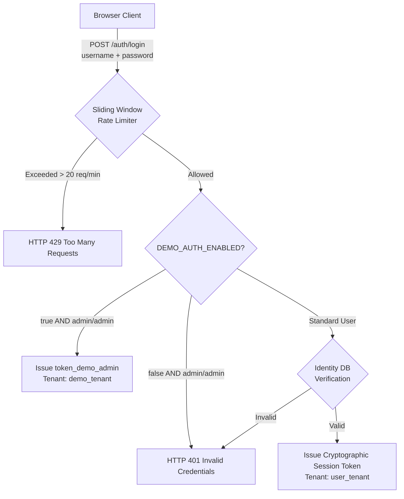

# Authentication & Identity Architecture

> **Platform Scope**: Web Productization & API Boundary.  
> **Platform Status**: Desktop application (Windows `.exe`, macOS `.dmg`) and Android mobile packaging are **DEFERRED TO FUTURE WORKSTREAM**. All authentication services terminate at the web gateway.

---

## 1. Authentication Security Boundary

AegisTrace treats authentication not merely as a UI gate, but as a zero-trust cryptographic boundary:



---

## 2. Dual-Mode Authentication Engine

### 2.1 Demo Authentication Mode (`DEMO_AUTH_ENABLED=true`)
Designed exclusively for hackathon evaluation:
- Default credentials `admin / admin` are validated against the backend.
- Automatically maps the user session to `tenant_id: "demo_tenant"`.
- Rate limiting remains active to protect against brute-force abuse.
- Frontend displays an Autofill button and an unambiguous yellow **DEMO DATA** badge.

### 2.2 Production Authentication Mode (`DEMO_AUTH_ENABLED=false`)
In production environments:
- Default `admin/admin` credentials are **strictly rejected**.
- Users authenticate using administrative enterprise tokens or federated enterprise directory accounts.
- The session payload is signed and bound to the officer's organization tenant.

---

## 3. Sliding Window Rate Limiting

To prevent credential stuffing and brute-force attacks on unauthenticated endpoints, `apps/api/routers/auth.py` implements an in-memory sliding window rate limiter:

- **Window**: 60 seconds
- **Max Requests**: 20 requests per client IP address
- **Exceeded Behavior**: Returns `HTTP 429 Too Many Requests` with a `Retry-After: <seconds>` response header.

---

## 4. Self-Service Registration Disabled

To preserve enterprise chain of custody, self-service account creation is intentionally unavailable:
- `POST /auth/register` returns:
  ```json
  {
    "error": {
      "code": "REGISTRATION_DISABLED",
      "message": "Self-service registration is disabled in this deployment. Contact your system administrator to enroll an identity."
    }
  }
  ```
- The frontend `SignUpScreen` communicates this clearly to the user, providing an honest explanation of enterprise governance.

---

## 5. Session Management & Logout

- **Client Storage**: Session metadata (`user_id`, `name`, `email`, `role`, `tenant_id`, `token`) is stored in browser memory and local session storage.
- **API Transport**: The token is transmitted in the `Authorization: Bearer <token>` header for all authenticated requests.
- **Logout**: `POST /auth/logout` invalidates the active session and resets browser state immediately.
