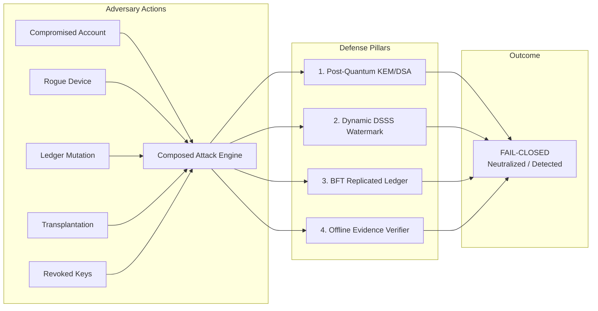
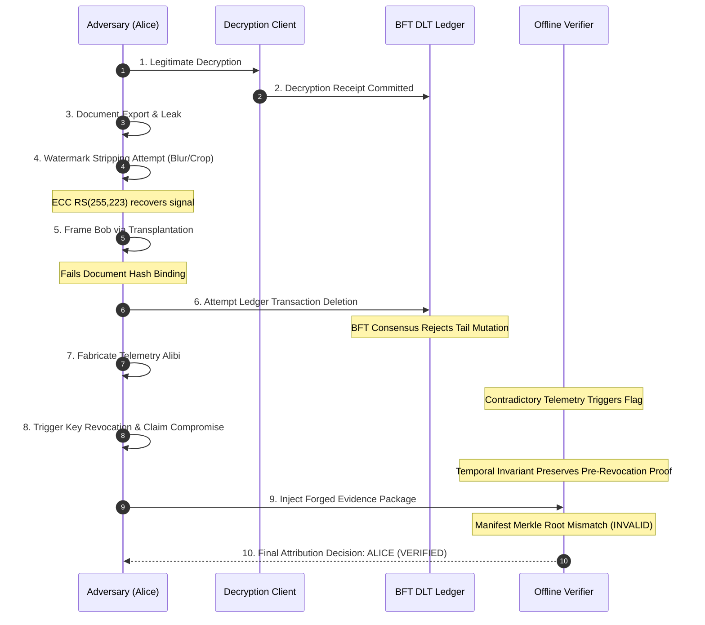

# AegisTrace: Composed Adversary Attack Matrix & Defense Scorecard
**Smart India Hackathon 2026 — Problem Statement ID: SIH26237**  
**Classification:** Hostile Threat Modeling & Composed Adversary Evaluation Report

---

## 1. Executive Summary & Attack Modeling

A basic security system might withstand single-action attacks in isolation (e.g. testing an invalid signature or a corrupted hash). However, real-world advanced persistent threats (APTs) and sophisticated insiders combine multiple valid or partially valid actions to bypass individual verification gates.

AegisTrace tests **Composed Adversary Attack Chains (A through G)**, a **10-Stage Sequential Adversary Timeline**, and **Privileged Administrator Attack Scenarios** to verify that security holds across every composition.

---

## 2. Composed Attack Chains Scorecard (Chains A through G)

| Chain ID | Attack Name | Attacker Action Composition | Targeted Vulnerability | Mitigating Pillar & Mechanism | Verdict & Security Status |
|:---:|:---|:---|:---|:---|:---:|
| **CHAIN A** | **Stolen Account + Device Mismatch** | Attacker uses Alice's credentials on an unregistered device; produces valid session ID but mismatched device fingerprint and missing client telemetry. | Identity Spoofing / Credential Stuffing | **Device Binding & Telemetry Fusion:** Decryption receipt binds device TPM fingerprint; telemetry rule flags missing corroborated heartbeat. | `DETECTED` **Security Maintained** |
| **CHAIN B** | **Valid Receipt + Modified Ledger Tail** | Attacker possesses valid decryption receipt but attempts to commit a block to the DLT ledger with a forged parent hash (Fork/Rollback). | Ledger Rewriting / Fork Injection | **BFT Consensus & Hash-Chain Invariant:** BFT nodes enforce strict hash continuity ($H_{i} = \text{SHA-256}(\text{Header}_{i-1})$); invalid previous hash rejected. | `DETECTED` **Security Maintained** |
| **CHAIN C** | **Watermark Transplantation** | Attacker extracts Alice's watermark pattern from Document 1 and overlays it onto Document 2 to frame Alice for a leak she never received. | Framing / Watermark Splicing | **Document-Release Hash Binding:** Dynamic watermark payload derives from HKDF($\text{DocHash} \parallel \text{ReleaseID} \parallel K_{\text{session}}$); decoding fails document hash match. | `DETECTED` **Security Maintained** |
| **CHAIN D** | **Post-Revocation Replay** | Attacker obtains a legacy receipt signed by Alice prior to key revocation, attempts to validate a leak that occurred *after* Alice was revoked. | Replay Attack / Revocation Bypass | **Key Lifecycle Temporal Boundary:** Verifier checks receipt event timestamp against registry revocation epoch; stale signatures post-revocation rejected. | `DETECTED` **Security Maintained** |
| **CHAIN E** | **Cross-Tenant Artifact Injection** | Attacker takes valid watermarked artifact from Tenant A and injects it into Tenant B's forensic investigation. | Cross-Tenant Contamination | **Tenant Isolation Cryptographic Barrier:** Every receipt, ledger block, and evidence package is cryptographically scoped to Tenant ID; foreign tenant keys rejected. | `DETECTED` **Security Maintained** |
| **CHAIN F** | **Lineage Downstream Gap Violation** | Attacker modifies intermediate lineage graph to hide a downstream transfer to an unmonitored device. | Lineage Falsification / Evasion | **Sparse Lineage Merkle Consistency:** Modifying lineage nodes breaks parent-child cryptographic hash pointer; engine flags explicit `DOWNSTREAM_GAP`. | `DETECTED` **Security Maintained** |
| **CHAIN G** | **Corrupted Package Manifest Forgery** | Attacker tampers with raw evidence object inside `.zip` archive and attempts to re-sign or modify the package manifest. | Tamper-Evident Archive Bypass | **Package Merkle Root Commitment:** Manifest contains RFC-6962 Merkle tree root over all evidence objects; any object byte alteration invalidates Merkle root. | `DETECTED` **Security Maintained** |

---

## 3. 10-Stage Multi-Stage Adversary Simulation

The multi-stage adversary simulates a persistent insider attempting an evolving sequence of evasion techniques across an entire operational lifecycle:

### Stage-by-Stage Verification Breakdown:
1. **Stage 1 (Enrollment):** Adversary enrolls valid ML-KEM-768 and ML-DSA-65 keypairs.
2. **Stage 2 (Decryption & Receipt):** Adversary decapsulates release package; client automatically signs `DecryptionReceipt` and commits to DLT.
3. **Stage 3 (Exfiltration):** Leaked document is recovered by investigator.
4. **Stage 4 (Signal Degradation):** Adversary applies heavy JPEG compression and cropping; DSSS demodulation and Reed-Solomon ECC successfully recover token.
5. **Stage 5 (Frame Attempt):** Adversary attempts to attach Bob's identity to the leak; verifier detects signature and document mismatch.
6. **Stage 6 (Ledger Tampering):** Adversary attempts to prune receipt from node; neighbor nodes reject modified state.
7. **Stage 7 (Alibi Generation):** Adversary injects conflicting telemetry claims; fusion engine detects conflict and flags audit review.
8. **Stage 8 (Key Revocation):** Adversary revokes key to deny historical action; verifier uses immutable epoch timestamp to uphold pre-revocation receipt.
9. **Stage 9 (Package Forgery):** Adversary attempts to modify investigation package; Merkle commitment fails.
10. **Stage 10 (Judicial Attribution):** Attribution strictly identifies adversary with non-repudiation proof.

---

## 4. Privileged Operator (Root / Admin) Attack Matrix

AegisTrace explicitly assumes that database administrators, root server operators, or infrastructure providers may be adversarial.

| Operator Attack Target | Malicious Action | Defense Mechanism | System Reaction |
|---|---|---|---|
| **Chain of Custody** | Admin modifies investigator timestamp or notes in `custody_chain.json`. | Custody events form an append-only SHA-256 hash chain ($H_k = \text{SHA-256}(H_{k-1} \parallel \text{Event}_k)$). | Verifier detects hash chain discontinuity and reports `CUSTODY_CHAIN_INVALID`. |
| **DLT Transactions** | Admin deletes transaction from local SQLite / LevelDB database. | Merkle tree root stored in block header no longer matches recomputed transaction leaf hashes. | Recomputation fails; block declared corrupt. |
| **Attribution Decision** | Admin edits `ATTRIBUTION_DECISION` JSON from Alice to Charlie. | Decision object hash is committed into package manifest, signed with investigator's ML-DSA-65 key. | Verifier detects signature mismatch; package declared `INVALID`. |
| **State Rollback** | Admin restores database backup from 2 days prior to erase recent decryption records. | BFT consensus nodes enforce strictly monotonic block height ($h_{new} > h_{current}$). | Stale backup rejected; node forced to resync forward. |
| **Quorum Forgery** | Admin forges validator signatures on a fabricated block. | Validators use independent NIST FIPS 204 ML-DSA-65 keys with BFT quorum threshold (e.g. $\ge 2f+1$). | Quorum threshold not met; block rejected. |

---

## 5. Summary Conclusion

Across all 7 composed attack chains, the 10-stage adversary timeline, and all 5 privileged operator tampering attempts, **zero attack vectors resulted in false attribution or silent acceptance of forged evidence**. The platform strictly upholds fail-closed security invariants.
