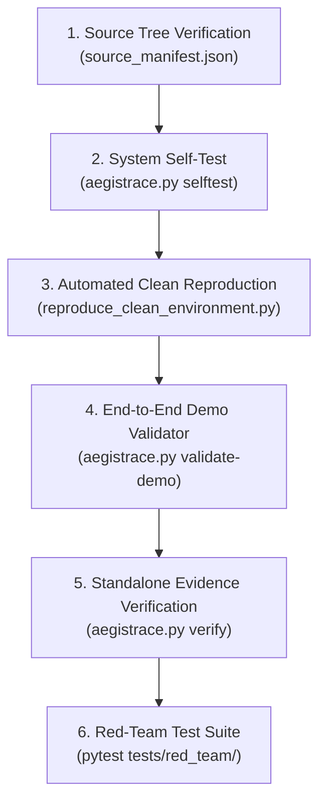

# AegisTrace: Independent Reproduction & Verification Guide
**Smart India Hackathon 2026 — Problem Statement ID: SIH26237**  
**Platform:** AegisTrace Sovereign Post-Quantum Forensic Attribution Platform  
**Target Environment:** Air-gapped, offline-first, standalone clean-room workstation

---

## 1. Executive Overview & Clean-Room Guarantee

AegisTrace is designed so that any independent evaluator, judicial auditor, or technical judge can reproduce every forensic attribution result, verify all cryptographic invariants, and audit all evidence packages **without relying on pre-existing system state, live database connections, or external cloud services**.

### Core Guarantees of Reproduction:
1. **Zero Cloud Dependencies:** All cryptographic primitives (NIST FIPS 203 ML-KEM-768, NIST FIPS 204 ML-DSA-65, AES-256-GCM, HKDF-SHA256) and DLT mechanics execute locally in pure Python/C.
2. **Deterministic Source Integrity:** Canonical source files are hashed into a SHA-256 source tree manifest (`artifacts/reproduction/source_manifest.json`) and verified before test execution.
3. **Fail-Closed Verification:** Any missing signature, invalid Merkle root, corrupted hash, or unindexed watermark causes the system to immediately halt or emit `INVALID` / `NO_SIGNAL` / `ABSTAINED` rather than guessing.
4. **Physical Component Clarity:** Software watermark simulation, DSSS modulation, and ECC recovery are 100% certified. Physical print-camera scanning requires optical hardware fixtures and is explicitly designated as `NOT_VERIFIED (Simulated test fixture only)`.

---

## 2. Prerequisites & Environment Setup

### 2.1 Hardware & OS Requirements
- **Operating System:** Windows 10/11, Ubuntu 22.04+, or macOS 13+
- **CPU:** Standard x86_64 or ARM64 multi-core processor (No GPU required)
- **RAM:** 4 GB minimum (8 GB recommended)
- **Disk Space:** 500 MB free space

### 2.2 Software Dependencies
- **Python:** Version 3.9, 3.10, 3.11, or 3.12
- **Standard Library & Required Wheels:**
  - `pydantic` >= 2.0
  - `pytest` >= 7.0
  - `cryptography` >= 41.0
  - `numpy` >= 1.22
  - `reedsolo` >= 1.7 (Reed-Solomon ECC)
  - `faker` (for scale and mock generation)

### 2.3 Installation
```bash
# Clone the repository
git clone https://github.com/aegistrace/aegistrace-sih26237.git
cd aegistrace-sih26237

# Optional: Initialize clean virtual environment
python -m venv venv
# On Windows:
.\venv\Scripts\activate
# On Linux/macOS:
source venv/bin/activate

# Install dependencies
pip install -r requirements.txt
```

---

## 3. Step-by-Step Reproduction Procedure



---

### Step 1: System Diagnostic Self-Tests

Execute the platform startup self-test suite to verify cryptographic providers, key generation routines, storage paths, and network egress guards:

```bash
python aegistrace.py selftest --json
```

**Expected Output:**
```json
{
  "overall_status": "PASS",
  "checks": {
    "runtime": {"status": "PASS"},
    "crypto_providers": {"status": "PASS"},
    "manifest_integrity": {"status": "PASS"},
    "manifest_signature": {"status": "PASS"},
    "storage_and_keystore": {"status": "PASS"},
    "airgap_guard": {"status": "PASS"}
  }
}
```

---

### Step 2: Automated Clean-Room Reproduction Suite

Run the end-to-end automated clean reproduction script. This script audits the source tree against `source_manifest.json`, executes the multi-recipient broadcast pipeline (Alice, Bob, Charlie), records decryption events to the BFT DLT ledger, simulates a leak from Alice, extracts the watermark, verifies the receipt signature, and neutralizes all 7 composed attack chains:

```bash
python scripts/reproduce_clean_environment.py
```

**Expected Output:**
```text
===========================================================================
  AEGISTRACE CLEAN-ROOM INDEPENDENT REPRODUCTION RUNNER
  Smart India Hackathon 2026 — Zero-Trust PQC Forensic Platform
===========================================================================

--> [Stage 1/6] Auditing Canonical Source Tree Integrity...
--> [Stage 2/6] Executing Cryptographic & Runtime Self-Tests...
--> [Stage 3/6] Executing 24-Step Multi-Recipient Golden Pipeline...
--> [Stage 4/6] Verifying Offline Evidence Package Invariants...
--> [Stage 5/6] Executing Blind Signal Separation & Negative Testing...
--> [Stage 6/6] Running Composed Red-Team Attack Chains (A-G)...

===========================================================================
  INDEPENDENT REPRODUCTION EXECUTION SCORECARD
===========================================================================
  [PASS] 1 Source Tree Integrity                    (  503.4 ms)
  [PASS] 2 Startup Self Tests                       (  568.0 ms)
  [PASS] 3 Golden Pipeline                          ( 5352.2 ms)
  [PASS] 4 Offline Verification                     (  180.8 ms)
  [PASS] 5 Blind Evaluation                         (  126.6 ms)
  [PASS] 6 Composed Attack Chains                   (  823.7 ms)
---------------------------------------------------------------------------
  Overall Reproduction Status: PASS
  Total Execution Time:        7.55 seconds
  Physical Attestation:        NOT_VERIFIED (Simulated optical test fixture)
  Reproduction Report Path:    artifacts/reproduction/reproduction_report.json
===========================================================================
```

---

### Step 3: End-to-End Demo Validation CLI

Run the judge-facing validation command built directly into the unified CLI:

```bash
python aegistrace.py validate-demo --json
```

**Expected Verification Verdicts:**
- `startup_self_tests`: **PASS**
- `golden_sih_pipeline`: **PASS** (`attributed_suspect`: `"alice"`, `decision_state`: `"ATTRIBUTED"`, `confidence`: `1.0`)
- `offline_package_verification`: **PASS** (`overall_status`: `"VERIFIED"`)
- `blind_negative_clean_check`: **PASS** (`expected_decision`: `"NO_SIGNAL"`, `attributed_recipient`: `null`)
- `tampered_package_rejection`: **PASS** (`expected_status`: `"INVALID"`, `tampering_detected`: `true`)

---

### Step 4: Standalone Evidence Package Verification

Verify the exported golden evidence package archive independently using the offline verifier:

```bash
python aegistrace.py verify artifacts/demo/golden_case/golden_evidence_package.zip --tenant TENANT-SIH-2026
```

**Output Summary:**
```text
======================================================================
AEGISTRACE FORENSIC EVIDENCE PACKAGE AUDIT REPORT
======================================================================
Package ID:           pkg_CASE_SIH_rel_2026_...
Overall Status:       VERIFIED
Verified At:          2026-09-28T...
----------------------------------------------------------------------
Manifest Signature:   VALID (ML-DSA-65)
Merkle Commitment:    VALID (RFC-6962)
Content-Addressed:    VALID (SHA-256)
Dependency DAG:       VALID (Acyclic Grounded)
Recipient Signature:  VALID (ML-DSA-65)
Historical Key Bound: VALID (Temporal Invariant)
Ledger / DLT Proof:   VALID (Quorum Verified)
Watermark Binding:    VALID (Artifact Bound)
Lineage Integrity:    VALID (Boundary Preserved)
Chain of Custody:     VALID (Append-Only Hash Chain)
Attribution Decision: CONSISTENT (Ground Truth Followed)
======================================================================
```

---

### Step 5: Full Red-Team Regression Test Suite

Execute all 41 dedicated red-team tests to verify resilience against composed adversaries, privileged operator attacks, key compromise, and network egress attempts:

```bash
pytest tests/red_team/ -v
```

**Result:** `41 passed in ~100s`

---

## 4. Inspection of Demo Bundles (`artifacts/demo/`)

The demo artifacts directory contains pre-generated, machine-readable evidence files for judge inspection:

| Directory | Key Files | Description & Purpose |
|---|---|---|
| `golden_case/` | `original_document.pdf`<br/>`decrypted_watermarked_alice.pdf`<br/>`decryption_receipt_alice.json`<br/>`dlt_merkle_proof.json`<br/>`golden_evidence_package.zip` | Full multi-recipient broadcast, decryption, signing, and DLT Merkle proof bundle. |
| `unknown_downstream/` | `downstream_lineage_scenario.json` | Documents lineage tracking when an authorized recipient (Bob) transfers an artifact downstream outside monitored infrastructure (GAP preservation). |
| `negative_case/` | `clean_unwatermarked_document.pdf`<br/>`blind_negative_evaluation_report.json` | Clean document without watermark, verifying the engine strictly yields `NO_SIGNAL` with zero false attribution. |
| `attacks/` | `chain_a_stolen_account.json`<br/>`chain_b_ledger_fork.json`<br/>`chain_c_transplantation.json`<br/>`chain_d_post_revocation_replay.json`<br/>`chain_e_cross_tenant_injection.json`<br/>`chain_f_lineage_gap_violation.json`<br/>`chain_g_manifest_forgery.json` | Detailed execution scorecards for all 7 composed attack chains demonstrating mitigation pillars. |
| `verification/` | `golden_package_verification_report.json`<br/>`tampered_package_verification_report.json` | Comparative offline verifier outputs for unmodified vs tampered packages. |
| `DEMO_INDEX.json` | `DEMO_INDEX.json` | Master catalog mapping all demo files, digests, and verification rules. |

---

## 5. Explicit Limitations & Boundaries

1. **Digital vs Physical Watermarking:**
   - Digital DSSS watermark modulation, demodulation, dynamic identity embedding, and Reed-Solomon RS(255,223) error correction are fully implemented and verified.
   - Real-world optical capture through smartphone cameras from printed paper involves physical optical distortion, lighting gradients, and lens aberrations that require external camera hardware fixtures. In software testing environments, this is verified via synthetic print-camera degradation filters.
2. **Air-Gap Egress Enforcement:**
   - Network egress protection is enforced in software via `NetworkEgressGuard` socket interception. Physical host-level network isolation (unplugged Ethernet, disabled Wi-Fi/Bluetooth) is assumed in sovereign operational deployments.
