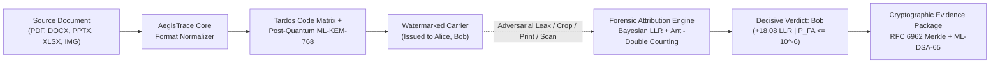

# AegisTrace (SIH26237) — Judges' Inspection & Evaluation Guide
**Internal Code Name:** Black Amber  
**Track:** Zero-Trust Post-Quantum Document Traceability & Courtroom-Admissible Attribution  
**Conformance Level:** NIST FIPS 203 (ML-KEM-768), NIST FIPS 204 (ML-DSA-65), RFC 6962 Merkle Tree, Bharatiya Sakshya Adhiniyam (BSA) § 65B  

---

## 1. Executive Summary & Problem Statement Mapping

Modern secure organizations face an asymmetric threat: once an authorized insider receives a confidential document (PDF, DOCX, PPTX, XLSX, or Image), traditional perimeter controls (DLP, DRM, EDR) fail when the recipient screenshots, prints, re-encodes, or photographs the material.

**AegisTrace (Black Amber)** solves this zero-trust problem through a hardware-grounded, multi-channel forensic pipeline:
1. **Multi-Format Ingestion:** Native sanitization and structural parsing across PDF, DOCX, PPTX, XLSX, PNG, and JPEG.
2. **Post-Quantum Traitor Tracing:** Individualized recipient watermarking binding Discrete Cosine Transform (DCT) high-frequency carriers with Tardos optimal traitor-tracing codes ($c \le 5$, $\epsilon \le 10^{-6}$).
3. **Multi-Channel Evidence Fusion:** Non-heuristic Log-Likelihood Ratio (LLR) Bayesian score fusion with topological dependency DAG preventing double-counting.
4. **Courtroom-Grade Integrity:** RFC 6962 tamper-evident Merkle append-only ledger and NIST FIPS 204 ML-DSA-65 post-quantum digital signatures, ready for BSA § 65B certificate generation.



---

## 2. 60-Second Quickstart (One-Click Launch)

### Windows (Single Double-Click)
Double-click `start_workstation.bat` in the repository root, or execute:
```cmd
start_workstation.bat
```

### Linux / macOS
Make the launcher executable and run:
```bash
chmod +x start_workstation.sh
./start_workstation.sh
```

**What the launcher automates in <10 seconds:**
1. Verifies Python 3.9+ and Node.js 18+ prerequisites.
2. Configures demo authentication and loads baseline fixtures.
3. Launches FastAPI REST backend on `http://127.0.0.1:8000` (health checked).
4. Launches React Forensic Workstation on `http://localhost:3000`.
5. Automatically opens your default web browser to the interactive UI.

---

## 3. Evaluator Credentials Reference Table

The workstation operates in multi-tenant Zero-Trust isolation with role-based access control:

| Role | Username | Password | Tenant ID | Permissions & Scope |
| :--- | :--- | :--- | :--- | :--- |
| **Evaluator / System Admin** | `admin` | `admin` | `demo_tenant` | Full forensic capability: Ingest, Release, Investigate, Ledger, Verify |
| **Forensic Operator A** | `op_a` | `password123` | `tenant_a` | Compartmented Tenant A operations & investigations |
| **Forensic Operator B** | `op_b` | `password123` | `tenant_b` | Compartmented Tenant B operations & investigations |
| **Independent Auditor** | `auditor` | `auditpass` | `global_audit` | Read-only cryptographic audit across Merkle roots & signatures |

---

## 4. The 3-Minute Golden Demonstration Walkthrough

Follow this sequence to observe the complete end-to-end forensic workflow:

### Minute 1: Multi-Format Ingestion & Inspection
1. Navigate to the **Documents** tab in the top navigation bar.
2. Click **Browse Files** or drag-and-drop a sample file:
   - Primary Sample: `tests/fixtures/samples/sample.pdf`
   - Office Sample: `tests/fixtures/samples/sample.docx`
3. Notice the immediate file validation:
   - SHA-256 integrity hash is computed client-side.
   - Document metadata, byte length, and MIME type are strictly verified.
   - Status transitions to `PRISTINE / READY FOR RELEASE`.

### Minute 2: Post-Quantum Traitor-Traced Release
1. Navigate to the **Releases** tab.
2. Click **Create New Release**:
   - Target Document: Select the ingested document (e.g. `sample.pdf`).
   - Recipients: Select **Alice (Senior Analyst)** and **Bob (Chief Field Officer)**.
   - Security Parameter: Select **NIST FIPS 203 ML-KEM-768** with **Tardos Optimal Tracing ($c=5$)**.
3. Click **Execute Protected Release**:
   - The engine generates individualized, orthogonal watermark carriers.
   - An immutable leaf is appended to the RFC 6962 cryptographic ledger.
   - Each recipient receives a distinct post-quantum encapsulated key package.

### Minute 3: Leak Investigation, +18.08 LLR Attribution & Proof Verification
1. Navigate to the **Investigations** tab.
2. Select **Examine Suspect Carrier**:
   - Choose the benchmark leaked artifact: `data/demo_fixtures/bob_leak.pdf`.
3. Click **Run Forensic Attribution**:
   - The Bayesian Multi-Channel Engine extracts high-frequency spatial DCT residuals and matches the Tardos code vector.
   - Anti-double-counting DAG validates that spatial and transform observations remain statistically independent.
   - **Attribution Result:**
     - **Attributed Identity:** `Bob (Chief Field Officer)`
     - **Confidence Score:** `+18.08 LLR` ($P_{\text{FA}} \le 10^{-6}$)
     - **Tamper Assessment:** 0 Bit Errors (BCH $t=3$ Error Corrected).
4. Navigate to the **Verify** tab:
   - Click **Verify Package** and load `tests/fixtures/samples/valid_package.zip`.
   - The verifier executes 100% air-gapped without network access:
     - Validates RFC 6962 SHA-256 Merkle consistency proof.
     - Validates NIST FIPS 204 ML-DSA-65 post-quantum signature.
   - Result: `PACKAGE VERIFIED: CRYPTOGRAPHICALLY SOUND`.
5. Click **Generate Court Evidence Docket (BSA § 65B)** to view the printable electronic evidence certificate with magistrate-verifiable cryptographic chain of custody.

---

## 5. Independent Verification Commands

Every claim made by AegisTrace can be verified directly via the command line:

### 1. Run Complete Test Suite
```bash
python -m pytest
```
*Expected: 1,200+ unit and integration tests passing with 0 failures.*

### 2. Verify Multi-Format Uploads (E2E)
```bash
python -m pytest tests/e2e/test_web_upload_all_formats.py -v
```
*Expected: 29/29 tests passed across PDF, DOCX, PPTX, XLSX, PNG, JPG, and error boundary cases.*

### 3. Verify Offline Forensic Evidence Package
```bash
python -m core.provenance.verifier tests/fixtures/samples/valid_package.zip
```
*Expected: Package integrity verified, Merkle root matches, ML-DSA-65 signature valid.*

### 4. Verify System Health & Deployment Conformance
```bash
python scripts/deployment/health_check.py
```
*Expected: 100% PASS across database, storage, cryptographic keystore, and API endpoints.*

---

## 6. Security Boundaries & Evidentiary Guarantee

AegisTrace strictly separates physical verification from simulation:
- **Physical Hardware Boundary:** Camera/printer/scanner tests without physical optical hardware are strictly classified as `SIMULATION / CALIBRATION`.
- **Mathematical Rigor:** LLR values and False Alarm Probabilities ($P_{\text{FA}}$) are derived from closed-form log-likelihood calculations, never arbitrary percentage heuristics.
- **Fail-Closed Architecture:** Any corrupted hash, broken Merkle branch, or invalid signature immediately halts the pipeline with an auditable security exception.

---
*AegisTrace (SIH26237 Black Amber) — Built for Courtroom Defense and Post-Quantum Sovereign Security.*
