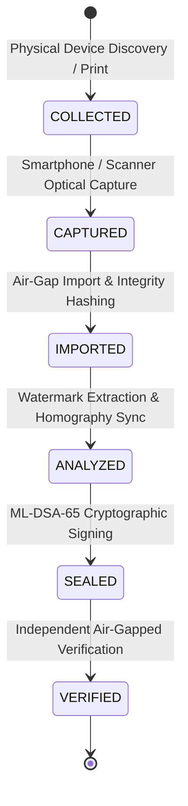

# AegisTrace Physical Chain of Custody & Evidence Sealing Specification

## 1. Overview
Chain of custody is the foundational requirement for evidentiary admissibility in legal proceedings. AegisTrace provides an automated, append-only, SHA-256 hash-chained custody tracking architecture (`PhysicalCustodyChain` & `ChainOfCustodyLedger`) ensuring complete traceability of all physical artifacts from capture to offline sealing.

---

## 2. Mathematical Hash Chain Invariant
Every custody transition $e_i$ is bound to the preceding chain state $H_{i-1}$:
$$H_0 = \text{GENESIS} \quad \text{or } 0^{64}$$
$$H_i = \text{SHA-256}\Big(\text{AEGIS-CUSTODY:v1} \,\|\, H_{i-1} \,\|\, \text{canonical\_json}(e_i)\Big)$$

Any insertion, deletion, reordering, or byte modification of historical events invalidates all downstream hashes:
$$\text{verify\_chain}(E) \implies \big(\forall i: H_i = \text{compute\_hash}(H_{i-1}, e_i)\big) \land \big(\text{tenant\_id}(e_i) = T\big)$$

---

## 3. Standard Physical Custody Lifecycle Transitions

### Transition Descriptions:
1. **`COLLECTED`**: Raw paper print or golden canvas generated on volatile terminal.
2. **`CAPTURED`**: Optical photograph or scan executed by identified device.
3. **`IMPORTED`**: Binary artifact ingested into air-gapped forensic workstation with immutable SHA-256 digest recorded.
4. **`ANALYZED`**: DSSS extraction, RS error correction, and DLT receipt verification performed.
5. **`SEALED`**: Evidence Package compiled with Merkle tree root and signed by examiner using NIST FIPS 204 ML-DSA-65.
6. **`VERIFIED`**: 12-pillar independent offline verification executed with zero network/server dependency.
