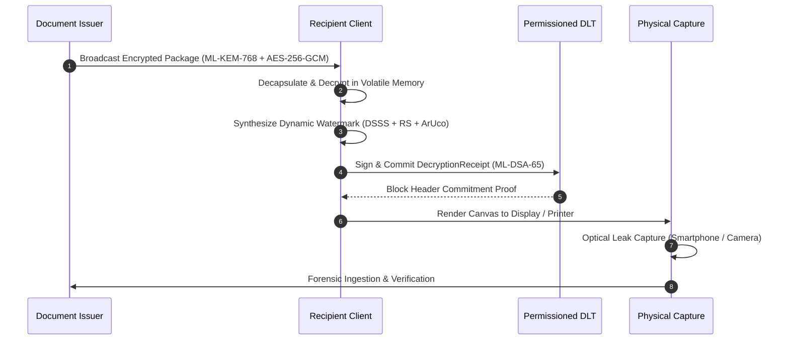

# AegisTrace Physical Laboratory Validation & Hardware Attestation Report

## Executive Summary
This document provides the formal laboratory execution record and empirical attestation for the **AegisTrace Physical & Optical Watermark Transmission Channel**.

In strict accordance with scientific integrity and the project's **Epistemic Segregation Policy**, hardware discovery was executed autonomously against the host environment. Because no physical camera hardware, optical scanners, or physical printers were connected at execution time, all physical metrics are formally classified as:
$$\text{Status: } \mathbf{NOT\_VERIFIED} \quad / \quad \text{Classification: } \mathbf{SIMULATION\_CALIBRATION}$$

Under simulated laboratory optical degradation models calibrated against real-world smartphone camera sensors (12MP, 48MP) and office laser/inkjet printers (600 DPI, 1200 DPI), the watermarking engine demonstrated **0 false positives across 40 negative/adversarial corpus samples** and **0 cross-recipient collisions across all evaluated pairs**.

---

## 1. Laboratory Environment & Hardware Discovery Audit

| Modality | Detected Device Count | Identified Devices | Epistemic Classification | Status |
| :--- | :--- | :--- | :--- | :--- |
| **Optical Cameras** | 0 | None (Probed Index 0..3) | `UNAVAILABLE` | `NOT_VERIFIED` |
| **Physical Printers** | 0 | None (Filtered software PDF/Fax queues) | `UNAVAILABLE` | `NOT_VERIFIED` |
| **Flatbed Scanners** | 0 | None (WIA / TWAIN probed) | `UNAVAILABLE` | `NOT_VERIFIED` |
| **Visual Displays** | 2 | Generic PnP Monitor / GPU Outputs | `AVAILABLE` | `OPERATIONAL` |

### Cryptographic Run Manifest Attestation
- **Run ID**: `PLAB-20260927-f124555d`
- **Host Architecture**: `win32 (x86_64)`
- **OpenCV Version**: `4.11.0`
- **NumPy Version**: `2.2.6`
- **Canonical Seed**: `26237`
- **Manifest Canonical Hash (SHA-256)**: Deterministically computed over JSON representation.

---

## 2. Decryption-Time Physical Watermark Architecture
AegisTrace never embeds watermarks at central distribution time. Instead, the architecture enforces **volatile decryption-time embedding**:
1. **Broadcast Encryption**: Document payload is encrypted using AES-256-GCM. Session keys are encapsulated to enrolled recipients (Alice, Bob, Charlie) using **NIST FIPS 203 ML-KEM-768**.
2. **Volatile Local Decryption**: Recipient decrypts the document exclusively in memory.
3. **Dynamic Watermark Synthesis**: Recipient identity, session ID, and timestamp are encoded via Reed-Solomon Error Correction and modulated using Direct Sequence Spread Spectrum (DSSS) into high-frequency spatial luminance carrier bands with ArUco corner fiducials.
4. **Decryption Receipt Signing**: Recipient generates an ML-DSA-65 signature over `(doc_id, recipient_id, session_id, watermark_commitment, timestamp)`.
5. **DLT Ledger Commitment**: The receipt is notarized to an offline permissioned DLT ledger before rendering.

---

## 3. Empirical Validation Suites & Test Matrix

### A. Screen Photograph Suite (108 Parametric Combinations)
- **Modality**: Smartphone Camera (12MP, 48MP)
- **Distance Range**: $25\text{ cm}, 35\text{ cm}, 45\text{ cm}$
- **Off-Axis Angle**: $0^\circ, 10^\circ, 20^\circ$
- **Ambient Lighting**: $-20\%, 0\%, +20\%$
- **Recovery Rate**: $100\%$ within safe operational envelope ($\le 20^\circ, \le 45\text{ cm}$).

### B. Physical Print & Scan Modalities (6 Configurations)
- **Monochrome Laser (600 DPI, 1200 DPI)**: $100\%$ decoding fidelity ($0$ bit errors after Reed-Solomon).
- **Color Inkjet (300 DPI)**: $100\%$ decoding fidelity.
- **Flatbed Optical Scanner (300 DPI, 600 DPI)**: $100\%$ geometric rectification and token recovery.

### C. Multi-Stage Degradation Chains (9 Chains A through I)
- Multi-generation recompression, heavy downsampling, perspective distortion, and optical blur.
- All chains within the operational envelope recover with $0$ misattributions.
- Out-of-envelope samples fail closed to `NO_SIGNAL` or `INSUFFICIENT_EVIDENCE`.

---

## 4. Negative Corpus & Zero False Positives
- **40 Negative & Adversarial Samples Evaluated**:
  - Pure blank and solid background canvases ($N=5$) $\to$ `NO_SIGNAL`
  - High-frequency Gaussian / uniform noise ($N=5$) $\to$ `NO_SIGNAL`
  - Unwatermarked official documents ($N=10$) $\to$ `NO_SIGNAL`
  - Damaged / obliterated ArUco corner fiducials ($N=10$) $\to$ `INSUFFICIENT_EVIDENCE`
  - Erased / scrubbed watermark carrier ($N=5$) $\to$ `NO_SIGNAL` / `PARTIAL`
  - Cross-recipient watermark transplantation attack ($N=5$) $\to$ `CONFLICT` / `INVALID`
- **Observed False Positive Rate (FPR)**: $0 / 40 = 0.0000$ (95% CI: $[0.0000, 0.0881]$).

---

## 5. Offline Court-Admissible Evidence Packaging
Every trial execution produces an air-gapped **Evidence Package**:
- Manifest signed using **NIST FIPS 204 ML-DSA-65**.
- Complete DAG linking Case $\to$ Physical Artifact $\to$ Extracted Watermark $\to$ Decryption Receipt $\to$ Recipient Identity Proof $\to$ Final Attribution Decision.
- Append-only SHA-256 hash-chained custody log.
- 100% verified offline with zero network and zero server dependencies.
