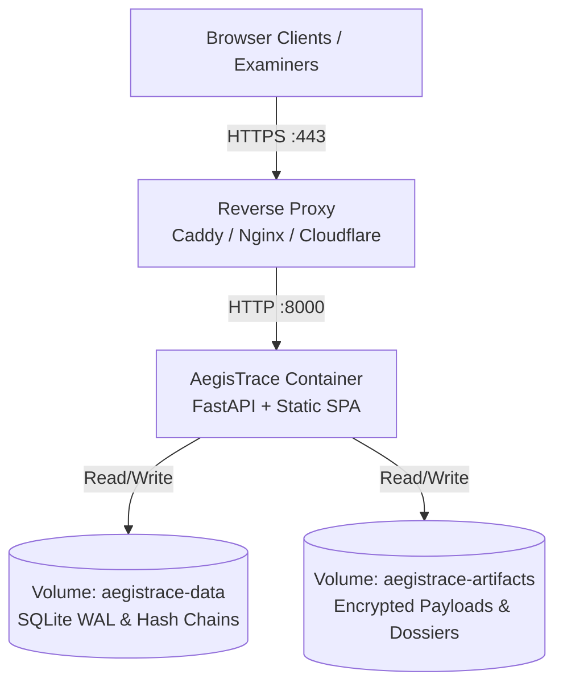

# AegisTrace Production Deployment Specification

> **Target Platform**: Production Web Workstation & API Gateway.  
> **Platform Status**: Desktop application (Windows `.exe`, macOS `.dmg`) and Android mobile packaging are **DEFERRED TO FUTURE WORKSTREAM**. All enterprise workflows are conducted through the hardened web workstation.

---

## 1. Production Architecture Overview

In production, AegisTrace is deployed as a hardened container behind a TLS-terminating reverse proxy with strict resource attribution and data isolation:



---

## 2. Mandatory Production Settings

Ensure the following variables are configured in `.env` or container orchestrator secrets:

```env
# 1. Operational Security
DEMO_AUTH_ENABLED=false
CORS_ORIGINS=https://trace.agency.gov
PUBLIC_BASE_URL=https://trace.agency.gov
API_BASE_URL=https://trace.agency.gov

# 2. Network & Storage (Dynamic Cloud Port Binding)
SIH_HOST=0.0.0.0
PORT=8000
SIH_PORT=8000
SIH_DATA_DIR=/app/data

# 3. Rate Limiting Protection
AUTH_RATE_LIMIT_MAX_REQUESTS=20
AUTH_RATE_LIMIT_WINDOW_SECONDS=60
```

> **Dynamic Cloud Port Support**: The container automatically inspects `$PORT` (injected dynamically by Render, Cloud Run, and Fly.io) and binds to `0.0.0.0:$PORT` while defaulting to port `8000` for local and Docker Compose environments.

> [!CAUTION]
> Setting `DEMO_AUTH_ENABLED=true` in production is strictly prohibited. When disabled, default `admin/admin` credentials return `401 Unauthorized`.

---

## 3. Deployment Procedure

### Step 1: Clone and Configure
```bash
git clone <production_repo_url> /opt/aegistrace
cd /opt/aegistrace
cp .env.example .env
chmod 600 .env
```

### Step 2: Build and Launch Multi-Stage Container
```bash
docker compose -f docker-compose.yml up -d --build
```

### Step 3: Configure Reverse Proxy & TLS
Follow [docs/deployment/HTTPS.md](docs/deployment/HTTPS.md) to configure Caddy or Nginx with Let's Encrypt certificates.

### Step 4: Verify Readiness Probe
```bash
curl -f https://trace.agency.gov/ready
```
Ensure the response returns `HTTP 200 OK` with all components reporting `status: healthy`.

---

## 4. Production Security Controls

1. **Zero Fake Data**: The production database starts with 0 documents, 0 releases, 0 investigations, and 0 evidence records.
2. **Registration Disabled**: Self-service user registration is disabled by default (`POST /auth/register` returns `403 Forbidden`).
3. **Fail-Closed Guard**: Decryption operations without valid post-quantum credentials fail closed with zero information leakage.
4. **Content Security Policy**: `default-src 'self'` prevents external script injection.
5. **No-Store Headers**: Sensitive evidence downloads enforce `Cache-Control: no-store, no-cache, private`.
