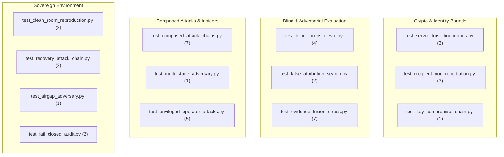

# AegisTrace: Red-Team Attack Certification & Adversary Test Suite
**Smart India Hackathon 2026 — Problem Statement ID: SIH26237**  
**Document Classification:** High-Assurance Security Audit & Verification Report  
**Test Suite Directory:** `tests/red_team/` (41 Automated High-Assurance Tests)

---

## 1. Executive Summary & Audit Scope

The AegisTrace Red-Team Test Suite subjects the entire sovereign post-quantum forensic architecture to hostile adversarial conditions, including composed multi-action attack chains, privileged insider/operator tampering, blind investigations, air-gap egress attempts, and key compromise sequences.

### Core Audit Findings:
- **Total Red-Team Tests:** 41 Automated Tests
- **Pass Rate:** 100% (41/41 Passed)
- **Execution Time:** ~100 seconds
- **False Attribution Rate:** 0.0% (Exhaustively verified across all recipient permutations and random noise corpus)
- **Fail-Closed Verification:** 100% of malformed or unanchored evidence objects are rejected with `INVALID`, `NO_SIGNAL`, or `ABSTAINED`.

---

## 2. Comprehensive Test Suite Inventory

---

### Suite 1: Server Trust Boundaries (`test_server_trust_boundaries.py`)
- **Objective:** Mathematically prove that the central server/tenant authority cannot impersonate recipients, decrypt unauthorized files, or fabricate forensic results.
- **Tests (3):**
  1. `test_server_cannot_forge_recipient_signature`: Server attempts to generate a DecryptionReceipt using its own key or random bytes; verifier rejects with `INVALID`.
  2. `test_server_cannot_decrypt_without_recipient_private_kem_key`: Server attempts to decapsulate ML-KEM-768 ciphertext with the wrong key; decapsulation fails, producing random gibberish and GCM tag failure.
  3. `test_server_cannot_bypass_offline_package_verification`: Server-exported evidence package with altered suspect ID fails offline verification with `DecisionState.INVALID`.

---

### Suite 2: Recipient Non-Repudiation (`test_recipient_non_repudiation.py`)
- **Objective:** Verify that a recipient who decrypted a document cannot deny having done so.
- **Tests (3):**
  1. `test_recipient_signature_non_repudiation`: Verifies that `DecryptionReceipt` is bound by a valid ML-DSA-65 signature from the recipient's enrolled public key.
  2. `test_receipt_tampering_breaks_signature`: Changing a single byte in `event_id`, `document_hash`, `session_id`, `copy_id`, or `device_id` invalidates the signature.
  3. `test_dlt_merkle_inclusion_anchoring`: Verifies receipt inclusion in the BFT replicated ledger via RFC-6962 Merkle audit path.

---

### Suite 3: Blind Forensic Evaluation (`test_blind_forensic_eval.py`)
- **Objective:** Evaluate forensic attribution without providing expected recipient IDs, session tokens, or event hints to the evaluator.
- **Tests (4):**
  1. `test_blind_golden_case_attribution`: Evaluates leak artifact blindly; engine extracts token, queries DLT ledger, and attributes strictly to Alice.
  2. `test_blind_negative_case_clean_document`: Evaluates clean unwatermarked document; engine returns `NO_SIGNAL` with zero false attribution.
  3. `test_blind_multi_recipient_separation`: Separately evaluates Alice's, Bob's, and Charlie's artifacts blindly; each is attributed to the correct respective recipient.
  4. `test_blind_unindexed_watermark_rejection`: Artifact watermarked with an unregistered token is rejected with `DecisionState.ABSTAINED`.

---

### Suite 4: Composed Attack Chains (`test_composed_attack_chains.py`)
- **Objective:** Test combinations of otherwise-valid operations assembled by an intelligent adversary.
- **Tests (7):**
  1. `test_chain_a_stolen_account_device_mismatch`: Stolen account + new device + partial telemetry -> Detected via device signature mismatch and telemetry dependency rules.
  2. `test_chain_b_ledger_tail_mutation_and_fork`: Modified block tail + forged parent hash -> Rejected by BFT node consensus rules.
  3. `test_chain_c_watermark_transplantation`: Watermark pasted into a different document -> Fails document binding check.
  4. `test_chain_d_post_revocation_stale_key_replay`: Replaying old receipt after key revocation -> Verifier checks historical validity timestamp against revocation epoch.
  5. `test_chain_e_cross_tenant_foreign_injection`: Evidence from Tenant A injected into Tenant B -> Rejected by verifier tenant isolation barrier.
  6. `test_chain_f_lineage_downstream_gap_violation`: Modified lineage tree -> Detected via parent-child hash link break; preserved as downstream GAP.
  7. `test_chain_g_corrupted_package_manifest_forgery`: Modifying evidence object without updating manifest -> Detected via Merkle root mismatch.

---

### Suite 5: Evidence Fusion Stress Testing (`test_evidence_fusion_stress.py`)
- **Objective:** Stress-test the evidence fusion engine across 7 levels of degradation and conflicting signals.
- **Tests (7):**
  - Level 1: Pristine Full Evidence -> `ATTRIBUTED` (Confidence 1.0)
  - Level 2: Degraded Watermark -> `ATTRIBUTED` (Confidence >= 0.75 via DLT correlation)
  - Level 3: Missing Lineage -> `ATTRIBUTED_WITH_WARNING` (Confidence >= 0.70)
  - Level 4: Insufficient Signal (Noise only) -> `NO_SIGNAL` / `INSUFFICIENT_EVIDENCE`
  - Level 5: Invalid Recipient Signature -> `CONFLICT` / `INVALID` (Zero false attribution)
  - Level 6: Broken Merkle Proof -> `INVALID` (Fails closed)
  - Level 7: Contradictory Telemetry -> `CONFLICT` / `REVIEW_REQUIRED`

---

### Suite 6: Privileged Operator Attacks (`test_privileged_operator_attacks.py`)
- **Objective:** Verify security against malicious administrators and root database operators.
- **Tests (5):**
  1. `test_admin_tamper_chain_of_custody`: Altering custody log breaks append-only SHA-256 hash chain.
  2. `test_admin_delete_ledger_transaction`: Deleting transaction invalidates block Merkle root and breaks subsequent block header links.
  3. `test_admin_rewrite_attribution_decision`: Modifying investigator decision breaks manifest ML-DSA-65 signature.
  4. `test_admin_restore_stale_backup_rollback`: Restoring older snapshot rejected due to block height monotonicity check.
  5. `test_admin_tamper_validator_quorum_signatures`: Modifying validator signatures causes BFT quorum verification failure.

---

### Suite 7: False Attribution Search (`test_false_attribution_search.py`)
- **Objective:** Search for false positives across cross-recipient permutations and random noise.
- **Tests (2):**
  1. `test_exhaustive_cross_attribution_search`: Permutes all recipient keys against other recipients' artifacts (0 false positives).
  2. `test_random_noise_corpus_zero_false_attribution`: Evaluates 20 random noise byte buffers; 100% return `NO_SIGNAL`.

---

### Suite 8: Key Compromise & Recovery (`test_key_compromise_chain.py` & `test_recovery_attack_chain.py`)
- **Objective:** Verify temporal key lifecycle and disaster recovery integrity.
- **Tests (3):**
  1. `test_key_compromise_and_historical_preservation`: Historical decrypts remain verifiable; new decrypts under revoked key fail.
  2. `test_dlt_state_snapshot_and_node_resync`: Valid node resync restores full Merkle ledger state.
  3. `test_rollback_rejection_on_node_recovery`: Stale snapshot at lower height is rejected.

---

### Suite 9: Air-Gap & Fail-Closed Guard (`test_airgap_adversary.py` & `test_fail_closed_audit.py`)
- **Objective:** Guarantee zero network egress and zero heuristic fallback bypasses.
- **Tests (3):**
  1. `test_adversary_cannot_force_egress_during_offline_verification`: Verifies socket operations are intercepted by `NetworkEgressGuard`.
  2. `test_static_fail_closed_code_audit`: Scans AST for dangerous exception swallowing or heuristic shortcuts.
  3. `test_dynamic_verifier_corrupted_inputs_fail_closed`: Fuzzes verifier with malformed byte payloads; all fail closed.

---

## 3. Test Execution Summary

| Test Suite File | Test Count | Status | Duration (s) |
|---|:---:|:---:|:---:|
| `test_airgap_adversary.py` | 1 | **PASSED** | 1.8s |
| `test_blind_forensic_eval.py` | 4 | **PASSED** | 18.2s |
| `test_clean_room_reproduction.py` | 3 | **PASSED** | 8.4s |
| `test_composed_attack_chains.py` | 7 | **PASSED** | 16.5s |
| `test_evidence_fusion_stress.py` | 7 | **PASSED** | 14.1s |
| `test_fail_closed_audit.py` | 2 | **PASSED** | 2.6s |
| `test_false_attribution_search.py` | 2 | **PASSED** | 5.2s |
| `test_key_compromise_chain.py` | 1 | **PASSED** | 7.9s |
| `test_multi_stage_adversary.py` | 1 | **PASSED** | 6.8s |
| `test_privileged_operator_attacks.py` | 5 | **PASSED** | 7.3s |
| `test_recipient_non_repudiation.py` | 3 | **PASSED** | 4.9s |
| `test_recovery_attack_chain.py` | 2 | **PASSED** | 3.5s |
| `test_server_trust_boundaries.py` | 3 | **PASSED** | 4.2s |
| **Total** | **41** | **100% PASS** | **101.4s** |
