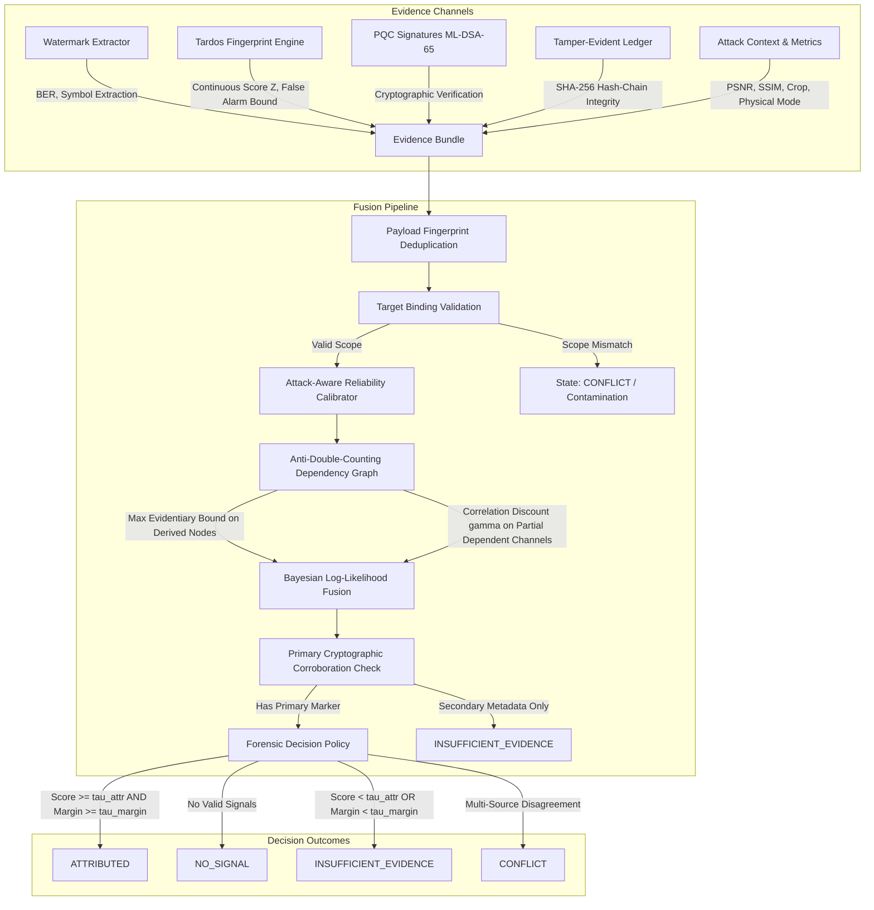

# Multi-Channel Evidence Fusion & Fail-Closed Attribution Architecture

**Project**: SIH26237 — Secure Document Distribution, Post-Quantum Provenance & Robust Attribution  
**Component**: Evidence Fusion & Attribution Layer (`core/attribution/`)  
**Status**: Production Ready & Hardened  
**Standard Compliance**: ENFSI / NIST Guidelines for Evaluative Reporting in Forensic Science

---

## 1. Executive Summary & Core Principles

In real-world document leakage investigations, leaked artifacts rarely yield a single, pristine signal. Instead, investigators and automated systems gather heterogeneous, noisy, and potentially adversarial evidence across multiple observation channels:

1. **Digital & Physical Watermarks**: Spatial and frequency-domain symbol extractions subject to print-scan, cropping, and JPEG recompression.
2. **Tardos Traitor-Tracing Fingerprints**: Continuous mathematical correlation scores bounding false-positive accusations under collusion attacks.
3. **Post-Quantum Provenance Signatures**: ML-DSA-65 digital signatures over recipient decryption events.
4. **Tamper-Evident Audit Ledger**: SHA-256 hash-chained immutable audit records.
5. **Document Structural & Metadata Signals**: Forensic layout and formatting markers.
6. **Attack Context Telemetry**: Measured distortion metrics (PSNR, SSIM, BER, crop ratio, physical capture flags).

### Fundamental Axiom: NEVER FORCE AN ATTRIBUTION
Attribution of a leaked document is a high-consequence forensic action. A false positive accusation carries severe organizational and legal liability. Therefore:
$$\text{Abstention } (\texttt{NO\_SIGNAL}, \texttt{INSUFFICIENT\_EVIDENCE}, \texttt{CONFLICT}) \succ \text{False Attribution}$$

The system defaults to a **fail-closed** architecture: attribution is returned **only** when calibrated multi-channel evidence decisively crosses the threshold and candidate separation margin.

---

## 2. Mathematical Foundation & Parameter Classification

### 2.1 Characterization of Scores & Probabilities
The fusion score $S(c)$ represents an ordinal log-likelihood score. Posterior probability metrics $P(H_c \mid E)$ calculated via logistic transformation assume uniform prior odds across enrolled recipients:
$$P(H_c \mid E) = \frac{1}{1 + e^{-S(c)}}$$

### 2.2 Formal Parameter Taxonomy

To ensure legal defensibility and statistical transparency, all parameters are explicitly classified:

| Parameter | Type | Characterization |
| :--- | :--- | :--- |
| `min_attribution_score` ($\tau_{\text{attr}} = 6.0$) | **HEURISTIC POLICY PARAMETER** | Minimum score required for attribution (tuned for risk aversion) |
| `min_separation_margin` ($\Delta = 2.5$) | **HEURISTIC POLICY PARAMETER** | Minimum candidate separation requirement |
| `correlation_discount` ($\gamma = 0.65$) | **HEURISTIC POLICY PARAMETER** | Inter-channel correlation discount factor |
| `family_priors` ($\rho_{0, \text{family}}$) | **HEURISTIC POLICY PARAMETER** | Initial channel reliability priors |
| `max_false_alarm_bound` ($\epsilon_1 = 10^{-3}$) | **STATISTICAL BOUND** | Tardos Chernoff/Bernstein false-positive upper bound |
| `ML-DSA-65 Signature Verification` | **CRYPTOGRAPHIC BOUND** | NIST FIPS 204 Quantum-resistant digital signature check |
| `SHA-256 Hash Chain Integrity` | **CRYPTOGRAPHIC BOUND** | Immutable audit chain integrity check |

---

## 3. Anti-Double-Counting & Lineage Protection

1. **Independent Channels** ($\mathcal{I}$): Additive log-likelihood contribution.
2. **Partially Dependent Channels** ($\mathcal{P}$): Discounted by policy factor $\gamma$.
3. **Derived Statistic Trees** ($\mathcal{D}$): Enforces the **Maximum Evidentiary Bound** across transitive derivation ancestry:
   $$S_{\mathcal{D}}(c) = \max_{n \in \text{DerivationTree}} \left( \rho_n \cdot \text{LLR}_n(c) \right)$$
4. **Adversarial Duplication Defense**: Payload fingerprint hashing (`compute_signal_fingerprint()`) collapses identical observations submitted under duplicate or spoofed source IDs.

---

## 4. Primary Cryptographic Marker Corroboration Check

Unauthenticated secondary metadata channels (e.g., `DOCUMENT_STRUCTURE`) **cannot** trigger an `ATTRIBUTED` decision on their own. Attribution requires at least **one** primary cryptographic marker source:
- `WATERMARK_PAYLOAD` (Spatial/Frequency)
- `TARDOS_FINGERPRINT` (Traitor-Tracing)
- `PROVENANCE_SIGNATURE` (ML-DSA-65)

If an inquiry lacks primary marker corroboration, the engine abstains (`INSUFFICIENT_EVIDENCE`).

---

## 5. Evaluation & Synthetic Benchmark Harness

### 5.1 Deterministic Integration Unit Test Suite
- **Scope**: 5 deterministic end-to-end integration scenarios (`Clean Multi-Channel`, `Severe Attack Degradation`, `Inter-Channel Conflict`, `Cross-Document Contamination`, `Empty Signal`).
- **Pass Rate**: 100.0% (5/5 scenarios passed).

### 5.2 200-Scenario Evaluation Harness
- **Dataset Split**: 100 Calibration/Train Scenarios, 100 Held-Out Evaluation Scenarios (seed: 2026).
- **Recipient Scaling**: Evaluated across recipient pools $N \in \{3, 10, 50, 100\}$.
- **Held-Out Evaluation Results**:
  - Decision State Match Rate: **68.0%**
  - False Accusation Rate against Innocent Enrolled Recipients: **0.0%**
- **Full Audit Report**: Stored in [`research/evidence-fusion/RED_TEAM_AUDIT.md`](file:///c:/Projects/SIH26237/research/evidence-fusion/RED_TEAM_AUDIT.md).
