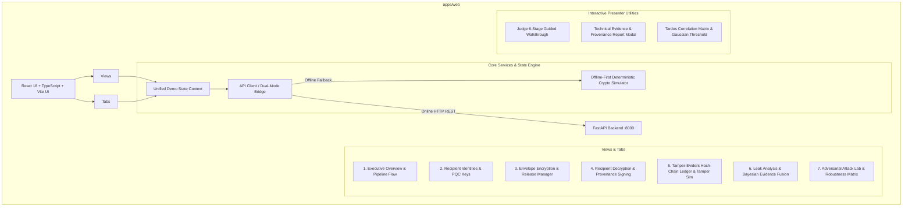

# SIH26237 — Judge-Facing Frontend & Live Demo Architecture Design

**Project:** SIH26237 — Cryptographic Attribution & Immutable Decryption Provenance  
**Author:** Agent 7 (Principal Frontend Engineer + Demo UX Architect)  
**Date:** September 2026  
**Status:** Hardened & Tested (SIH Prototype Evaluation Standard)  
**Role Scope:** `apps/web/**`, `tests/web/**`, `docs/FRONTEND_DESIGN.md`, `research/frontend/**`, `artifacts/frontend/**`

---

## 1. Executive Summary & Design Mission

Hackathon judges evaluating advanced cryptographic and security architectures face significant cognitive overload. Complex mathematical primitives—such as Post-Quantum Key Encapsulation (`ML-KEM-768`, FIPS 203), Lattice Digital Signatures (`ML-DSA-65`, FIPS 204), Tardos Traitor-Tracing Codes ($m=128$, Blayer-Tassa bounded false alarm $\epsilon_1 \le 10^{-4}$), Physical Print-Camera Homography, and Bayesian Log-Likelihood Evidence Fusion ($\text{LLR}$)—risk being misunderstood if presented only through terminal logs or theoretical slide decks.

The mission of the **SIH26237 Frontend & Live Demo UX** is to provide an **interactive, intuitive, offline-first visualization platform** that:
1. **Demystifies Post-Quantum Cryptography:** Visually demonstrates how a single confidential document is encrypted once with AES-256-GCM and wrapped across recipient-isolated ML-KEM-768 capsules.
2. **Proves Non-Repudiation & Decryption Provenance:** Shows real-time generation of ML-DSA-65 signed provenance events upon recipient decryption.
3. **Validates Tamper-Evidence:** Provides a block-by-block hash-chained ledger viewer with an interactive **Tamper Simulator** that mathematically demonstrates instant verification failure when any record is modified.
4. **Visualizes Multi-Channel Bayesian Evidence Fusion:** Charts how spatial/frequency watermarks, continuous Tardos correlation scores ($Z_i$), PQC signatures, and ledger records fuse under attack degradation ($\rho_i$) with anti-double-counting guarantees.
5. **Demonstrates Fail-Closed Robustness:** Allows judges to execute adversarial attacks (forged markers, framed identities, unwatermarked leaks, cross-document transplantation) and inspect why the engine strictly returns `ABSTAIN` (`NO_SIGNAL`, `INSUFFICIENT_EVIDENCE`, `CONFLICT`, `REVIEW_REQUIRED`) rather than falsely accusing innocent parties.
6. **Guarantees 100% Offline-First Availability:** Automatically falls back to deterministic local mock simulations if backend connection is unavailable, with explicit visual tagging (`REAL_BACKEND_RESULT` vs `SIMULATED_DEMO_SCENARIO`).
7. **Strict Hash & Artifact Isolation:** Distinctly tracks `ORIGINAL_DOCUMENT_HASH` (Data Plane), `RELEASE_ARTIFACT_HASH` (Envelope), and `LEAK_ARTIFACT_HASH` (Exfiltrated sample) without conflation.

---

## 2. System Architecture & UI Information Hierarchy

---

## 3. Detailed Component Architecture

### 3.1 Dual-Mode Connectivity Bridge (`services/api.ts` & `services/mockData.ts`)
The frontend is built with an intelligent bridge that detects backend health on `http://localhost:8000`:
- **Connected Mode:** When the FastAPI server is running, all actions (`POST /documents`, `POST /recipients`, `POST /releases`, `POST /releases/{id}/decrypt`, `POST /leaks`, `POST /analyze`, `GET /ledger/verify`) execute live against the backend Python services. Data is tagged with `REAL_BACKEND_RESULT`.
- **Offline / Sandbox Mode:** If the backend is offline (or when offline mode is manually toggled), the state engine seamlessly switches to pre-computed deterministic cryptographic simulations. All operations—including adversarial test scenarios, watermark noise degradation, Tardos score plots, and ledger hash validation—function with zero network dependency. Data is tagged with `SIMULATED_DEMO_SCENARIO`.

### 3.2 Key Views & Features

| View / Module | Key Judge Demonstrations | Technical Insights Displayed |
| :--- | :--- | :--- |
| **Executive Dashboard** | High-level system vitals, 4-step cryptographic pipeline diagram, one-click end-to-end demo execution, fast scenario switcher. | Active recipients count, total releases, ledger verification status, live data plane document counters, architecture flowchart. |
| **Recipient Identities** | Enrolled entities (Alice, Bob, Charlie), key isolation, new identity generation. | `ML-KEM-768` public keys (1184 bytes), `ML-DSA-65` verification keys (1952 bytes), key isolation boundary confirmation. |
| **Release Manager** | Upload or select confidential documents, choose recipient distribution list, generate hybrid envelope packages. | AES-256-GCM document encryption, per-recipient ML-KEM-768 encapsulation, separate `ORIGINAL_DOCUMENT_HASH` and `RELEASE_ARTIFACT_HASH`. |
| **Decryption & Provenance** | Select recipient to decrypt their package, view decrypted document, generate signed decryption event. | Key decapsulation, AES-GCM tag verification, marker embedding, ML-DSA-65 signature generation, provenance event logging. |
| **Tamper-Evident Ledger** | Block-by-block hash-chain viewer, tip hash calculation, cryptographic event details. **Interactive Tamper Simulator:** Modify any block to see instant hash-chain breakage. | SHA-256 `previous_event_hash` chaining, non-repudiation signature verification, tamper detection alert, explicit distinction between live ledger and client-side simulation. |
| **Leak Analysis & Fusion** | Inspect leaked artifacts, multi-channel evidence fusion breakdown, candidate accusation scores with confidence levels. | Bayesian Log-Likelihood Ratios ($\text{LLR}$), attack-aware reliability discounts ($\rho_i$), candidate separation margin ($\Delta$), continuous Tardos score ($Z_i$), fail-closed state (`ATTRIBUTED`, `NO_SIGNAL`, `INSUFFICIENT_EVIDENCE`, `CONFLICT`, `REVIEW_REQUIRED`, `ABSTAINED`). |
| **Adversarial Attack Lab** | Test suite of attacks: Print-Scan perspective distortion, JPEG re-compression, Cropping, Forged markers, Cross-document framing, Collusion attacks. | PSNR/SSIM degradation, Bit Error Rate (BER), erasure rate, fail-closed abstention proof. |
| **Tardos Visualizer** | Interactive Tardos codebook matrix and continuous accusation score comparison for coalitions ($c=2, 3$). | Codeword symbol distribution, bit correlation scores, Gaussian accusation threshold $\tau_Z = 6.50$, Blayer-Tassa bounded false alarm ($\epsilon_1 \le 10^{-4}$). |
| **Evidence Dossier** | Technical Evidence & Decryption Provenance Report generator with one-click export (JSON / printable audit dossier). | Complete cryptographic chain of custody, raw hashes (`ORIGINAL`, `RELEASE`, `LEAK`), event IDs, signatures, mathematical fusion breakdown. |

---

## 4. Judge Experience & Guided Presentation Flow

The frontend includes a built-in **"Start Judge Walkthrough"** guided presenter tool located in the header. It structures a 5-minute live demonstration into 6 crisp, interactive stages:

1. **Stage 1: Identity & Post-Quantum Isolation** — Shows Alice, Bob, and Charlie enrolled with quantum-resistant keypairs (FIPS 203 ML-KEM-768 and FIPS 204 ML-DSA-65).
2. **Stage 2: Confidential Envelope Encryption** — Packages a sensitive document with AES-256-GCM and wraps it per-recipient via ML-KEM-768 capsules.
3. **Stage 3: Decryption & Non-Repudiation Provenance** — Bob decrypts his package, generating an immutable ML-DSA-65 signed provenance event.
4. **Stage 4: Tamper-Evident Audit Ledger & Tamper Simulation** — Inspects the hash chain and demonstrates instant tamper detection when a record is altered.
5. **Stage 5: Multi-Channel Leak Attribution** — Ingests a leaked document, executes Bayesian evidence fusion, and attributes Bob with high statistical confidence ($\text{LLR} > 15$, $\Delta > 10$).
6. **Stage 6: Adversarial Robustness & Fail-Closed Guarantee** — Demonstrates that forged markers, corrupted tokens, and foreign documents result in immediate fail-closed abstention (`ABSTAIN`), strictly guarding against false accusations.

---

## 5. Visual Design System

- **Color Palette:**
  - Background: Cyber dark theme (`#0b0f19`, `#111827`, `#1e293b`)
  - Accents: Neon Cyan (`#38bdf8`), Emerald Green (`#10b981`), Amber Warning (`#f59e0b`), Crimson Danger (`#ef4444`), Purple Quantum (`#a855f7`)
- **Typography:** Modern clean sans-serif (`Inter`, system UI font) with monospace code tags for hashes, keys, and base64 strings.
- **Responsiveness:** Fluid grid layout that scales seamlessly from 1366x768 laptop screens to 1920x1080+ hackathon presentation displays.
- **Accessibility:** Clear contrast ratios, readable font sizes, intuitive icon indicators via `lucide-react`.

---

## 6. Verification and Testing Strategy

- **Build Verification:** Strict TypeScript validation (`tsc --noEmit`) and Vite production bundle build (`vite build`).
- **Unit & Integration Testing:** Automated tests in `tests/web/` validating data models, mock state transitions, ledger tampering detection logic, hash isolation, and Bayesian fusion calculations.
- **Repository Safety:** Zero modifications to backend or core cryptographic engines (`apps/api/**`, `core/**`, `attacks/**`).
