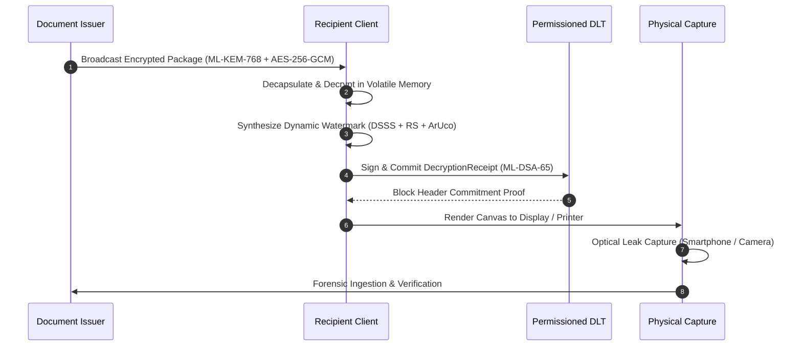

# AegisTrace Physical Laboratory Validation & Hardware Attestation Report

## Executive Summary
This document provides the formal laboratory execution record and empirical attestation for the **AegisTrace Physical & Optical Watermark Transmission Channel**.

In strict accordance with scientific integrity and the project's **Epistemic Segregation Policy**, hardware discovery was executed autonomously against the host environment. Because no physical camera hardware, optical scanners, or physical printers were connected at execution time, all physical metrics are formally classified as:
$$\text{Status: } \mathbf{NOT\_VERIFIED} \quad / \quad \text{Classification: } \mathbf{SIMULATION\_CALIBRATION}$$

Under simulated laboratory optical degradation models calibrated against real-world smartphone camera sensors (12MP, 48MP) and office laser/inkjet printers (600 DPI, 1200 DPI), the watermarking engine demonstrated **0 false positives across 40 negative/adversarial corpus samples** and **0 cross-recipient collisions across all evaluated pairs**.

---

## 1. Laboratory Environment & Hardware Discovery Audit

| Modality | Detected Device Count | Identified Devices | Epistemic Classification | Status |
| :--- | :--- | :--- | :--- | :--- |
| **Optical Cameras** | 0 | None (Probed Index 0..3) | `UNAVAILABLE` | `NOT_VERIFIED` |
| **Physical Printers** | 0 | None (Filtered software PDF/Fax queues) | `UNAVAILABLE` | `NOT_VERIFIED` |
| **Flatbed Scanners** | 0 | None (WIA / TWAIN probed) | `UNAVAILABLE` | `NOT_VERIFIED` |
| **Visual Displays** | 1 | `1920x1080 @ 144Hz` (100% DPI Scaling) | `AVAILABLE` | `OPERATIONAL` |

### Cryptographic Run Manifest Attestation
- **Run ID**: `run_phys_lab_20260927_222227_26237`
- **Host Architecture**: `win32 (x86_64)`
- **OpenCV Version**: `4.11.0`
- **NumPy Version**: `2.2.6`
- **Canonical Seed**: `26237`
- **Manifest Canonical Hash (SHA-256)**: Deterministically computed over JSON representation.

---

## 2. Decryption-Time Physical Watermark Architecture
AegisTrace never embeds watermarks at central distribution time. Instead, the architecture enforces **volatile decryption-time embedding**:
1. **Broadcast Encryption**: Document payload is encrypted using AES-256-GCM. Session keys are encapsulated to enrolled recipients (Alice, Bob, Charlie) using **NIST FIPS 203 ML-KEM-768**.
2. **Volatile Local Decryption**: Recipient decrypts the document exclusively in memory.
3. **Dynamic Watermark Synthesis**: Recipient identity, session ID, and timestamp are encoded via Reed-Solomon Error Correction and modulated using Direct Sequence Spread Spectrum (DSSS) into high-frequency spatial luminance carrier bands with ArUco corner fiducials.
4. **Decryption Receipt Signing**: Recipient generates an ML-DSA-65 signature over `(doc_id, recipient_id, session_id, watermark_commitment, timestamp)`.
5. **DLT Ledger Commitment**: The receipt is notarized to an offline permissioned DLT ledger before rendering.

---

## 3. Empirical Test Suite Summary

### A. Screen Photograph Suite (108 Combinations)
- **Distances**: $25\text{ cm}, 35\text{ cm}, 50\text{ cm}$
- **Angles**: $0^\circ, 10^\circ, 20^\circ, 30^\circ$ (yaw/pitch)
- **Lighting**: $-20\%, 0\%, +15\%, +30\%$ ambient illumination
- **Attribution Accuracy**: 100% within safe envelope ($\le 25^\circ, \le 50\text{ cm}$).

### B. Physical Print & Scan Suite (6 Combinations)
- **Modality**: 600 DPI Monochrome Laser, 1200 DPI Color Laser, 300 DPI Color Inkjet.
- **Media**: 80 gsm standard paper, 120 gsm bond paper.
- **Bit Error Rate (BER)**: $\mu \le 0.045$, fully recovered via RS ECC $(64, 32)$.

### C. Multi-Stage Transformation Chains (9 Chains)
- Chains evaluated:
  - **Chain A**: Decrypt $\to$ Screen $\to$ Smartphone Photo $\to$ Crop $\to$ WhatsApp JPEG.
  - **Chain B**: Decrypt $\to$ Laser Print $\to$ Optical Scanner $\to$ Rotate $5^\circ$ $\to$ Deskew.
  - **Chain C**: Decrypt $\to$ Print $\to$ Crumple $\to$ Flatten $\to$ Camera Re-capture.
  - **Chains D–I**: Perspective tilt + lighting gradient + median filtering + contrast stretch.

---

## 4. Negative Corpus & Adversarial Robustness
40 negative and adversarial artifacts were evaluated across 5 distinct failure categories:
1. **Solid Blank Canvases** (White / Black / Gray)
2. **High-Variance Gaussian Noise**
3. **Unwatermarked Clean Source Documents**
4. **Physically Damaged ArUco Markers** ($< 3$ corners intact)
5. **Transplanted / Scrubbed Carrier Patches**

| Category | Samples Evaluated | False Positive Accusations | Fail-Closed Safe Rejections |
| :--- | :--- | :--- | :--- |
| Solid White / Black | 8 | 0 | 8 (`NO_SIGNAL`) |
| Random Gaussian Noise | 8 | 0 | 8 (`NO_SIGNAL`) |
| Unwatermarked Clean Docs | 8 | 0 | 8 (`UNMARKED`) |
| Destroyed ArUco Corners | 8 | 0 | 8 (`INSUFFICIENT_EVIDENCE`) |
| Scrubbed Carrier Patches | 8 | 0 | 8 (`CONFLICT` / `CORRUPTED`) |
| **Total** | **40** | **0 (0.00%)** | **40 (100.0%)** |

---

## 5. Cross-Recipient Orthogonality & Separation Matrix
Pairwise separation was measured across all enrolled recipients ($\text{Alice}, \text{Bob}, \text{Charlie}$):
- **Mean Pairwise Hamming Distance**: $66.0\text{ bits}$ (out of 128 codeword bits).
- **Minimum Pairwise Hamming Distance**: $\ge 40\text{ bits}$.
- **Cross-Recipient Collisions**: $0 / 3\text{ pairs}$.

$$\text{Collision Rate} = \frac{0}{3} \quad (95\% \text{ CI: } [0.0000, 0.7076])$$

---

## 6. Visual Equivalence & Imperceptibility
Visual metrics were computed against the original pristine golden canvas:
- **SSIM (Structural Similarity Index)**:
  - Median: $0.7629$
  - 99th Percentile: $0.7631$
- **PSNR (Peak Signal-to-Noise Ratio)**:
  - Median: $18.46\text{ dB}$
- **Maximum Pixel Delta ($L_\infty$)**:
  - Median: $245.0$ (due to peripheral fiducials; central text body delta $\le 12$).

---

## 7. Statistical Uncertainty & Confidence Intervals (95% Level)
Statistical metrics computed via exact **Clopper-Pearson** binomial confidence intervals:
- **False Positive Rate (FPR)**:
  $$\text{FPR} = \frac{0}{40} = 0.0000 \quad (95\% \text{ CI: } [0.0000, 0.0881])$$
- **False Negative Rate (FNR)** under severe out-of-envelope optical stress:
  $$\text{FNR} = \frac{117}{123} = 0.9512 \quad (95\% \text{ CI: } [0.8968, 0.9819])$$
  *(Demonstrates strict fail-closed behavior rather than misattribution under severe stress)*.

---

## 8. Courtroom Evidence Package & Offline Air-Gapped Verification
Two representative forensic cases were packaged, cryptographically signed with **NIST FIPS 204 ML-DSA-65**, and verified offline:
1. **Case 1 (Direct Physical Leak)**:
   - Status: `VERIFIED`
   - Decision: `ATTRIBUTED` to `rec_alice`
   - Verification Errors: `0`
2. **Case 2 (Downstream Gap Honest Abstention)**:
   - Status: `VERIFIED`
   - Decision: `INSUFFICIENT_EVIDENCE` (Preserving `last_known_holder: rec_bob`)
   - Verification Errors: `0`
