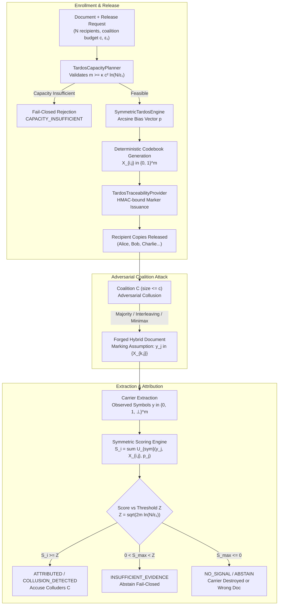

# SIH26237 — Collusion-Resistant Tardos Traceability Architecture & Design

**Project:** SIH26237 — Cryptographic Attribution & Immutable Decryption Provenance  
**Author:** Agent 2 (Principal Applied Cryptography + Fingerprinting Research Engineer)  
**Date:** September 2026  
**Status:** Approved & Implemented  

---

## 1. Executive Summary & Purpose

When confidential documents are distributed to multiple authorized recipients, dishonest recipients may form a **coalition** $C \subseteq \{1, \dots, N\}$ of size $|C| \le c$. By comparing their individually released copies, the colluders identify differences in recipient-specific carrier marks and synthesize a hybrid document to conceal their identities or frame an innocent user.

While v0.1 of SIH26237 provided authenticated single-recipient markers, it was not collusion-resistant: two colluders comparing markers could easily isolate the recipient ID.

To solve this, SIH26237 integrates the **Symbol-Symmetric Tardos Fingerprinting Code** (Škorić et al. 2008; Blayer & Tassa 2008) into `core/traceability/`. This provides:
1. **Mathematical Collusion Resistance**: Proven security against coalitions of size up to $c$ under the Marking Assumption.
2. **Guaranteed Bounded False Accusations**: Innocent recipient false-positive probability strictly bounded by $\mathbb{P}(S_{\text{innocent}} \ge Z) \le \epsilon_1$.
3. **Zero Innocent Score Expectation**: $\mathbb{E}[S_{\text{innocent}}] = 0$ across *any* collusion strategy (majority, interleaving, random symbol, minimax).
4. **Pre-Flight Capacity Planning**: Strict fail-closed validation (`CAPACITY_INSUFFICIENT`) when available carrier capacity is below theoretical lower bounds.
5. **Fail-Closed Evidence Abstention**: Returns `NO_SIGNAL` or `INSUFFICIENT_EVIDENCE` when signals do not cross threshold $Z$, preventing false blame.

---

## 2. Architecture & Pipeline



---

## 3. Mathematical Formulation

### 3.1 Code Length & Capacity Bounds (Blayer & Tassa 2008)

The minimum code length $m$ required to resist coalitions of size up to $c$ among $N$ recipients with false-accusation probability bounded by $\epsilon_1$ is:
$$m \ge \lceil \kappa \cdot c^2 \cdot \ln(N / \epsilon_1) \rceil$$

Where:
- $\kappa = 100.0$: Original Tardos (2003) conservative parameter.
- $\kappa = 20.0$: Optimized Blayer-Tassa / Škorić parameter (used in SIH26237).
- $\kappa_{\min} = \frac{\pi^2}{2} \approx 4.93$: Information-theoretic asymptotic lower bound.

### 3.2 Continuous Arcsine Bias Sampling

To eliminate collusion advantage, each carrier position $j \in \{0, \dots, m-1\}$ is assigned a secret bias $p_j \in [t, 1-t]$ drawn from the continuous arcsine probability density:
$$f(p) = \frac{1}{2 \arcsin(1 - 2t)} \cdot \frac{1}{\sqrt{p(1-p)}}$$
with cutoff parameter $t = \frac{1}{300c}$.

In SIH26237, $p_j$ is sampled deterministically using a release-specific seed derived via HMAC-SHA256:
$$p_j = \sin^2\left(t' + r_j \left(\frac{\pi}{2} - 2t'\right)\right)$$
where $t' = \arcsin\sqrt{t}$, and $r_j \in [0, 1)$ is derived from `HMAC(release_seed, "bias:{j}:{c}")`.

### 3.3 Codeword Assignment

Each recipient $i$ receives a binary codeword $X_{i} = (X_{i,0}, \dots, X_{i,m-1}) \in \{0, 1\}^m$:
$$\mathbb{P}(X_{i,j} = 1) = p_j, \quad \mathbb{P}(X_{i,j} = 0) = 1 - p_j$$
Generated deterministically via `HMAC(release_seed, "code:{recipient_id}:{j}")`.

### 3.4 Symmetric Scoring Function (Škorić et al. 2008)

For observed symbol $y_j \in \{0, 1, -1\}$ (where $-1$ represents an erasure $\bot$), the score contribution for recipient $i$'s bit $X_{i,j}$ is:
$$U_{\text{sym}}(y_j, X_{i,j}, p_j) = \begin{cases}
+\sqrt{\frac{1-p_j}{p_j}} & \text{if } y_j = 1 \text{ and } X_{i,j} = 1 \\
-\sqrt{\frac{p_j}{1-p_j}} & \text{if } y_j = 1 \text{ and } X_{i,j} = 0 \\
-\sqrt{\frac{1-p_j}{p_j}} & \text{if } y_j = 0 \text{ and } X_{i,j} = 1 \\
+\sqrt{\frac{p_j}{1-p_j}} & \text{if } y_j = 0 \text{ and } X_{i,j} = 0 \\
0.0 & \text{if } y_j = -1 \text{ (erasure / carrier loss)}
\end{cases}$$

Total recipient score:
$$S_i = \sum_{j=0}^{m-1} U_{\text{sym}}(y_j, X_{i,j}, p_j)$$

### 3.5 The Zero Expectation Theorem

For any innocent recipient $i \notin C$, regardless of the colluders' strategy $y_j$:
$$\mathbb{E}[U_{\text{sym}}(1, X_{i,j}, p_j)] = p_j \sqrt{\frac{1-p_j}{p_j}} - (1-p_j) \sqrt{\frac{p_j}{1-p_j}} = \sqrt{p_j(1-p_j)} - \sqrt{p_j(1-p_j)} = 0$$
$$\mathbb{E}[U_{\text{sym}}(0, X_{i,j}, p_j)] = -p_j \sqrt{\frac{1-p_j}{p_j}} + (1-p_j) \sqrt{\frac{p_j}{1-p_j}} = 0$$
$$\implies \mathbb{E}[S_i] = 0 \quad \forall i \notin C$$

Conversely, for colluders $k \in C$, the sum of expected scores satisfies:
$$\sum_{k \in C} \mathbb{E}[S_k] \ge \frac{2}{\pi} m$$

### 3.6 Threshold & Chernoff Accusation Bound

The accusation threshold $Z$ is computed as:
$$Z = \sqrt{2 \cdot m \cdot \ln(N / \epsilon_1)}$$

By the Chernoff/Bernstein bound:
$$\mathbb{P}(S_i \ge Z) \le \frac{\epsilon_1}{N} \quad \forall i \notin C$$
Applying the union bound across all $N$ recipients guarantees:
$$\mathbb{P}(\exists i \notin C : S_i \ge Z) \le \epsilon_1$$

---

## 4. Collusion Attacks under the Marking Assumption

The Marking Assumption states that if all colluders $k \in C$ possess the same symbol $X_{k,j} = b$ at position $j$, they cannot detect that a mark exists and are forced to emit $y_j = b$. When they differ, they can select any symbol.

The implementation in `core/traceability/collusion.py` models 6 adversarial attacks:
1. **Majority Voting (`majority_collusion`)**: Colluders output the symbol held by the majority.
2. **Interleaving (`interleaving_collusion`)**: At each index $j$, colluders pick one random member's bit.
3. **Random Symbol (`random_symbol_collusion`)**: Where colluders differ, they flip an unbiased coin $\mathbb{P}(y_j = 1) = 0.5$.
4. **Minimax Strategy (`minimax_collusion`)**: Colluders pick $y_j$ minimizing the maximum expected score increase among members.
5. **Extreme Zero/One Biasing (`all_zeros_collusion`, `all_ones_collusion`)**: Colluders force output to 0 (or 1) wherever undetectable marks permit.
6. **Noisy/Erasure Channel (`apply_noise_and_erasure`)**: Simulates bit flips ($P_e$) and symbol deletions ($P_{erasure} = -1$).

---

## 5. Comparison: Prototype vs. Tardos Provider

| Dimension | PrototypeTraceabilityProvider (v0.1) | TardosTraceabilityProvider (v1.0) |
| :--- | :--- | :--- |
| **Marking Type** | Direct identity token (HMAC binding) | Probabilistic fingerprint codeword $X_i \in \{0, 1\}^m$ |
| **Collusion Resistance** | **None** ($c = 1$ only; 2 colluders can compare and strip) | **Proven resistant** against $|C| \le c$ under Marking Assumption |
| **Capacity Enforcement** | None (fixed metadata payload) | **Pre-flight verification** via `TardosCapacityPlanner` |
| **False Accusation Guarantee** | Binary token match (heuristic) | **Rigorous Chernoff bound** ($\le \epsilon_1$) |
| **Evidence Extraction** | Full marker deserialization | Discrete carrier symbols scored against codebook |
| **Innocent User Expectation** | N/A | $\mathbb{E}[S_i] = 0.0$ analytically proven |
| **Degraded Evidence Handling** | Token mismatch $\to$ fail | Soft erasures ($0.0$) + fail-closed abstention |
| **Use Case** | Single-recipient releases, internal testing | Multi-recipient releases with adversarial collusion threat |

---

## 6. Implementation Components

```
core/traceability/
├── planner.py     -> TardosCapacityPlanner (feasibility, deficits, parameter scaling)
├── tardos.py      -> SymmetricTardosEngine (arcsin biases, deterministic codebook, symmetric scoring, accusation)
├── collusion.py   -> Collusion attack simulation suite & Marking Assumption validator
└── provider.py    -> TardosTraceabilityProvider (embed, extract, verify, analyze_collusion_leak)
```

---

## 7. Security Boundaries & Realistic Non-Claims

> [!IMPORTANT]
> **What This Traitor-Tracing Engine Guarantees:**
> - Under the Marking Assumption, for coalitions $|C| \le c$, false positive accusations against any innocent user are bounded by $\epsilon_1$.
> - With high probability ($1 - \epsilon_2$), at least one guilty coalition member is identified with score exceeding $Z$.
> - Deterministic codebook generation eliminates large key database requirements while remaining verifiable.

> [!WARNING]
> **What This Engine DOES NOT Guarantee (Explicit Non-Claims):**
> - Tardos codes are discrete mathematical sequences, **not physical watermarks**. They require a discrete embedding carrier (e.g., PDF stream modulation, font glyph spacing, transform coefficients).
> - If an adversary alters symbols outside the Marking Assumption (e.g. massive lossy compression or OCR print-scan destroying $> 50\%$ of carrier bits), the score drops below threshold $Z$ and the engine **abstains fail-closed** (`INSUFFICIENT_EVIDENCE` or `NO_SIGNAL`), refusing to guess.

---

## 8. Key Epochs, Rotation & Historical Analysis

To ensure long-term operational resilience and legal defensibility over multi-year lifecycles, SIH26237 implements an explicit **Key-Epoch and Rotation Architecture** via `TraceabilityKeystore`.

### 8.1 Key-Epoch Lifecycle
1. **Active Epoch**: The currently deployed secret key $K_{\text{active}}$ used to issue new recipient marks and codebooks.
2. **Key Identifier (Key Epoch Tag)**:
   $$\text{KeyID} = \text{"tkey\_"} \parallel \text{Hex}(\text{SHA-256}(K))[:8]$$
   - Included in marker metadata to enable direct $\mathcal{O}(1)$ historical key selection.
   - Non-leaking: reveals zero bits of the 256-bit secret key $K$.
3. **Historical Registry**: Historical secret keys from previous rotation epochs ($K_1, K_2, \dots$) are indexed by their `key_id` in `TraceabilityKeystore`.
4. **Retirement & Cold Archival**: Old keys transition to immutable read-only historical registry storage.

### 8.2 Historical Forensic Analysis Workflow
When a leaked document is investigated years after release:
1. `extract_marker()` extracts the metadata payload and reads `metadata["key_id"]`.
2. `TraceabilityKeystore.get_key_by_id(key_id)` performs direct lookup for the matching historical key.
3. If the required key is found, the engine reconstructs the exact codebook and verifies the marker (`key_epoch_status = "HISTORICAL"`).
4. If the required key is absent, the engine **fails closed** (`key_epoch_status = "KEY_EPOCH_UNAVAILABLE"`), refusing to guess or silently evaluate against the active key.

### 8.3 Failure Modes & Defensive Invariants
- **Wrong Key / Mismatched Epoch**: Returns `is_valid = False` and `confidence = 0.0` with `KEY_EPOCH_MISMATCH`.
- **Unavailable Epoch**: Returns `KEY_EPOCH_UNAVAILABLE` fail-closed.
- **Cross-Document / Cross-Release / Cross-Recipient Replay**: Cryptographic HMAC binding rejects all out-of-context replays with zero cross-attribution leakage.
- **No In-Source Secrets**: Master keys must be injected via runtime arguments, environment variables (`SIH26237_TRACEABILITY_MASTER_SECRET`), or secure keystores. In `SIH26237_ENV=production`, missing secrets strictly raise `MissingSecretError`.
