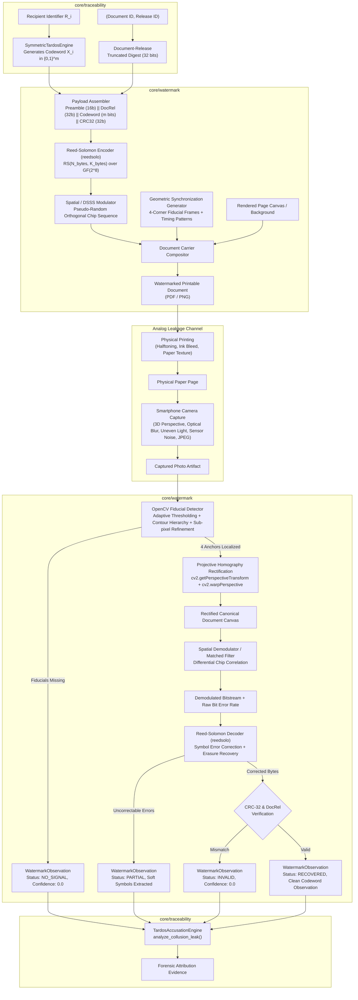

# SIH26237 — Physical / Print-Camera Watermark Architecture & Design

**Project:** SIH26237 — Cryptographic Attribution & Immutable Decryption Provenance  
**Author:** Agent 4 (Principal Digital Watermarking + Robustness Research Engineer)  
**Date:** September 2026  
**Status:** Approved & Implemented  
**Strategy:** REUSE-FIRST  

---

## 1. Executive Summary & Purpose

Digital protection mechanisms (such as access control lists, PDF encryption passwords, and DRM viewing restrictions) only protect documents while they remain in the digital memory domain. The moment an authorized recipient renders a document onto a physical screen or paper sheet, an adversary can bypass digital controls using an optical analog hole:
$$\text{Document PDF} \longrightarrow \text{Physical Print} \longrightarrow \text{Paper Sheet} \longrightarrow \text{Smartphone Camera} \longrightarrow \text{Leaked Photograph}$$

The primary objective of the SIH26237 Watermark Workstream is to establish a **practical physical leakage channel** capable of surviving print-scan-camera capture, without reinventing watermarking algorithms or duplicating cryptographic identity mechanisms.

### Core Architectural Principles:
1. **Reuse First:** Leverage mature, tested, permissively licensed components (`reedsolo` for Reed-Solomon ECC, OpenCV for geometric synchronization and sub-pixel homography, NumPy for vectorized carrier modulation).
2. **Strict Separation of Concerns:**
   - **Tardos Layer (`core/traceability/`):** Manages traitor tracing mathematics, codebooks, coalition collusion resistance, and accusation scoring.
   - **Watermark Layer (`core/watermark/`):** Operates as a physical transport carrier responsible for embedding and recovering abstract symbol observations $\{0, 1, \bot\}^m$ through distortion channels.
3. **Decoupled Payload Binding:** The watermark does **not** carry recipient identifiers in plaintext. It carries abstract Tardos codeword symbols bound cryptographically to the specific document and release via a truncated integrity digest.
4. **Fail-Closed Abstention:** Badly degraded, corrupted, unwatermarked, or foreign documents return explicit `NO_SIGNAL` or `INVALID` observations rather than generating misleading false-positive accusations.

---

## 2. System Architecture & Information Flow



---

## 3. Payload Structuring & Error-Correction Design

### 3.1 Payload Field Layout
The watermark payload is structured into four functional fields:

| Field | Size | Encoding / Type | Purpose |
| :--- | :--- | :--- | :--- |
| **`PREAMBLE`** | 16 bits | Barker-13 sequence + 3-bit phase (`0b1111100110101110`) | Frame synchronization, correlation peak detection, and 180° rotation ambiguity resolution. |
| **`DOC_REL_ID`** | 32 bits | Truncated SHA-256 of `f"{doc_id}:{release_id}"` | Document-release cryptographic binding; detects payload replay and transplantation to foreign documents. |
| **`CODEWORD`** | $m$ bits | Binary symbols $\{0, 1\}^m$ (e.g., $m=128$) | Abstract Tardos fingerprint symbols. |
| **`CRC32`** | 32 bits | Standard IEEE 802.3 32-bit Cyclic Redundancy Check | Hardware/software verification of decoded payload integrity prior to accusation. |

Total raw payload length:
$$K_{\text{raw}} = 16 + 32 + m + 32 = (80 + m) \text{ bits}$$
For standard $m = 128$ bits (capable of resisting $c=2$ or $c=3$ coalitions in Tardos), $K_{\text{raw}} = 208$ bits ($26$ bytes).

### 3.2 Reed-Solomon Error Correction Codec (`reedsolo`)
Physical print-camera transmission suffers from burst errors caused by paper creases, ink smudge, specular reflection hot spots, and camera defocus. Reed-Solomon codes over $GF(2^8)$ are ideally suited for this channel because any number of bit errors within an 8-bit symbol count as only a single symbol error.

Using the mature `reedsolo` library, we configure $2t$ parity bytes (default $2t = 16$ bytes, $t=8$ symbol error capability):
$$N_{\text{encoded}} = K_{\text{bytes}} + 2t = 26 + 16 = 42 \text{ bytes (336 bits)}$$
- **Error Correction Capability:** Corrects up to 8 completely corrupted bytes anywhere in the payload (equivalent to up to 64 burst bit errors), or up to 16 localized erasures.
- **Payload Interleaving:** To prevent localized paper damage from wiping out contiguous codeword bytes, bits are interleaved across spatial carrier tiles using a deterministic pseudo-random permutation seed.

---

## 4. Geometric Synchronization Subsystem

### 4.1 The Physical Synchronization Challenge
Under a smartphone camera capture, the document image undergoes an arbitrary 8-degree-of-freedom projective planar homography:
$$\begin{bmatrix} x' \\ y' \\ 1 \end{bmatrix} \sim H \begin{bmatrix} x \\ y \\ 1 \end{bmatrix} = \begin{bmatrix} h_{11} & h_{12} & h_{13} \\ h_{21} & h_{22} & h_{23} \\ h_{31} & h_{32} & h_{33} \end{bmatrix} \begin{bmatrix} x \\ y \\ 1 \end{bmatrix}$$

Without geometric synchronization, spatial and frequency watermarks desynchronize when rotated by as little as $0.5^\circ$ or tilted by $5^\circ$.

### 4.2 Multi-Scale Fiducial Anchor System
Our synchronization subsystem (`core/watermark/sync.py`) implements a robust 4-corner fiducial alignment architecture:
1. **Fiducial Geometry:**
   - Placed at the four canonical outer corners of the printable canvas:
     - Top-Left (TL): Asymmetric triple-ring concentric marker (distinctive orientation anchor).
     - Top-Right (TR): Double-ring concentric marker.
     - Bottom-Right (BR): Single-ring solid disk marker.
     - Bottom-Left (BL): Crosshair concentric ring marker.
2. **Detection Pipeline (`cv2`):**
   - **Adaptive Thresholding:** `cv2.adaptiveThreshold` handles severe lighting gradients and directional shadows.
   - **Contour Filtering:** Identifies nested concentric contours matching aspect ratio ($\approx 1.0$), solidity, and area ratios.
   - **Sub-Pixel Corner Refinement:** `cv2.cornerSubPix` refines marker centroids with sub-pixel precision ($< 0.2$ pixels error).
   - **Homography Estimation:** `cv2.getPerspectiveTransform` computes the exact $3 \times 3$ rectification matrix.
   - **Bilinear Warp:** `cv2.warpPerspective` warps the camera image back into the canonical canonical grid $(W_c, H_c)$ (e.g., $1024 \times 1325$ at 150 DPI).
3. **Four-Way Orientation Disambiguation:**
   - If the user holds the phone upside down ($180^\circ$) or in landscape mode ($90^\circ$ / $270^\circ$), the topological asymmetry of the 4 unique corner fiducials combined with the Barker-13 sync preamble automatically resolves the canonical orientation without user intervention.

---

## 5. Document Carrier Strategies

We support three carrier strategies tailored to different organizational document aesthetics:

### Strategy A: Rendered Page Canvas Carrier (Full Page)
- **Carrier Substrate:** Full rasterized page canvas (text, tables, headers).
- **Modulation:** Direct Sequence Spread Spectrum (DSSS) differential spatial modulation. The encoded bitstream is expanded using a pseudo-random bipolar chip sequence $C_k \in \{-1, +1\}^L$ (chip length $L = 64$ or $128$).
- **Carrier Blending:** Chips are modulated into the luminance channel ($Y$ in YUV or grayscale) with a perceptually tuned gain factor $\alpha \approx 2.5\text{--}4.0$ (invisible on paper, easily recoverable by matched filter).
- **Capacity:** $> 512$ bits per page.

### Strategy B: Designated Graphical Region-of-Interest (Seal / Header / Banner)
- **Carrier Substrate:** Embedded into designated organizational elements (e.g., official department seal, security banner, or authorization crest).
- **Advantage:** Completely isolates the text body; zero modification to document textual typography.
- **Vulnerability:** If the leaker crops the photograph to show only the body paragraphs, the carrier is excised.

### Strategy C: Micro-Pattern Document Background Texture (Guilloche / Security Background)
- **Carrier Substrate:** Document-wide faint security guilloche pattern or micro-dot lattice across the page background (analogous to banknote anti-counterfeiting patterns).
- **Spatial Tiling:** The payload is spatially tiled across multiple $128 \times 128$ pixel blocks across the page.
- **Advantage:** Highly resilient to partial cropping (e.g., photographing only the top half of the page).

---

## 6. Decoder Observation & Fail-Closed Abstention Interface

The decoder interface (`core/watermark/base.py`) returns a structured `WatermarkObservation` object:

```python
class WatermarkStatus(str, Enum):
    RECOVERED = "RECOVERED"      # Sync OK, ECC OK, CRC verified, complete codeword
    PARTIAL = "PARTIAL"          # Sync OK, uncorrectable ECC, soft symbols available
    NO_SIGNAL = "NO_SIGNAL"      # Fiducials missing, image blank, or carrier destroyed
    INVALID = "INVALID"          # CRC error, corrupted header, or doc binding mismatch

class WatermarkObservation(BaseModel):
    status: WatermarkStatus
    is_valid: bool
    confidence: float            # 0.0 to 1.0 (derived from sync error and BER)
    raw_ber: float               # Pre-ECC bit error rate (0.0 to 1.0)
    symbol_count: int            # Number of decoded symbols
    document_release_id: Optional[str] = None
    observed_symbols: List[Optional[int]] = Field(default_factory=list)  # {0, 1, None}
    telemetry: Dict[str, Any] = Field(default_factory=dict)
```

### Abstention Rules:
1. If fiducial detection fails $\longrightarrow$ Return `status=NO_SIGNAL, confidence=0.0`.
2. If CRC fails and uncorrectable errors exceed RS budget $\longrightarrow$ Return `status=PARTIAL` with raw soft symbols, allowing Tardos to evaluate if any partial correlation exists, but never declaring a confident match.
3. If `DOC_REL_ID` does not match the expected document $\longrightarrow$ Return `status=INVALID` (transplantation / foreign document detection).

---

## 7. Security & Threat Analysis

| Threat / Attack | Mechanism | Mitigation in SIH26237 Architecture |
| :--- | :--- | :--- |
| **Payload Transplantation** | Adversary cuts watermarked footer from Document A and pastes it into Document B. | **Cryptographic Document-Release Binding:** Truncated hash of `(document_id, release_id)` is embedded inside the ECC-signed payload. Decoder verifies match against the queried document. |
| **Watermark Removal (Scrubbing)** | Adversary applies median filtering, heavy blur, or thresholding to remove watermark. | **Spread Spectrum Energy Distribution:** DSSS spreads watermark energy across low- and mid-band spatial frequencies. Scrubbing watermark to unrecoverable levels renders text unreadable. |
| **Fiducial Erasure / Cropping** | Adversary crops out the 4 corner fiducial marks. | **Spatial Redundancy & Secondary Anchors:** Tiled background patterns and document margin anchors allow partial recovery. When fiducials are erased, decoder safely outputs `NO_SIGNAL` (fail-closed). |
| **Collusion / Averaging** | Multiple recipients average their copies together to cancel out watermarks. | **Tardos Tracing Codebook:** Handled mathematically by the Tardos layer (`core/traceability/`), which is specifically designed to identify colluders under the Marking Assumption. |
| **False Accusation Framing** | Adversary generates random noise to frame an innocent colleague. | **Dual Barrier:** Reed-Solomon ECC + CRC-32 rejects random noise as `NO_SIGNAL`, and Tardos mathematical threshold guarantees innocent accusation probability $\le \epsilon_1$. |
