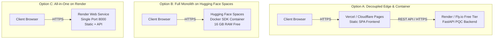

# $0/Month Zero-Cost Free Hosting Architecture

> **Platform Scope**: Web Workstation & API.  
> **Desktop Status**: Standalone native desktop distributions are **DEFERRED TO FUTURE WORKSTREAM**. All product capabilities are designed for zero-cost web deployment.

---

## 1. Zero-Cost Architectural Overview

AegisTrace can be hosted publicly at **$0/month indefinitely** using free tiers of modern container and edge hosting providers.



---

## 2. Option A: Split Deployment (Vercel / Cloudflare Pages + Render)

### 2.1 Backend Deployment on Render (Free Tier)
1. Fork or push this repository to GitHub.
2. Log in to [Render.com](https://render.com).
3. Click **New +** -> **Web Service**.
4. Connect your GitHub repository.
5. Select **Docker** environment.
6. Set the following Environment Variables in the Render dashboard:
   ```env
   SIH_HOST=0.0.0.0
   SIH_PORT=8000
   DEMO_AUTH_ENABLED=true
   DEMO_USERNAME=admin
   DEMO_PASSWORD=admin
   CORS_ORIGINS=*
   ```
7. Click **Create Web Service**. Render builds the multi-stage Dockerfile and deploys to `https://<your-service>.onrender.com`.

### 2.2 Frontend Deployment on Cloudflare Pages (Free Tier)
1. Log in to [Cloudflare Dashboard](https://dash.cloudflare.com) -> **Workers & Pages**.
2. Select **Create application** -> **Pages** -> **Connect to Git**.
3. Choose repository:
   - **Root directory**: `apps/web`
   - **Build command**: `npm run build`
   - **Build output directory**: `dist`
4. Set Environment Variables:
   ```env
   VITE_API_URL=https://<your-service>.onrender.com
   ```
5. Click **Save and Deploy**. Cloudflare provisions edge SSL and global CDN distribution.

---

## 3. Option B: Full Container on Hugging Face Spaces (Recommended for Demos)

Hugging Face Spaces provides **2 vCPU, 16 GB RAM** completely free using the Docker SDK:

1. Create a free account at [huggingface.co](https://huggingface.co).
2. Click **New Space** -> Choose **Docker** as Space SDK -> **Blank**.
3. Clone the space repository locally or push your files:
   ```bash
   git remote add space https://huggingface.co/spaces/<username>/<space-name>
   git push space main
   ```
4. In Space Settings -> **Variables and secrets**, add:
   ```env
   DEMO_AUTH_ENABLED=true
   DEMO_USERNAME=admin
   DEMO_PASSWORD=admin
   ```
5. Hugging Face automatically detects the root `Dockerfile`, builds the web frontend and Python backend, and exposes port 8000 with a public HTTPS link!

---

## 4. Option C: Monolithic Container on Render Free Tier

Because the root `Dockerfile` bundles both the frontend and backend together:
1. Create a **New Web Service** on Render with Docker runtime.
2. Select root directory.
3. Configure `DEMO_AUTH_ENABLED=true`.
4. Render exposes port 8000. Navigating to `https://<service-name>.onrender.com` opens the AegisTrace Web Workstation directly, with no need for separate frontend hosting.

---

## 5. Cold Start Mitigation (Free Tier Keepalive)

Free tier instances on Render or Fly.io sleep after 15 minutes of inactivity. When a judge accesses the application, a cold start may take 20–30 seconds.

### Mitigation: Uptime Kuma or Cron Keepalive
Configure a free ping monitor (e.g., [Cron-Job.org](https://cron-job.org) or [UptimeRobot.com](https://uptimerobot.com)):
- **Target URL**: `https://<your-service>.onrender.com/ready`
- **Interval**: Every 10 minutes
- **Method**: `GET`
- **Expected Status**: `200 OK`

This keeps the instance warm continuously during hackathon judging periods at zero financial cost.

---

## 6. Custom Domain & SSL/TLS Setup

Both Cloudflare Pages and Render support free custom domains with automatic Let's Encrypt certificates:
1. Add CNAME record at your DNS provider:
   ```
   CNAME trace.yourdomain.org -> <your-service>.onrender.com
   ```
2. In the provider dashboard, add `trace.yourdomain.org`. SSL verification and certificate issuance complete within 5 minutes.
