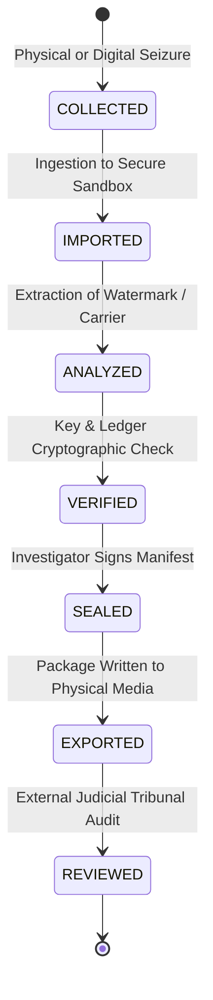

# AegisTrace Cryptographic Chain of Custody Specification (v1.0)
**Standard:** ISO/IEC 27037 Digital Evidence Handling | Federal Rules of Evidence Rule 902(13)/(14)  
**Hash Construction:** Recursive Recursive SHA-256 State Chaining  
**Author:** AegisTrace Cryptographic Architecture Group  

---

## 1. Regulatory & Evidentiary Mandate

Under international evidence standards (such as **ISO/IEC 27037** and US **FRE Rule 902(14)** *Records Generated by an Electronic Process or System*), digital evidence is only admissible in court if the proponent demonstrates an unbroken, tamper-evident record of custody from seizure to analysis.

In conventional systems, chains of custody are paper logs or mutable SQL database records, susceptible to post-hoc alteration by system administrators.

AegisTrace replaces paper logs and mutable database tables with an **Append-Only Cryptographic Chain of Custody** bound into every evidence package.

---

## 2. The 7 Formal Custody Lifecycle Actions

Every interaction with an evidence artifact or package must be categorized as one of seven atomic actions:



1. **`COLLECTED`**: Initial seizure or acquisition of the leaked artifact (e.g., physical document recovery, dark web post scraping).
2. **`IMPORTED`**: Transfer of raw artifact into the air-gapped forensic laboratory.
3. **`ANALYZED`**: Execution of signal extraction (spatial DSSS carrier detection, Reed-Solomon decoding).
4. **`VERIFIED`**: Cryptographic replay of recipient ML-DSA-65 signatures and DLT ledger block consensus.
5. **`SEALED`**: Package builder compiles Merkle commitments and signs the manifest with examiner's private key.
6. **`EXPORTED`**: Package serialized to ZIP or directory for external handover.
7. **`REVIEWED`**: Independent magistrate or third-party forensic examiner verifies package via `aegistrace_verify.py`.

---

## 3. Recursive Cryptographic Hash Chaining

The chain is initialized at the genesis hash:
$$H_{\text{genesis}} = \text{0}^{64} = \text{"0000000000000000000000000000000000000000000000000000000000000000"}$$

For each custody event $e_i$ ($i \ge 0$), the event payload is structured and canonically serialized:

$$\text{Payload}_i = \{ \text{action}, \text{custody\_event\_id}, \text{device\_identity}, \text{evidence\_object\_id}, \text{operator\_identity}, \text{previous\_custody\_hash}, \text{reason}, \text{resulting\_evidence\_hash}, \text{tenant\_id}, \text{timestamp} \}$$

The linking hash $H_i$ is computed with strict domain separation:

$$H_i = \text{SHA-256}(\text{"AEGIS-CUSTODY:v1:"} \parallel H_{i-1} \parallel \text{":"} \parallel \text{CanonicalJSON}(\text{Payload}_i))$$

### Chaining Invariant
For event $i$:
$$e_i.\text{previous\_custody\_hash} == H_{i-1}$$

---

## 4. Tamper Detection & Resistance Properties

| Adversarial Attack | Detection Mechanism in Verifier (Pillar 11) |
|---|---|
| Modifying an operator name or timestamp | `ev.verify_content_integrity()` fails: $e_i.\text{content\_hash} \ne H(\text{Payload}_i)$. |
| Changing a reason retroactively | Recomputed link $H_i$ changes $\implies$ Event $i+1$ fails with `broken custody link`. |
| Deleting an intermediate event | Event $i+1$'s `previous_custody_hash` does not match $H_{i-1}$, immediately detecting the omission. |
| Inserting a fabricated event | Event order breaks hash chain continuity across subsequent events. |
| Injecting events from another tenant | Verifier checks `ev.tenant_id == expected_tenant_id` and flags `tenant mismatch`. |

---

## 5. Judicial Admissibility & Expert Witness Defense

When presenting an AegisTrace forensic evidence package before a court:
1. **Self-Authenticating Record:** Under FRE Rule 902(14), the package is self-authenticating because its integrity is guaranteed by cryptographic hash chaining and digital signatures without requiring live testimony from every intermediate network technician.
2. **Deterministic Reproducibility:** Any court-appointed expert witness can run:
   ```bash
   python aegistrace_verify.py /path/to/evidence_package.zip
   ```
   and obtain the exact same hash chain, Merkle root, and verification verdict.
3. **Tamper-Evident History:** If opposing counsel alleges evidence tampering while in police or agency custody, the cryptographic hash chain proves mathematical continuity of the artifact's hash from the exact second of collection to final sealing.
