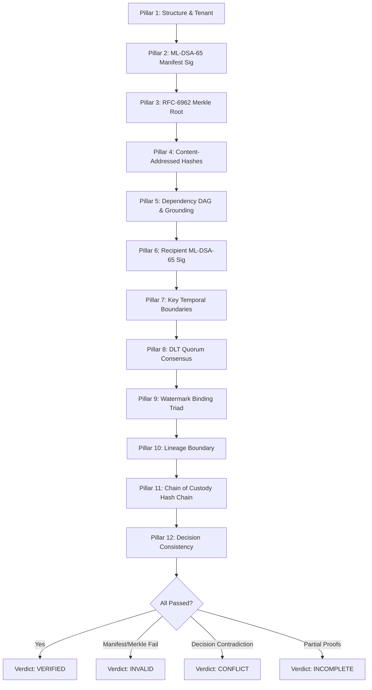

# AegisTrace Evidence Verification Protocol (v1.0)
**Standard:** 12-Pillar Zero-Trust Audit Pipeline  
**Execution Environment:** Air-Gapped / Isolated Python 3.9+ Runtime  
**Author:** AegisTrace Cryptographic Architecture Group  

---

## 1. Overview of the 12-Pillar Verification Model

The verification protocol is executed by `OfflineEvidenceVerifier` and the standalone CLI `aegistrace_verify.py`. It operates under strict zero-trust assumptions:
* **No Database:** No connection to PostgreSQL, SQLite, or Redis.
* **No Network:** Sockets, DNS, HTTP requests are completely forbidden and blocked.
* **No Origin Server:** The package is evaluated strictly using the mathematics of the enclosed objects, proofs, and signatures.

To achieve an authoritative verdict of `VERIFIED`, an evidence package must satisfy all 12 pillars sequentially and fail closed on any single violation.

---

## 2. Mathematical Definition of the 12 Pillars

### Pillar 1: Package Structure & Tenant Isolation Check
If an expected tenant identifier $T_{\text{expected}}$ is supplied (e.g., via `--tenant`), the verifier enforces:
$$T_{\text{manifest}} == T_{\text{expected}}$$
Any mismatch immediately aborts verification with a `TENANT_ISOLATION_VIOLATION`.

### Pillar 2: Post-Quantum ML-DSA-65 Manifest Signature Verification
The verifier recomputes the manifest digest:
$$M_{\text{digest}} = \text{SHA-256}(\text{CanonicalJSON}(\text{Manifest} \setminus \{\text{is\_redacted}, \text{redacted\_object\_ids}\}))$$
It decodes the investigator's public key $PK_{\text{signer}}$ and signature $\sigma$, and invokes NIST FIPS 204:
$$\text{ML-DSA-65.Verify}(PK_{\text{signer}}, M_{\text{digest}}, \sigma) \stackrel{?}{=} \text{True}$$

### Pillar 3: RFC-6962 Evidence Merkle Root Recomputation
All evidence objects are sorted by `object_id`:
$$\mathcal{L} = [O_0.\text{content\_hash}, O_1.\text{content\_hash}, \dots, O_{n-1}.\text{content\_hash}]$$
The binary tree is built using prefixes $0\text{x}00$ and $0\text{x}01$:
$$\text{RecomputedRoot} = \text{EvidenceMerkleTree}(\mathcal{L}).\text{root}$$
$$\text{RecomputedRoot} \stackrel{?}{=} \text{Manifest}.\text{evidence\_merkle\_root}$$

### Pillar 4: Content-Addressed Hash Integrity for Every Object
For every object $O \in \text{Objects}$:
* If $O$ is `RedactedEvidenceStub`: Leaf hash preservation is validated ($O.\text{content\_hash} == O.\text{original\_content\_hash}$).
* Otherwise: Recompute $H(O) = \text{SHA-256}(\text{CanonicalJSON}(O \setminus \{\text{content\_hash}\}))$ and assert:
$$O.\text{content\_hash} \stackrel{?}{=} H(O)$$

### Pillar 5: Evidence Dependency DAG Grounding & Cycle Check
The verifier constructs directed graph $G = (V, E)$ from evidence nodes and `DependencyEdge` elements:
1. **Acyclicity:** Kahn’s algorithm computes topological order. If topological sort length $< |V|$, a cycle exists:
   $$\text{In-Degree}(v) == 0 \implies \text{Queue.push}(v)$$
2. **Grounding:** Traverse incoming edges from `Manifest.final_decision_reference` using BFS/DFS. Assert reachability to empirical evidence nodes (Artifact, Watermark, Receipt, Ledger).

### Pillar 6: Canonical Decryption Receipt ML-DSA-65 Signature Replay
For each `DecryptionReceiptObject` $R$:
Reconstruct the exact canonical recipient confirmation payload:
$$\text{Payload} = \text{AEGIS-DECRYPT-CONFIRM:v1}:R.\text{doc\_id}:R.\text{rel\_id}:R.\text{rec\_id}:R.\text{sess\_id}:R.\text{key\_id}:R.\text{epoch}:R.\text{token}:R.\text{commit}:R.\text{ts}$$
Verify recipient ML-DSA-65 signature:
$$\text{ML-DSA-65.Verify}(R.\text{recipient\_public\_key}, \text{Payload}, R.\text{recipient\_signature}) \stackrel{?}{=} \text{True}$$

### Pillar 7: Key Lifecycle & Historical Revocation Boundary Check
For each receipt $R$ referencing key $K$:
Locate `RecipientIdentityProofObject` $P_K$:
Assert receipt timestamp $t_R$ respects key lifetime boundaries:
$$t_{\text{activation}} \le t_R < t_{\text{revocation}}$$
Any decryption signature generated after key revocation is flagged as `POST_REVOCATION_REJECTION`.

### Pillar 8: DLT Block Header & Quorum Consensus Proof
For each `LedgerProofObject` $L$:
1. **Receipt Inclusion:** Validate Merkle audit path $P = [(h_i, d_i)]$:
   $$C_0 = \text{SHA-256}(0\text{x}00 \parallel L.\text{receipt\_hash})$$
   $$C_{k+1} = \text{SHA-256}(0\text{x}01 \parallel \text{Left} \parallel \text{Right})$$
   $$\text{Final } C_k \stackrel{?}{=} L.\text{merkle\_root}$$
2. **Validator Confirmation:** Verify proposer and quorum signatures on `AEGIS-BLOCK-CONFIRM:` $\parallel L.\text{block\_hash}$:
   $$\sum_{v \in \text{Quorum}} \mathbb{I}(\text{ML-DSA-65.Verify}(PK_v, \text{BlockMsg}, \sigma_v)) \ge L.\text{quorum\_threshold}$$

### Pillar 9: Watermark Binding Triad (Artifact $\to$ Token $\to$ Ledger)
For each `WatermarkEvidenceObject` $W$:
1. $W.\text{artifact\_hash}$ must match an authentic `ArtifactEvidenceObject`.
2. $W.\text{extracted\_token}$ must bind to an authentic `DecryptionReceiptObject` registered in the ledger.

### Pillar 10: Lineage Integrity & Boundary Preservation
For each `LineageEvidenceObject`:
* If `has_downstream_gap == True`, assert `last_known_holder` is non-null.
* Assert no fabricated downstream actors are present in the lineage path without cryptographic receipt proofs.

### Pillar 11: Append-Only Chain-of-Custody SHA-256 Hash Chain Integrity
The custody sequence $[C_0, C_1, \dots, C_{m-1}]$ must link back to `0`*64:
$$H_0 = \text{SHA-256}(\text{AEGIS-CUSTODY:v1}:0^{64}:\text{CanonicalJSON}(C_0))$$
$$H_i = \text{SHA-256}(\text{AEGIS-CUSTODY:v1}:H_{i-1}:\text{CanonicalJSON}(C_i))$$
Assert $C_i.\text{previous\_custody\_hash} == H_{i-1}$ for all $i \ge 1$.

### Pillar 12: Final Attribution Decision Consistency Check
Evaluate `AttributionDecisionObject`:
* If `decision_state == ATTRIBUTED`: Must specify `attributed_principal_id`, and requires valid `DecryptionReceiptObject` and `WatermarkEvidenceObject`.
* If `decision_state \in {NO_SIGNAL, INSUFFICIENT_EVIDENCE, ABSTAINED}`: Must NOT attribute a principal (`attributed_principal_id == None`).

---

## 3. Verdict Determination & Exit Codes

| Verification Verdict | Conditions | CLI Exit Code |
|---|---|---|
| `VERIFIED` | All 12 pillars pass with 0 errors. | `0` |
| `PARTIALLY_VERIFIED` | Core signatures pass, but non-critical advisory proofs incomplete. | `1` |
| `CONFLICT` | Manifest & Merkle valid, but evidentiary contradiction (e.g. over-attribution). | `4` |
| `INVALID` | Signature corrupted, Merkle mismatch, or tampering detected. | `4` |
| `INCOMPLETE` | Missing required dependency objects or ungrounded decision. | `4` |
