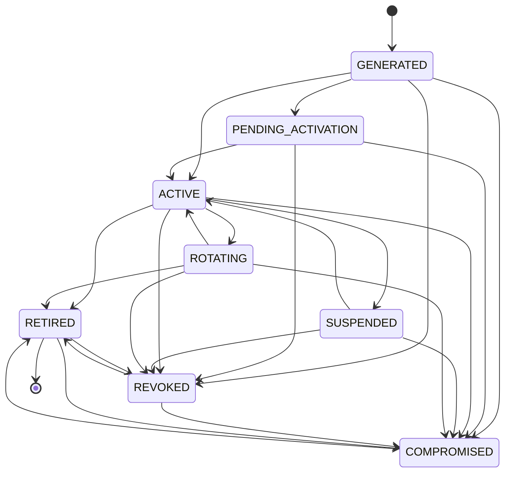

# AegisTrace Cryptographic Key Lifecycle Architecture

**Document ID:** AEGIS-ARCH-KEY-LIFECYCLE-01  
**Classification:** Forensics & Cryptographic Security Specification  
**Subsystem:** Core Cryptography (`core/crypto/lifecycle/`)  
**Status:** Implemented & Formally Verified  

---

## 1. Executive Summary

In a zero-trust forensic document security platform, cryptographic keys cannot be treated as static credentials. Document releases, dynamic watermarking, recipient decryption non-repudiation, and permissioned ledger consensus each depend on cryptographic keys with varying lifetimes, custody requirements, and threat profiles.

AegisTrace implements an air-gapped, multi-tenant, post-quantum key lifecycle management system that enforces:
1. **Explicit 9-State Lifecycle Model** with fail-closed state machines.
2. **Cryptographic Identity Continuity** across routine rotations and algorithm migrations.
3. **Forensic Historical Verifiability Invariant**: Rotating or revoking a key $K_1 \to K_2$ must **never** invalidate historical forensic receipts, Merkle inclusion proofs, or attribution decisions generated before the revocation boundary $T_{\text{revocation}}$.
4. **Air-Gapped Operation**: 100% local operation with zero cloud KMS dependencies, verified with all network sockets disabled.

---

## 2. Key Taxonomy & Classification

AegisTrace audits and categorizes every security-relevant key across eight distinct functional domains:

```
+----------------------------------------------------------------------------------------------------+
|                                    AEGISTRACE KEY TAXONOMY                                         |
+------------------------------------+------------------+---------------------+----------------------+
| Key Category                       | Algorithm        | Custody Class       | Recovery Class       |
+------------------------------------+------------------+---------------------+----------------------+
| 1. Recipient Signature Keys        | ML-DSA-65        | LOCAL_PROTECTED     | RECOVERABLE          |
| 2. Recipient Decapsulation Keys     | ML-KEM-768       | LOCAL_PROTECTED     | RECOVERABLE          |
| 3. Device Attestation Keys         | P-256 / WebAuthn | HARDWARE_BACKED     | HARDWARE_BOUND       |
| 4. Traceability/Tardos Epoch Keys  | HMAC-SHA256      | SECURE_KEYSTORE     | RECOVERABLE          |
| 5. Watermark Secret Epoch Keys     | AES-256 / HKDF   | SECURE_KEYSTORE     | RECOVERABLE          |
| 6. DLT Validator Consensus Keys    | ML-DSA-65        | SECURE_KEYSTORE     | RECOVERABLE          |
| 7. Master Ephemeral Session Keys   | AES-256-GCM      | LOCAL_PROTECTED     | NON_RECOVERABLE      |
| 8. Forensic Evidence Bundle Keys   | ML-DSA-65        | SECURE_KEYSTORE     | RECOVERABLE          |
+------------------------------------+------------------+---------------------+----------------------+
```

### 2.1 Custody Classes
- **`HARDWARE_BACKED`**: Private key generated and stored inside a secure hardware element (TPM 2.0, Secure Enclave, YubiKey). Non-exportable by hardware design.
- **`SECURE_KEYSTORE`**: Stored in a platform-managed protected keystore with access controls and audit logging.
- **`EXTERNAL_SECRET_STORE`**: Managed by an air-gapped HSM or enterprise secret vault.
- **`LOCAL_PROTECTED_STORE`**: Encrypted at rest in local storage using an authenticated root key.
- **`DEVELOPMENT_ONLY`**: Ephemeral development keys. **Strictly prohibited and fails closed in production environments.**

### 2.2 Recovery Classifications
- **`HARDWARE_BOUND`**: Mathematically and physically non-exportable. Backup operations refuse export of private material.
- **`NON_RECOVERABLE`**: Ephemeral keys (e.g. session decryption keys) whose persistence would represent an unnecessary attack surface.
- **`RECOVERABLE`**: Software-managed private keys that can be securely backed up using authenticated passphrase envelopes.

---

## 3. Formal 9-State Lifecycle State Machine

Every key record transitions through a strictly validated directed acyclic graph (DAG) of lifecycle states:



### 3.1 State Invariants
1. **No State Reversals**: Neither `REVOKED` nor `COMPROMISED` can ever transition back to `ACTIVE`.
2. **Atomic Single-Active Key**: For any tuple `(owner, key_type, algorithm, tenant_id)`, exactly one key may reside in the `ACTIVE` state at any given time.
3. **Idempotent Transitions**: Requesting a transition from state $S \to S$ is a valid no-op.
4. **Audit Immutability**: Every state transition generates a signed, monotonically sequenced entry in the `KeyLifecycleAuditLogger`.

---

## 4. O(1) Composite Multi-Tenant Indexing

To prevent $O(n)$ full-table scans during high-throughput verification or session lookups, `KeyLifecycleManager` maintains two distinct hash indexes:

1. **`_active_index`**: Maps `(owner, key_type.value, algorithm, tenant_id) -> active_key_id`. Provides true $O(1)$ lookups for active operations.
2. **`_owner_index`**: Maps `(owner, key_type.value, algorithm, tenant_id) -> List[key_id]`. Keys are maintained in chronological epoch order for $O(\log n)$ or fast bounded resolution of historical epochs.

---

## 5. Summary of Guarantees

| Invariant | Implementation Mechanism | Enforcement Layer |
|:---|:---|:---|
| **Identity Continuity** | Entity IDs remain constant across key rotations | `RecipientKeyLifecycleAdapter` |
| **Fail-Closed Custody** | Prohibits `DEVELOPMENT_ONLY` in production | `KeyLifecycleManager._validate_custody_policy` |
| **Anti-Deadlock Concurrency** | Per-entity locks + global lock sequencing | `KeyLifecycleManager._get_entity_lock` |
| **Cryptographic Agility** | Algorithm-aware indexing supports post-quantum hybrid migrations | `(owner, type, algo, tenant)` key index |
