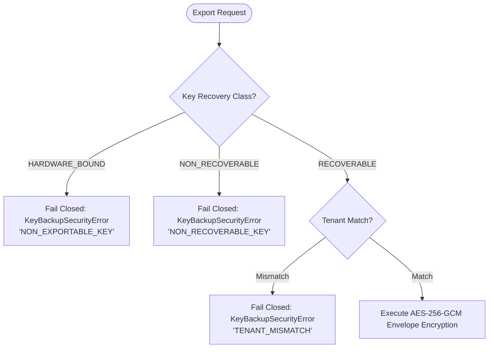

# AegisTrace Cryptographic Key Recovery & Backup Model

**Document ID:** AEGIS-SPEC-KEY-RECOVERY-01  
**Classification:** Disaster Recovery & Key Custody Specification  
**Subsystem:** Core Cryptography (`core/crypto/lifecycle/`)  
**Status:** Implemented & Formally Verified  

---

## 1. Architectural Philosophy: Air-Gapped Key Recovery

Unlike conventional web systems that rely on cloud-hosted key management services (AWS KMS, Google Cloud KMS, Azure Key Vault), AegisTrace is strictly designed for **air-gapped operational environments** (e.g. classified defense networks, sensitive forensic crime labs, and isolated offline servers).

The key recovery system must therefore satisfy three seemingly conflicting constraints:
1. **Zero External Network Dependencies**: 100% offline derivation and restoration with zero external API calls.
2. **Post-Quantum & Quantum-Resistant Envelopes**: Authenticated envelope encryption utilizing AES-256-GCM with HKDF-SHA256 key stretching.
3. **Custody Boundary Enforcement**: Software-managed private keys may be safely backed up, but hardware-bound private keys must **never** be exportable under any condition.

---

## 2. Authenticated Backup Envelope Specification

When an authorized security officer exports a backup package via `KeyBackupEngine.create_backup_package`, the following cryptographic transformations occur:

```
Passphrase + 16-byte Random Salt
             |
             v
       HKDF-SHA256  (Info: "AEGIS-BACKUP-AES-256-GCM-KEY", Len: 32 bytes)
             |
             v
      256-bit Backup Key K_backup
             |
             +-----------------------+
             |                       |
             v                       v
      Private Key Material     AAD: "AEGIS-BACKUP:1.0:<key_id>:<tenant>:<owner>:<epoch>"
             |                       |
             +-----------+-----------+
                         |
                         v
                    AES-256-GCM (12-byte random Nonce)
                         |
                         v
              { Ciphertext, 16-byte Auth Tag }
```

### 2.1 Envelope Schema
```json
{
  "version": "1.0",
  "key_id": "kid_7a8f9c0e...",
  "tenant_id": "defense_ops_alpha",
  "owner": "rec_alice",
  "key_type": "RECIPIENT_PRIVATE_KEY",
  "epoch": 2,
  "algorithm": "ML-DSA-65",
  "salt_b64": "vF7...",
  "nonce_b64": "9b1...",
  "ciphertext_b64": "p8A...",
  "tag_b64": "k3L...",
  "metadata_digest": "3c98a...",
  "metadata": { ... },
  "created_at": "2026-09-27T14:30:00Z"
}
```

---

## 3. Strict Non-Exportability & Custody Class Invariants

To eliminate data leakage, `KeyBackupEngine` inspects the key record's `KeyRecoveryClassification` before reading private key material:



1. **Hardware-Bound Keys**: Private keys backed by hardware tokens (TPM, YubiKey) cannot be extracted into software backup envelopes. Only their public metadata and verification certificates are serialized.
2. **Ephemeral Keys**: Short-lived session keys (`MASTER_EPHEMERAL_KEY`) are permanently non-recoverable.

---

## 4. Multi-Tenant Isolation & Anti-Tampering Protections

During offline restoration:
- **Tenant Isolation**: If a backup package generated for `tenant_alpha` is imported into an engine configured for `tenant_beta`, restoration immediately halts with `KeyBackupSecurityError("CROSS_TENANT_RECOVERY_REJECTED")`.
- **Pre-Decryption Integrity Check**: Before invoking cryptographic operations, the SHA-256 digest of the canonical metadata JSON is computed and asserted against `metadata_digest`. If any attribute (such as `owner` or `epoch`) was modified by an adversary, execution halts with `KeyBackupIntegrityError("BACKUP_METADATA_TAMPERED")`.
- **AEAD Authentication Tag**: Any alteration of ciphertext bytes, salt, or nonce causes AES-256-GCM decryption to fail closed with `KeyBackupIntegrityError("BACKUP_AUTHENTICATION_FAILED")`.
