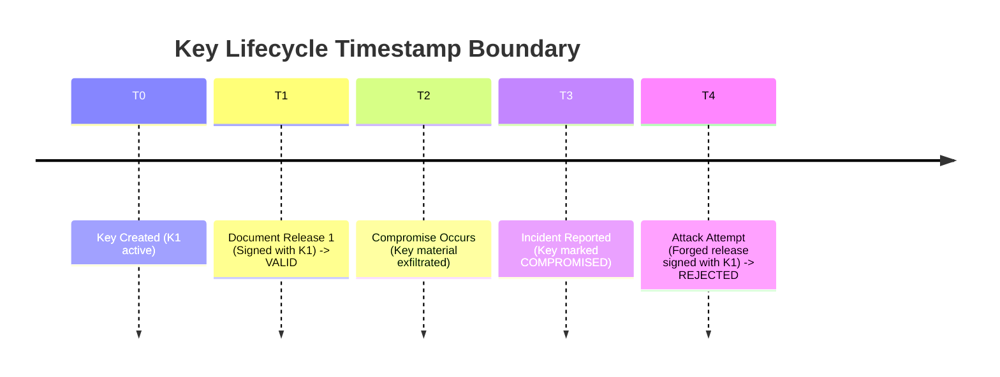

# AegisTrace Cryptographic Key Revocation Model

**Document ID:** AEGIS-SPEC-KEY-REVOCATION-01  
**Classification:** Cryptographic Security & Legal Non-Repudiation Model  
**Subsystem:** Core Cryptography (`core/crypto/lifecycle/`)  
**Status:** Implemented & Formally Verified  

---

## 1. Threat Model & Conceptual Distinctions

In cryptographic forensic architectures, confounding key replacement with compromise leads to catastrophic verification failure. AegisTrace explicitly delineates three lifecycle outcomes:

```
+----------------+-------------------------------+-----------------------------------+--------------------------------+
| Lifecycle Path | Operational Trigger           | Future Actions Authorized?        | Historical Actions Valid?      |
+----------------+-------------------------------+-----------------------------------+--------------------------------+
| ROTATION       | Routine cryptographic hygiene | No (Successor key must be used)   | Yes (100% historically valid)  |
| REVOCATION     | Administrative de-provisioning| No (Key is permanently disabled)  | Yes (Prior to T_revocation)    |
| COMPROMISE     | Private key material leaked   | No (Immediate emergency isolation)| Conditional (With forensic tag)|
+----------------+-------------------------------+-----------------------------------+--------------------------------+
```

---

## 2. Mathematical Timestamp Boundary Enforcement

When an investigator, legal auditor, or court reviews an evidentiary artifact (such as a recipient decryption receipt, a DLT block confirmation, or a watermarked leak attribution), the `HistoricalKeyResolver` applies the formal **Timestamp Boundary Decision Function** $\mathcal{F}(K, T_E)$:

$$\mathcal{F}(K, T_E) = \begin{cases} 
\text{KEY\_NOT\_YET\_CREATED} & \text{if } T_E < T_{\text{creation}} \\
\text{HISTORICALLY\_VALID} & \text{if } K \in \{\text{ACTIVE}, \text{RETIRED}\} \text{ and } T_E \ge T_{\text{creation}} \\
\text{HISTORICALLY\_VALID} & \text{if } K \in \{\text{REVOKED}\} \text{ and } T_{\text{creation}} \le T_E < T_{\text{revocation}} \\
\text{COMPROMISED\_HISTORICAL} & \text{if } K \in \{\text{COMPROMISED}\} \text{ and } T_{\text{creation}} \le T_E < T_{\text{compromise}} \\
\text{POST\_REVOCATION\_REJECTED} & \text{if } K \in \{\text{REVOKED}\} \text{ and } T_E \ge T_{\text{revocation}} \\
\text{POST\_COMPROMISE\_REJECTED} & \text{if } K \in \{\text{COMPROMISED}\} \text{ and } T_E \ge T_{\text{compromise}}
\end{cases}$$



### 2.1 Compromise Advisory Annotation
If an event was signed prior to $T_{\text{compromise}}$, the signature remains mathematically genuine, but the system issues a **Forensic Advisory Flag** (`COMPROMISED_KEY_HISTORICAL_VERIFIED`). This informs human investigators that while the signature matches, the timestamp must be verified against an independent external anchor (such as the permissioned DLT block timestamp) to eliminate backdating attacks.

---

## 3. DLT Consensus Quorum Exclusion

When a validator key is revoked or reported compromised:
1. `ValidatorKeyLifecycleAdapter.is_validator_active(vid)` immediately returns `False`.
2. The validator is pruned from the consensus voting set.
3. Any candidate block containing a quorum vote from the revoked validator fails verification (`Unrecognized / unauthorized validator vote`).
4. **Historical Ledger Invariance**: Blocks ratified prior to the validator's revocation remain fully authentic because their timestamp satisfies $T_{\text{block}} < T_{\text{revocation}}$.

---

## 4. Irreversibility Guarantees

The `KeyStateMachine` guarantees that state transitions into `REVOKED` and `COMPROMISED` are strictly unidirectional:
- **`REVOKED -> ACTIVE`**: Throws `KeyLifecycleTransitionError`. Once revoked, a key can never be resurrected.
- **`COMPROMISED -> ACTIVE`**: Throws `KeyLifecycleTransitionError`.
- **`RETIRED -> ACTIVE`**: Throws `KeyLifecycleTransitionError`.
- **`REVOKED -> COMPROMISED`**: Allowed as an escalation if forensic investigation subsequently confirms that a revoked key was also exfiltrated.
