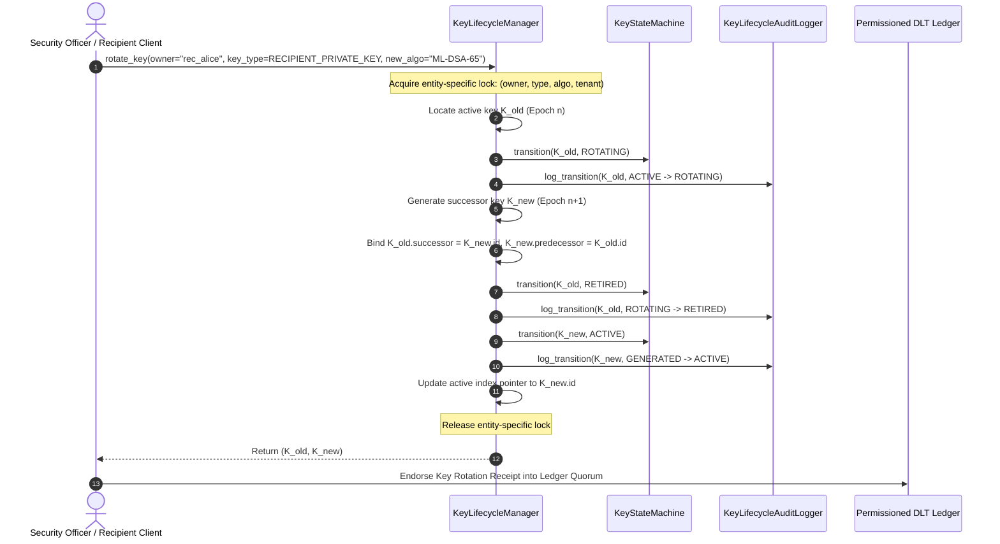

# AegisTrace Cryptographic Key Rotation Protocol

**Document ID:** AEGIS-PROTO-KEY-ROTATION-01  
**Classification:** Cryptographic Operations Protocol  
**Subsystem:** Core Cryptography (`core/crypto/lifecycle/`)  
**Status:** Implemented & Formally Verified  

---

## 1. Protocol Objective

The AegisTrace Key Rotation Protocol enables atomic, zero-downtime cryptographic key rotation for both asymmetric identities (post-quantum ML-DSA-65 signatures, ML-KEM-768 decapsulation, hardware device attestation) and symmetric epoch keys (Tardos collusion-secure fingerprints, dynamic watermark carriers, and DLT consensus voting).

The protocol guarantees:
1. **Linear Succession**: $K_n \to K_{n+1}$ forms a tamper-evident, strictly ordered chain with forward and backward cryptographic pointer binding.
2. **Mutual Pointer Binding**: Key records atomically store `predecessor_key_id` and `successor_key_id`.
3. **Continuous Verification**: Old documents released under $K_n$ can be retroactively verified using $K_n$, while new releases strictly require $K_{n+1}$.
4. **Race-Free Concurrency**: Per-entity synchronization locks prevent concurrent rotation requests from branching or corrupting the key lineage.

---

## 2. Asymmetric Key Rotation Sequence (Recipient & Validator)

The sequence diagram below illustrates the protocol execution when Recipient $R$ or Validator $V$ rotates an operational key:



---

## 3. Epoch Progression for Symmetric & Carrier Keys

For collusion-secure Tardos codes and dynamic watermark carrier transforms, key rotation operates via **Epoch Progression**:

```
Epoch E_1 (Secret S_1)   ===>   Epoch E_2 (Secret S_2)   ===>   Epoch E_3 (Secret S_3)
      |                               |                               |
Document Releases D_1           Document Releases D_2           Document Releases D_3
      |                               |                               |
Decryption Receipts R_1         Decryption Receipts R_2         Decryption Receipts R_3
```

### 3.1 Traceability Keystore Decoupling
1. In Epoch $E$, the `TraceabilityKeystore` generates recipient-specific codewords using $S_E$.
2. When transitioning to Epoch $E+1$, $S_E$ is stored in the historical archive, and $S_{E+1}$ becomes active.
3. Collusion audits for documents released under Epoch $E$ resolve $S_E$ via `TraceabilityEpochAdapter.get_epoch_secret(E)`, ensuring that mathematical accusations remain mathematically invariant across decades.

---

## 4. Active Session Lifecycle Policy

When a key rotates while a recipient is actively viewing an in-flight document session, AegisTrace evaluates the **Active Session Lifecycle Policy**:

```
+------------------------------------+---------------------------------------------------------------+
| Policy Option                      | Operational Behavior                                          |
+------------------------------------+---------------------------------------------------------------+
| SESSION_CONTINUES_UNTIL_EXPIRY     | The session remains valid in-memory until natural expiration. |
| (Default)                          | All export operations initiated after rotation bind to K_new. |
+------------------------------------+---------------------------------------------------------------+
| SESSION_REQUIRES_REAUTH            | Immediate termination of active viewing tokens.               |
| (High Security Mode)               | Recipient must re-authenticate and derive new session key.    |
+------------------------------------+---------------------------------------------------------------+
```

### Invariant:
**Under no circumstances can an export artifact generated after $T_{\text{rotation}}$ be signed or encrypted with the retired predecessor key.**
