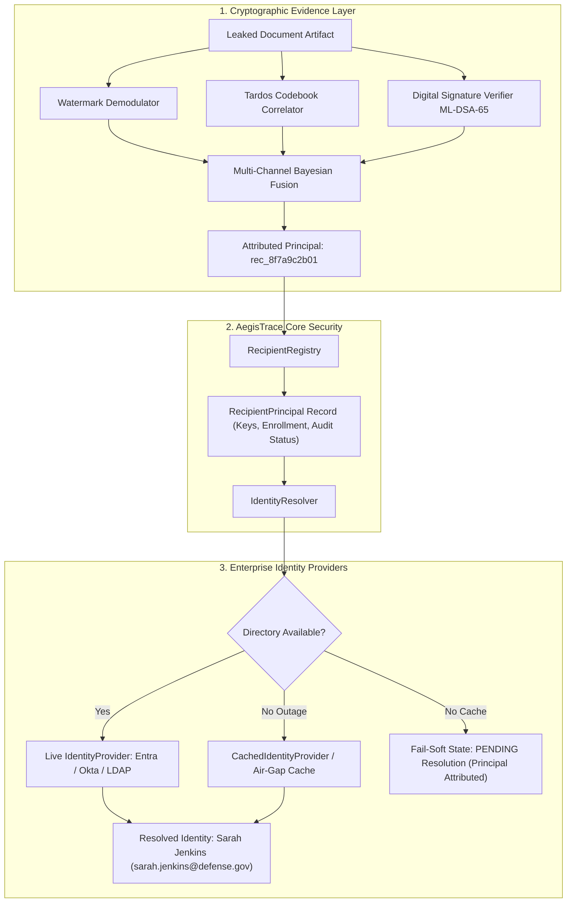

# AegisTrace Enterprise Identity Architecture

## 1. Executive Architectural Summary

AegisTrace separates **Forensic Identity** (cryptographic principals, public key bindings, watermark carriers, Tardos codebook symbols, and signed provenance hash chains) from **Human Enterprise Identity** (display names, email addresses, departments, security clearances, and IdP subjects).

Prior naive implementations conflated the suspect's human identity with the attribution query—requiring investigators to supply a suspect name or select a target from a static list to run correlation. In high-consequence forensic investigations, this introduces severe investigator bias, circular reasoning, and unacceptable legal liability.

In AegisTrace:
$$\text{Leaked Artifact} \xrightarrow{\text{Forensic Fusion}} \text{Principal ID } (\text{e.g. } rec\_8f7a9c2b) \xrightarrow{\text{Directory Resolver}} \text{Human Identity } (\text{Sarah Jenkins})$$

The investigator provides **only the untrusted leak artifact**. The Bayesian multi-channel fusion engine derives an opaque, cryptographically bound `recipient_id`. Human identity resolution occurs **strictly post-attribution** via the `IdentityResolver` and enterprise `IdentityProvider` integrations (Entra ID, Okta, Ping, Google Workspace, OpenLDAP).

---

## 2. The Three-Tier Identity Abstraction

### Tier 1: Forensic Identity (`recipient_id`)
- Stable, opaque cryptographic principal identifier (e.g., `rec_8f7a9c2b01` or `alice`).
- Tied to:
  - NIST FIPS 203 ML-KEM-768 public key capsule.
  - NIST FIPS 204 ML-DSA-65 signature verification key.
  - Tardos codebook column vectors $X_j \in \{-1, +1\}^m$.
  - DSSS spatial watermark carrier payload tokens.
  - Hash-chained non-repudiation decryption provenance events.
- **Invariant**: Forensic identity is immutable once enrolled. It never changes, even if a user's name, email, department, or IdP changes.

### Tier 2: AegisTrace Principal Store (`RecipientPrincipal`)
- Tracks participating identities within AegisTrace.
- Maintains cryptographic public keys and audit states (`ACTIVE`, `REVOKED`, `DEPROVISIONED`).
- Does **not** attempt to mirror or store 7 billion human identities. Only principals participating in protected document releases are registered.

### Tier 3: Enterprise Directory (`IdentityProvider`)
- Manages organizational metadata:
  - `identity_id`: Stable enterprise reference (e.g., `usr_8f7a9c2b01`, Entra OID, Okta user ID).
  - `display_name`: Human readable name.
  - `email`: Corporate email address (which may rotate or be renamed).
  - `organization_id`: Multi-tenant organization boundaries.
  - `department` / `title`: Organizational positioning.
  - `status`: Identity lifecycle state (`ACTIVE`, `SUSPENDED`, `REVOKED`, `DEPROVISIONED`).

---

## 3. Mathematical & Cryptographic Invariants

### Invariant 1: Unbiased Forensic Derivation
The forensic analysis function $F$ maps an artifact $A$ to an opaque principal:
$$F: \mathcal{A} \to \mathcal{R} \cup \{\bot\}$$
where $\mathcal{A}$ is the space of document artifacts, $\mathcal{R}$ is the set of enrolled cryptographic principals, and $\bot$ represents fail-closed abstention (`NO_SIGNAL`, `INSUFFICIENT_EVIDENCE`, `CONFLICT`).

The human identity directory lookup $D$ is executed strictly after attribution:
$$D: \mathcal{R} \to \mathcal{I} \cup \{\text{PENDING}\}$$
where $\mathcal{I}$ is the set of enterprise identities.
**Under no circumstances can an investigator supply an identity $i \in \mathcal{I}$ as an input to bias $F(A)$.**

### Invariant 2: Zero Shared Group Keys
When documents are targeted to organizational groups or distribution lists (e.g., `grp_cyber_secops`):
- AegisTrace expands the group into individual active members:
  $$\text{Group}(G) \to \{r_1, r_2, \dots, r_k\}$$
- Each recipient $r_i$ receives:
  - An independent ML-KEM-768 ciphertext encapsulation: $c_i = \text{ML-KEM.Encaps}(pk_i)$.
  - A unique AES-256-GCM wrapped document key.
  - A unique, orthogonal Tardos traitor tracing fingerprint.
  - A unique spatial DSSS watermark carrier.
- **Zero shared group keys exist.** Leaking a group-distributed document attributes uniquely to the specific individual who decrypted it.

### Invariant 3: Fail-Soft Directory Outage Resilience
If the external IdP (Entra ID, Okta, LDAP) suffers network partitions, timeouts, or DDoS:
- AegisTrace falls back to `CachedIdentityProvider` (local encrypted cache).
- If uncached, AegisTrace returns:
  $$\text{state} = \text{ATTRIBUTED}, \quad \text{candidate.recipient\_id} = r_i, \quad \text{resolution\_status} = \text{PENDING}$$
- **Directory unavailability never converts cryptographic evidence into `NO_SIGNAL` or `ABSTAIN`.**

### Invariant 4: Historical Revocation Non-Repudiation
When an employee departs or an account is compromised:
1. Administrator sets `status = REVOKED`.
2. The principal is immediately blocked from receiving new release keys or decrypting new documents.
3. For all documents released prior to revocation, the cryptographic signature on the ledger and the physical/digital watermarks remain valid.
4. If a leaked document from that past release is analyzed, AegisTrace attributes the recipient with:
   $$\text{state} = \text{ATTRIBUTED}, \quad \text{identity\_status} = \text{REVOKED}$$
   and flags: `Historical Principal (Currently Revoked)`.

---

## 4. Multi-Tenant Disambiguation & Collision Protection

1. **Composite Subject Isolation**: Internal identity references are scoped by `(organization_id, provider, identity_id)`. Two users with the same display name (e.g., two "Alex Mercer"s in different branches) or same email across different IdP tenants have distinct opaque `identity_id`s and distinct cryptographic keys.
2. **Email Renaming Immutability**: If an employee marries or changes their corporate email (e.g., `alice@defense.gov` $\to$ `alice.vance@defense.gov`), their `identity_id` and cryptographic `recipient_id` remain fixed. Historical and future releases retain continuous cryptographic chain-of-custody.

---

## 5. Summary of System Interfaces

| Interface | Method | Description |
| :--- | :--- | :--- |
| `IdentityProvider` | `get_identity(id)` | Queries external IdP (Entra/Okta/LDAP) for user metadata |
| `IdentityProvider` | `search_identities(query)` | Searches enterprise directory for provisioning |
| `IdentityProvider` | `get_group_members(group_id)` | Resolves organizational group into active individuals |
| `CachedIdentityProvider` | `cache_identity(identity)` | Air-gapped / offline encrypted local storage |
| `IdentityResolver` | `resolve_recipient(rec_id)` | Post-attribution resolution decoupling engine from IdP |
| `ReleaseTargetingService`| `resolve_targets(targets)` | Enforces zero shared group keys and inactive blocks |
| `AttributionEngine` | `analyze_leak(artifact)` | Unbiased multi-channel Bayesian evidence derivation |
