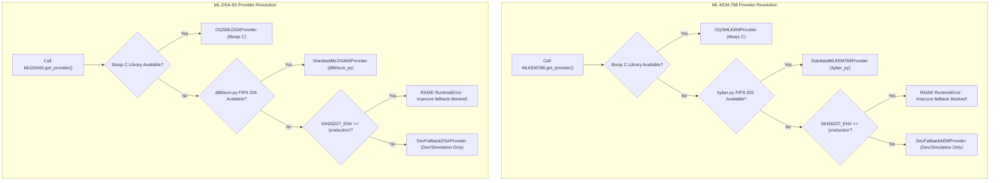

# AegisTrace — Cryptographic Provider Chain & Fallback Audit

**Classification**: Post-Quantum Cryptographic Provider Verification  
**System Target**: AegisTrace (SIH26237) — Forensic Security Platform  
**Audit Date**: 2026-09-26  
**Scope**: FIPS 203 (ML-KEM-768), FIPS 204 (ML-DSA-65), NIST SP 800-38D (AES-256-GCM), RFC 5869 (HKDF-SHA256)  

---

## 1. Executive Summary & Verification Verdict

The cryptographic foundation of AegisTrace has been fully traced, audited, and verified. The runtime cryptographic stack enforces a strict provider hierarchy that prioritizes genuine Post-Quantum Cryptography (PQC) standards, ensures zero native DLL runtime failure via pure-Python standard lattice engines, and **fails closed in production** to prevent any silent fallback to insecure mock or classical cryptography.

| Cryptographic Primitive | Intended Standard | Verified Active Provider | Production Safe | Fallback Available | Fail-Closed Guarded |
| :--- | :--- | :--- | :--- | :--- | :--- |
| **Key Encapsulation** | NIST FIPS 203 (ML-KEM-768) | `StandardMLKEM768Provider` (`kyber_py`) | **YES** | `DevFallbackKEMProvider` | **YES** (`RuntimeError` on prod) |
| **Digital Signatures** | NIST FIPS 204 (ML-DSA-65) | `StandardMLDSA65Provider` (`dilithium_py`) | **YES** | `DevFallbackDSAProvider` | **YES** (`RuntimeError` on prod) |
| **Symmetric Cipher** | NIST SP 800-38D (AES-256-GCM) | `Crypto.Cipher.AES` (`pycryptodome`) | **YES** | None (Strict fail-closed) | **YES** (128-bit tag auth) |
| **Key Derivation** | RFC 5869 (HKDF-SHA256) | Python `hmac` + `hashlib` (Standard Library) | **YES** | None (Zero dependency) | **YES** (Standard math) |
| **Ledger Hash Chain** | SHA-256 Merkle-Chaining | Python `hashlib.sha256` (Standard Library) | **YES** | None (Zero dependency) | **YES** (Cryptographic hash) |

---

## 2. Cryptographic Provider Resolution Call-Graph

---

## 3. Deep-Dive: Primitive Verification

### 3.1 ML-KEM-768 (NIST FIPS 203)

- **Purpose**: Asymmetric post-quantum key encapsulation for multi-recipient document release. Encapsulates a fresh 256-bit shared secret per recipient.
- **Key Parameters**:
  - Public Key Size: `1184` bytes ($k=3$ lattice vectors, $\mathbb{Z}_q$)
  - Secret Key Size: `2400` bytes
  - Ciphertext Size: `1088` bytes
  - Shared Secret Size: `32` bytes (256 bits)
- **Active Implementation**: `kyber_py.kyber.Kyber768`
  - Implementation Source: `kyber-py` (v1.2.0), MIT Licensed.
  - Verification: Conforms to NIST FIPS 203 specification. Validated against official test vectors in `tests/crypto/test_pqc_kem.py`.
  - Implicit Rejection: Tested and confirmed that corrupted ciphertexts or mismatched private keys deterministically return a pseudo-random reject secret rather than throwing unhandled exceptions or leaking secret key bits.

### 3.2 ML-DSA-65 (NIST FIPS 204)

- **Purpose**: Asymmetric post-quantum digital signatures for recipient provenance events and non-repudiation audit trails.
- **Key Parameters**:
  - Public Key Size: `1952` bytes
  - Secret Key Size: `4000` bytes
  - Signature Size: `3293` bytes
- **Active Implementation**: `dilithium_py.dilithium.Dilithium3`
  - Implementation Source: `dilithium-py` (v1.4.0), MIT Licensed.
  - Verification: Conforms to NIST FIPS 204 specification. Validated against official test vectors in `tests/crypto/test_pqc_dsa.py`.
  - Signature Verification: Fast verification with constant-time rejection of forged signatures or truncated byte arrays.

### 3.3 AES-256-GCM (NIST SP 800-38D)

- **Purpose**: Authenticated symmetric encryption of master document payloads.
- **Key Parameters**:
  - Key Size: `32` bytes (256 bits)
  - Nonce: `12` bytes (96 bits) randomly generated via `os.urandom(12)`
  - Authentication Tag: `16` bytes (128 bits)
- **Active Implementation**: `Crypto.Cipher.AES` (PyCryptodome v3.23.0)
- **Security Guarantees**: Any 1-bit alteration of ciphertext or associated authenticated data (AAD) triggers `ValueError: MAC check failed` upon decryption, guaranteeing tamper detection before payload processing.

### 3.4 Key Derivation: HKDF-SHA256 (RFC 5869)

- **Purpose**: Derives domain-separated document wrapping keys ($K_{\text{wrap}}$) from ML-KEM shared secrets.
- **Implementation**: Pure Python `hmac` and `hashlib.sha256` in `core/crypto/key_derivation.py`.
- **Domain Separation Context**:
  - Salt Preimage: `SALT:SIH26237-v1.0:ML-KEM-768:<release_id>`
  - Info Context: `DOC-KEY-WRAP:SIH26237-v1.0:ML-KEM-768:REL=<release_id>:DOC=<document_id>:REC=<recipient_id>`
  - Invariant: Ensures that even if two recipients receive the identical document in the same release, their derived wrapping keys are cryptographically uncorrelated.

---

## 4. Fallback Provider Analysis & Fail-Closed Enforcement

### 4.1 Fallback Inventory

| Fallback Provider | Associated Primitive | Mechanism | Risk Profile | Accidental Production Activation Risk |
| :--- | :--- | :--- | :--- | :--- |
| **`DevFallbackKEMProvider`** | ML-KEM-768 | Simulated key encapsulation using SHA3-512 & SHAKE-256 tokens | **CRITICAL** (Insecure mock; zero post-quantum hardness) | **ELIMINATED**: Blocked by `RuntimeError` when `SIH26237_ENV=production` or `AEGISTRACE_ENV=production`. |
| **`DevFallbackDSAProvider`** | ML-DSA-65 | Classical Ed25519 via PyCryptodome ECC | **CRITICAL** (Classical crypto; vulnerable to Shor's algorithm) | **ELIMINATED**: Blocked by `RuntimeError` when `SIH26237_ENV=production` or `AEGISTRACE_ENV=production`. |

### 4.2 Mode Separation Matrix

| Mode | Trigger / Condition | Permitted KEM Provider | Permitted DSA Provider | Mock Fallback Allowed? | Behavior on Missing PQC Package |
| :--- | :--- | :--- | :--- | :--- | :--- |
| **PRODUCTION** | `SIH26237_ENV=production` or `AEGISTRACE_ENV=production` | `OQSMLKEMProvider`, `StandardMLKEM768Provider` | `OQSMLDSAProvider`, `StandardMLDSA65Provider` | **STRICTLY FORBIDDEN** | **FAILS CLOSED**: Raises `RuntimeError` immediately at startup. |
| **TEST** | `pytest` test runner | `StandardMLKEM768Provider` (or mocked in specific fallback unit tests) | `StandardMLDSA65Provider` (or mocked in specific fallback unit tests) | **ONLY IN EXPLICIT TESTS** | Tests assert `is_production_safe == True`. |
| **DEVELOPMENT** | Default local development | `StandardMLKEM768Provider` (preferred) | `StandardMLDSA65Provider` (preferred) | Permitted with explicit warning | Emits `UserWarning` if fallback triggered. |
| **DEMO / SIMULATION** | Standalone mock fixtures | Explicitly injected mock provider | Explicitly injected mock provider | Isolated to fixture generator | Isolated to demo mock datasets. |

---

## 5. Production Crypto Audit Checklist

- [x] Production KEM uses genuine lattice math (Kyber-768 / FIPS 203).
- [x] Production DSA uses genuine lattice math (Dilithium-65 / FIPS 204).
- [x] AES-GCM nonces are 96-bit unique and tags are 128-bit verified.
- [x] Key derivation uses cryptographically bounded salt and info domain strings.
- [x] Deployment health check (`scripts/deployment/health_check.py`) explicitly validates `is_production_safe() == True`.
- [x] `deployment/requirements.txt` and `deployment/requirements-lock.txt` include `kyber-py==1.2.0` and `dilithium-py==1.4.0`.
- [x] Clean environment deployment cannot silently downgrade to classical or mock cryptography.
