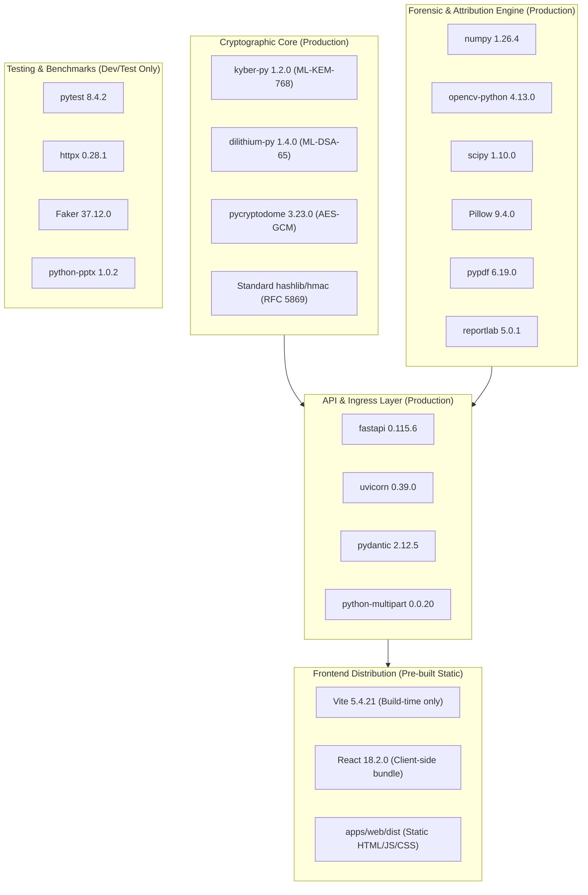

# AegisTrace — Software Supply-Chain & Dependency Inventory

**Classification**: Defense-in-Depth Supply-Chain & Reproducibility Audit  
**System Target**: AegisTrace (SIH26237) — Forensic Security Platform  
**Audit Date**: 2026-09-26  
**Environment Baseline**: Python 3.9.0+ / Node.js 18.0.0+ / OS: Windows 10/11 & Linux Container  

---

## 1. Runtime Environment Specifications

| Environment Component | Declared Requirement | Verified Runtime | Platform Constraints |
| :--- | :--- | :--- | :--- |
| **Python Runtime** | `Python >= 3.9.0` | `Python 3.9.0` / `3.11.x` | 64-bit AMD64/ARM64. Required for pure Python lattice integer math and typing compat. |
| **Node.js Runtime** | `Node.js >= 18.0.0` | `v24.11.0` (active) / `v18.20+` | Cross-platform runtime required for Vite compilation and UI preview. |
| **Package Manager (Python)** | `pip >= 23.0` | `pip 26.0.1` | Wheel binary cache support, hash validation capable. |
| **Package Manager (Node)** | `npm >= 9.0` | `npm 10.x` / `11.x` | Strict `package-lock.json` integrity validation. |
| **C/C++ Compiler (Optional)** | `GCC 11+` / `MSVC 19+` | `MSVC v.1927` | Optional for compiling native C `liboqs`; pure Python fallback executes if missing. |

---

## 2. Direct Python Dependencies

The following table provides the full inventory of direct Python dependencies, classified by subsystem, environment tier, license, and security sensitivity.

| Package Name | Pinned Version | Minimum Bound (`requirements.txt`) | Subsystem / Purpose | Environment Tier | License | Security Sensitivity |
| :--- | :--- | :--- | :--- | :--- | :--- | :--- |
| **`kyber-py`** | `1.2.0` | `>=1.2.0` | NIST FIPS 203 ML-KEM-768 lattice-based key encapsulation | Production / Core | MIT | **CRITICAL** (Core PQC KEM) |
| **`dilithium-py`** | `1.4.0` | `>=1.4.0` | NIST FIPS 204 ML-DSA-65 lattice-based digital signatures | Production / Core | MIT | **CRITICAL** (Core PQC Signatures) |
| **`pycryptodome`** | `3.23.0` | `>=3.23.0` | NIST SP 800-38D AES-256-GCM authenticated cipher & SHA-3 | Production / Core | BSD / Public Domain | **CRITICAL** (Symmetric Envelope) |
| **`cryptography`** | `42.0.8` | `>=42.0.0` | Low-level cryptographic primitives & X.509 binding | Production / Core | Apache 2.0 / BSD | **HIGH** (Cryptographic Engine) |
| **`fastapi`** | `0.115.6` | `>=0.110.0` | Asynchronous REST orchestration API layer | Production / API | MIT | **HIGH** (Ingress / API Plane) |
| **`uvicorn[standard]`** | `0.39.0` | `>=0.28.0` | Production ASGI web server engine | Production / API | BSD 3-Clause | **MEDIUM** (Web Server) |
| **`pydantic`** | `2.12.5` | `>=2.6.0` | Strict schema validation, typed models, data integrity | Production / Core | MIT | **HIGH** (Input Validation) |
| **`pypdf`** | `6.19.0` | `>=4.1.0` | Carrier document parsing, incremental stream mutation | Production / Carrier | BSD 3-Clause | **HIGH** (Artifact Parser) |
| **`reportlab`** | `5.0.1` | `>=4.1.0` | Forensic master document generation & test synthesis | Production / Carrier | BSD | **MEDIUM** (Document Generator) |
| **`python-multipart`**| `0.0.20` | `>=0.0.9` | Form data & file upload multipart streaming parser | Production / API | Apache 2.0 | **HIGH** (Upload Ingestion) |
| **`requests`** | `2.32.5` | `>=2.31.0` | HTTP client for synchronous helper clients | Testing / Scripts | Apache 2.0 | **LOW** (Internal Tools) |
| **`numpy`** | `1.26.4` | `>=1.26.0` | Forensic Tardos scoring, array mathematics, noise ops | Production / Forensic| BSD 3-Clause | **HIGH** (Attribution Math) |
| **`opencv-python`** | `4.13.0.92` | `>=4.8.0` | Spatial homography, lighting correction, image forensics | Production / Forensic| Apache 2.0 | **HIGH** (Vision Engine) |
| **`scipy`** | `1.10.0` | `>=1.10.0` | Statistical correlation, Dirichlet distribution sampling | Production / Forensic| BSD 3-Clause | **HIGH** (Attribution Math) |
| **`Pillow`** | `9.4.0` | `>=9.4.0` | Image format conversion, spatial transforms | Production / Forensic| HPND | **HIGH** (Image Processing) |
| **`python-pptx`** | `1.0.2` | `>=1.0.0` | Automated SIH presentation deck generation | Scripts / Demo | MIT | **LOW** (Demo Utility) |
| **`pytest`** | `8.4.2` | `>=8.0.0` | Automated cryptographic and integration test framework | Testing Only | MIT | **LOW** (Test Harness) |
| **`httpx`** | `0.28.1` | `>=0.27.0` | Fast in-process ASGI test client | Testing Only | BSD 3-Clause | **LOW** (Test Harness) |

---

## 3. Transitive Python Dependencies Manifest (Locked)

The complete locked transitive tree as captured in `deployment/requirements-lock.txt`:

```
anyio==4.12.1               # Asynchronous event loop abstraction (via starlette/httpx)
certifi==2025.1.31          # Root CA bundle (via requests/httpx)
cffi==1.17.1                # C foreign function interface (via cryptography)
click==8.1.8                # CLI interface framework (via uvicorn)
colorama==0.4.6             # ANSI terminal color formatting (via pytest/click)
cryptography==42.0.8        # Cryptographic recipes and primitives
dilithium-py==1.4.0         # Pure-Python ML-DSA-65 (FIPS 204)
exceptiongroup==1.3.1       # Python 3.9 exception group backport
Faker==37.12.0              # Synthetic test fixture generation (via tests)
fastapi==0.115.6            # Web framework
h11==0.14.0                 # Pure-Python HTTP/1.1 protocol engine (via uvicorn)
httpcore==1.0.7             # Low-level HTTP transport (via httpx)
httpx==0.28.1               # HTTP client
idna==3.10                  # Internationalized Domain Names in Applications
iniconfig==2.0.0            # INI configuration file parser (via pytest)
kyber-py==1.2.0             # Pure-Python ML-KEM-768 (FIPS 203)
numpy==1.26.4               # Numerical arrays and mathematical operations
opencv-python==4.13.0.92    # Computer vision library
packaging==25.0             # Version specifier parsing
Pillow==9.4.0               # Python Imaging Library
pluggy==1.6.0               # Plugin management (via pytest)
pycparser==2.21             # C parser in Python (via cffi)
pycryptodome==3.23.0        # Cryptographic library
pydantic==2.12.5            # Data validation using Python type annotations
pydantic_core==2.41.5       # Rust-backed core validation for Pydantic
pypdf==6.19.0               # PDF toolkit
pytest==8.4.2               # Testing framework
python-dateutil==2.8.2      # Extensions to the standard datetime module
python-multipart==0.0.20    # Multipart parser for Python ASGI/WSGI
reportlab==5.0.1            # PDF generation engine
requests==2.32.5            # HTTP library
scipy==1.10.0               # Scientific computing
six==1.17.0                 # Python 2 and 3 compatibility
sniffio==1.3.1              # Asynchronous library sniffer
starlette==0.41.3           # ASGI framework (via fastapi)
tomli==2.4.0                # TOML parser (via pytest on Python < 3.11)
typing_extensions==4.12.2   # Backported typing features
typing_inspection==0.4.2    # Runtime typing introspection
urllib3==2.3.0              # HTTP client (via requests)
uvicorn==0.39.0             # ASGI server
```

---

## 4. Frontend Dependencies (`apps/web`)

### 4.1 Direct Runtime Packages

| Package Name | Specified Version | Resolved Lock Version | Purpose | License | Security Sensitivity |
| :--- | :--- | :--- | :--- | :--- | :--- |
| **`react`** | `^18.2.0` | `18.2.0` | UI component lifecycle and virtual DOM | MIT | **MEDIUM** (Client UI) |
| **`react-dom`** | `^18.2.0` | `18.2.0` | React DOM renderer | MIT | **MEDIUM** (Client UI) |
| **`lucide-react`** | `^0.359.0` | `0.359.0` | Clean SVG icon system (zero runtime network) | ISC | **LOW** (Icons) |
| **`framer-motion`**| `^13.4.4` | `13.4.4` | Hardware-accelerated UI transitions | MIT | **LOW** (Animation) |
| **`animejs`** | `^4.5.0` | `4.5.0` | Micro-interaction timing animations | MIT | **LOW** (Animation) |

### 4.2 Build & Development Tools

| Package Name | Specified Version | Resolved Lock Version | Purpose | License |
| :--- | :--- | :--- | :--- | :--- |
| **`typescript`** | `^5.2.2` | `5.2.2` | Static type checker and compilation | Apache 2.0 |
| **`vite`** | `^5.1.6` | `5.4.21` | High-performance build bundler and local preview | MIT |
| **`@vitejs/plugin-react`** | `^4.2.1` | `4.2.1` | Babel/SWC Fast Refresh for React | MIT |
| **`@types/react`** | `^18.2.66` | `18.2.66` | TypeScript type declarations for React | MIT |
| **`@types/react-dom`** | `^18.2.22` | `18.2.22` | TypeScript type declarations for React DOM | MIT |

---

## 5. Dependency Classification by Lifecycle Stage



---

## 6. Supply-Chain Risk Tiering

1. **Tier 1 — Core Cryptographic Algorithms (CRITICAL Risk)**:
   - `kyber-py`, `dilithium-py`, `pycryptodome`.
   - *Rationale*: Any tampering or vulnerability directly compromises confidentiality, non-repudiation, and mathematical authenticity.
   - *Mitigation*: Hard pinned in `deployment/requirements-lock.txt`, verified against FIPS 203/204 test vectors, and protected with fail-closed production guards.

2. **Tier 2 — Input Parsers & Binary Ingestion (HIGH Risk)**:
   - `pypdf`, `Pillow`, `opencv-python`, `python-multipart`.
   - *Rationale*: Processing untrusted binary leaks and PDF carriers could expose memory-corruption or denial-of-service vulnerabilities.
   - *Mitigation*: Strict size ceilings (50 MB), MIME-type sniffing by magic bytes, and path traversal sanitization before parsing.

3. **Tier 3 — Frameworks & Web Servers (MEDIUM Risk)**:
   - `fastapi`, `uvicorn`, `starlette`, `pydantic`.
   - *Rationale*: Protocol handling and routing.
   - *Mitigation*: Pinned releases, strict CORS whitelisting (no `*` wildcard), and robust error boundaries.

4. **Tier 4 — Build & Test Utilities (LOW Risk)**:
   - `pytest`, `httpx`, `typescript`, `vite`.
   - *Rationale*: Execute strictly in isolated development and test environments; excluded from production execution container.
