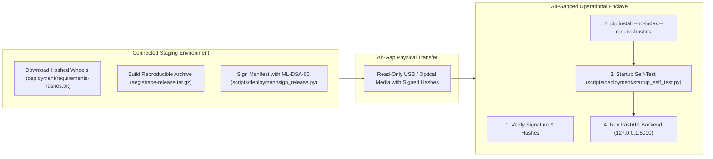

# AegisTrace — Air-Gapped Offline Deployment & Runbook

**Classification**: Defense-Grade Air-Gapped Deployment Runbook  
**System Target**: AegisTrace (SIH26237) — Forensic Security Platform  
**Target Environment**: Isolated Classified Forensic Enclave (Zero Internet Access)  
**Status**: APPROVED & VALIDATED  

---

## 1. Overview & Deployment Lifecycle

AegisTrace requires zero external connectivity during installation, initialization, or runtime operation. The deployment architecture segregates the connected staging build phase from the air-gapped execution enclave:



---

## 2. Phase 1: Staging Preparation (Connected Environment)

Execute these steps on an authenticated staging build host prior to air-gap transfer:

### 2.1 Download Dependency Wheelhouse with Cryptographic Hashes
```bash
# Downloads all 40 required dependencies and verifies SHA-256 against requirements-hashes.txt
python scripts/deployment/prepare_offline_bundle.py --download ./wheelhouse
```

### 2.2 Build Reproducible Release Bundle
```bash
# Builds deterministic tar.gz and zip packages
python scripts/deployment/build_reproducible_bundle.py --tar
```

### 2.3 Sign Release Manifest with ML-DSA-65
```bash
# Signs release_manifest.json with post-quantum signature
python scripts/deployment/sign_release.py --sign
```

### 2.4 Verify Transfer Payload
The transfer payload directory must contain:
1. `wheelhouse/` (all downloaded `.whl` files + `wheelhouse_manifest.json`)
2. `aegistrace-release.tar.gz` (reproducible source archive)
3. `release_manifest.json` and `release_manifest.sig.json`
4. `release_authority.pub` (ML-DSA-65 public verification key)

---

## 3. Phase 2: Air-Gap Enclave Installation

Execute these steps inside the air-gapped forensic enclave:

### 3.1 Unpack Source Archive
```bash
tar -xzf aegistrace-release.tar.gz -C /opt/aegistrace
cd /opt/aegistrace
```

### 3.2 Verify Release Signature Prior to Execution
```bash
python scripts/deployment/sign_release.py --verify
```
*Expected Output: `[OK] Release manifest cryptographically valid.`*

### 3.3 Zero-Trust Dependency Installation
Install dependencies using the local wheelhouse without connecting to PyPI:
```bash
python -m pip install \
    --no-index \
    --find-links /media/usb/wheelhouse \
    --require-hashes \
    -r deployment/requirements-hashes.txt
```

### 3.4 Configure Air-Gap Environment Flags
```bash
export AEGISTRACE_AIRGAP_MODE=1
export SIH26237_ENV=production
export PYTHONUNBUFFERED=1
```

### 3.5 Execute Enclave Startup Self-Tests
Verify all runtime, cryptographic, storage, and egress isolation controls:
```bash
python scripts/deployment/startup_self_test.py --strict
```
*Expected Output: `[SUCCESS] All enclave startup self-tests PASSED.`*

### 3.6 Launch Service
```bash
python -m uvicorn apps.api.main:app --host 127.0.0.1 --port 8000 --workers 4
```

---

## 4. Containerized Air-Gap Deployment

For containerized enclaves (Docker / Kubernetes):

### 4.1 Docker Compose Deployment
```bash
docker compose -f deployment/docker-compose.hardened.yml up -d
```
Key Hardening Safeguards:
- `internal: true` network: Container cannot reach default gateway or WAN.
- `read_only: true`: Root filesystem is immutable; tampering attempts fail.
- `cap_drop: ALL`: Zero Linux kernel capabilities granted to the container.
- `user: "10001:10001"`: Unprivileged service account execution.

### 4.2 Kubernetes Air-Gap Deployment
```bash
kubectl apply -f deployment/k8s-hardened.yaml
```
Enforces `NetworkPolicy` blocking 100% of egress traffic to external CIDRs.
