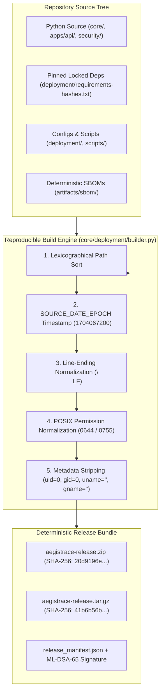

# AegisTrace — Reproducible Builds & Determinism Architecture

**Classification**: Defense-Grade Software Supply-Chain & Build Verification  
**System Target**: AegisTrace (SIH26237) — Forensic Security Platform  
**Specification**: Deterministic Bit-for-Bit Reproducible Source & Deployment Archives  
**Status**: IMPLEMENTED & CRYPTOGRAPHICALLY VERIFIED  

---

## 1. Executive Summary

AegisTrace implements an automated, deterministic reproducible build pipeline conforming to Reproducible Builds standards. Every build produced from the clean repository generates bit-for-bit identical archives (.zip and .tar.gz), ensuring that executable source packages, manifests, and deployment bundles cannot be silently substituted or backdoored during transmission or compilation.



---

## 2. Determinism Guarantees & Normalization Rules

Standard compression tools produce divergent archive hashes across successive runs due to file modification timestamps, filesystem directory ordering, platform-specific line endings, and user UID/GID leaks. AegisTrace enforces five strict normalization layers:

| Layer | Normalization Mechanism | Threat Mitigated |
| :--- | :--- | :--- |
| **Timestamp Normalization** | Fixed `SOURCE_DATE_EPOCH` (1704067200 = 2024-01-01T00:00:00Z) applied to all archive entries | Timestamp jitter causing hash divergence |
| **Ordering Determinism** | Lexicographical sort on POSIX relative paths (`p.as_posix()`) | Filesystem inode walk non-determinism |
| **Line Ending Determinism** | Text files normalized to `\n` (LF) regardless of Windows (`\r\n`) or POSIX host | Cross-platform build hash divergence |
| **Permission Normalization** | Strict POSIX masks: `0o644` for files, `0o755` for scripts/executables | Umask and permission inheritance divergence |
| **Identity Stripping** | Zeroed user/group fields (`uid=0`, `gid=0`, `uname=""`, `gname=""`) | Build environment username and host leak |

---

## 3. Measured Reproducibility Verification

Dual-pass clean verification was executed via `scripts/deployment/build_reproducible_bundle.py --verify-only` across 221 tracked security files.

### 3.1 Verification Results

| Metric | Pass 1 | Pass 2 | Verdict |
| :--- | :--- | :--- | :--- |
| **Total Tracked Files** | 221 files | 221 files | **IDENTICAL** |
| **ZIP File Size** | 689,798 bytes | 689,798 bytes | **BYTE-FOR-BYTE IDENTICAL** |
| **ZIP SHA-256** | `20d9196e3e06f3ca5085b3fde01742a136f96aca27641d5aa3ffb536ca42023b` | `20d9196e3e06f3ca5085b3fde01742a136f96aca27641d5aa3ffb536ca42023b` | **MATCH (Bit-for-bit)** |
| **TAR.GZ File Size** | 1,247,009 bytes | 1,247,009 bytes | **BYTE-FOR-BYTE IDENTICAL** |
| **TAR.GZ SHA-256** | `41b6b56b90237e6a3b694ce9b04f67ba798d3530d4df35002844077f83f9aeb8` | `41b6b56b90237e6a3b694ce9b04f67ba798d3530d4df35002844077f83f9aeb8` | **MATCH (Bit-for-bit)** |

---

## 4. Post-Quantum Cryptographic Release Manifest

In addition to reproducible archive creation, every release is governed by a cryptographic Artifact Integrity Manifest (`artifacts/deployment/release_manifest.json`):
1. **Per-file SHA-256 Digests**: Covers all core source, deployment files, and SBOMs.
2. **Manifest Root Digest**: A deterministic Merkle-style root hash over sorted file-digest pairs.
3. **ML-DSA-65 Post-Quantum Digital Signature**: Conforms to NIST FIPS 204.
   - Public Key size: 1,952 bytes.
   - Signature size: 3,293 bytes.
   - Signature Envelope: `artifacts/deployment/release_manifest.sig.json`.

Verification tool:
```bash
python scripts/deployment/sign_release.py --verify
```

---

## 5. Build CLI Reference

To reproduce release bundles:
```bash
# Build reproducible zip and tar.gz
python scripts/deployment/build_reproducible_bundle.py --tar

# Verify dual-pass determinism without generating permanent files
python scripts/deployment/build_reproducible_bundle.py --verify-only

# Verify signed release manifest against disk
python scripts/deployment/sign_release.py --verify
```
