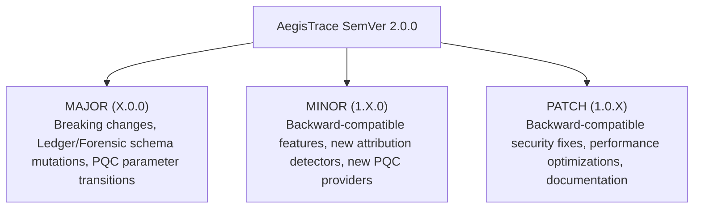

# AegisTrace — Upgrade, Migration & Rollback Policy

**Classification**: Defense-Grade Software Lifecycle & Upgrade Management  
**System Target**: AegisTrace (SIH26237) — Forensic Security Platform  
**Specification**: SemVer 2.0.0, Post-Quantum Upgrade Signatures & Atomic Migration  
**Status**: APPROVED & IMPLEMENTED  

---

## 1. Versioning Specification (SemVer 2.0.0)

AegisTrace follows Semantic Versioning 2.0.0 (`MAJOR.MINOR.PATCH`).
Version compliance is programmatically managed via `core/deployment/versioning.py`.



### 1.1 Compatibility Matrix

| Current Version | Target Version | Upgrade Classification | Database Migration Required? | Automated Rollback Safe? |
| :--- | :--- | :--- | :--- | :--- |
| `1.0.0` | `1.0.1` | Patch (Security update) | No | **Yes (Direct)** |
| `1.0.0` | `1.1.0` | Minor (Feature release) | Additive schemas only | **Yes (Transactional)** |
| `1.0.0` | `2.0.0` | Major (Breaking upgrade) | Full migration plan | **Yes (From backup)** |
| `1.1.0` | `1.0.0` | **DOWNGRADE ATTACK** | Blocked | **BLOCKED BY CONTROLLER** |

---

## 2. Upgrade Security Controls

Every software upgrade package must satisfy four mandatory security gates enforced by `UpgradeSafetyController`:

1. **Downgrade Attack Rejection**: An upgrade package targeting a lower SemVer than the currently active version is rejected with `UpgradeSecurityError: Downgrade attack prevented`.
2. **Post-Quantum Cryptographic Signature**: Upgrade metadata and package digests must be cryptographically signed with NIST FIPS 204 ML-DSA-65.
3. **Pre-Migration Transactional Backup**: The SQLite metadata database is atomically backed up to `data/backups/metadata_backup_{version}_{timestamp}.sqlite3` using the SQLite Online Backup API.
4. **Post-Upgrade Startup Self-Test**: Services cannot process traffic until `scripts/deployment/startup_self_test.py --strict` executes with an overall `PASS` verdict.

---

## 3. Standard Upgrade Workflow

```bash
# 1. Download and verify incoming upgrade package
python scripts/deployment/prepare_offline_bundle.py --verify ./upgrade_wheelhouse

# 2. Validate package signature and create transactional database backup
python -c "
from core.deployment.upgrade import UpgradeSafetyController
controller = UpgradeSafetyController()
backup = controller.create_database_backup()
print('Database backup secured at:', backup)
"

# 3. Apply updated code and wheels
tar -xzf aegistrace-upgrade.tar.gz -C /opt/aegistrace
pip install --no-index --find-links ./upgrade_wheelhouse --require-hashes -r deployment/requirements-hashes.txt

# 4. Verify post-quantum release signature
python scripts/deployment/sign_release.py --verify

# 5. Run full enclave startup self-test
python scripts/deployment/startup_self_test.py --strict
```

---

## 4. Rollback Runbook (Emergency Recovery)

If any stage of the upgrade or startup self-test fails:

1. **Halt Services**: Terminate uvicorn / container processes immediately.
2. **Restore Database**:
   ```bash
   cp data/backups/metadata_backup_<PREV_VERSION>_<TIMESTAMP>.sqlite3 data/metadata.sqlite3
   ```
3. **Revert Application Archive**: Unpack previous verified release archive (`aegistrace-release-<PREV_VERSION>.tar.gz`).
4. **Re-run Startup Self-Test**:
   ```bash
   python scripts/deployment/startup_self_test.py --strict
   ```
5. **Resume Normal Operations**.
