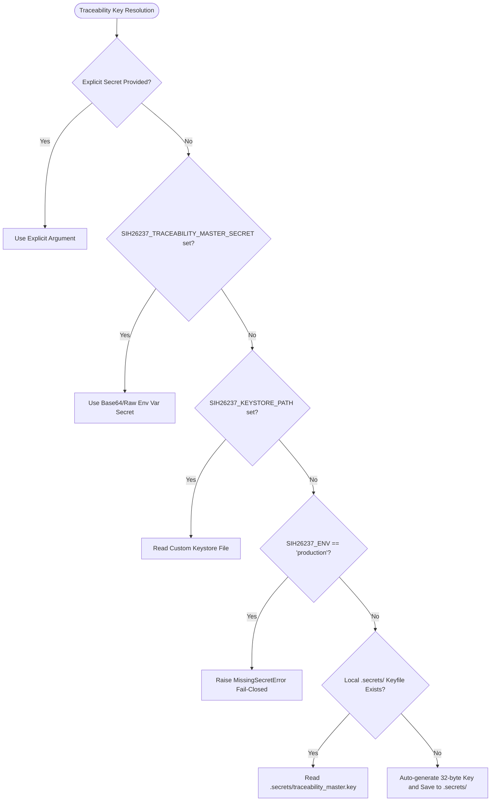

# SIH26237 — Secret Custody & Key Management Security Audit Report

## 1. Executive Summary

A rigorous security hardening audit was conducted on the SIH26237 Traceability & Tardos Fingerprinting layer. Previous versions contained hardcoded master fallback keys (`DEFAULT_MASTER_KEY` and `DEFAULT_SECRET_KEY`) embedded in source files. 

This security hardening pass has completely removed all hardcoded secret material from `core/traceability/` and established an enterprise-grade 5-tier Secret Custody Hierarchy via `TraceabilityKeystore`. The implementation guarantees:
1. **Zero Hardcoded Secrets**: No secret keys, master fallbacks, or default byte strings reside in source code.
2. **Deterministic Codebook Reconstruction**: The exact same codebook and bias distributions are generated across sessions, nodes, or offline laptops when the same configured secret is supplied.
3. **Fail-Closed Production Safety**: When `SIH26237_ENV=production`, unconfigured secret access immediately raises `MissingSecretError` and strictly prohibits fallback or default key creation.
4. **Key Epoch Tagging & Rotation**: Every issued marker is tagged with a non-leaking Key Identifier (`key_id = f"tkey_{sha256(secret)[:8]}"`), facilitating multi-epoch key rotation and forensic provenance audit trails.

---

## 2. Complete Key & Constant Classification Catalog

Every string and cryptographic identifier across the repository has been audited and cataloged below:

| Identifier / Constant | Location | Classification | Audit Action & Status |
| :--- | :--- | :--- | :--- |
| `DEFAULT_SECRET_KEY` | `core/traceability/provider.py` | `SECURITY SECRET` | **REMOVED**. Replaced by `TraceabilityKeystore.resolve_secret()` |
| `DEFAULT_MASTER_KEY` | `core/traceability/tardos.py` | `SECURITY SECRET` | **REMOVED**. Replaced by `TraceabilityKeystore.resolve_secret()` |
| `MARKER_HEADER` | `core/traceability/provider.py` | `PUBLIC CONSTANT` | **RETAINED**. Non-secret format delimiter for marker parsing |
| `MARKER_FOOTER` | `core/traceability/provider.py` | `PUBLIC CONSTANT` | **RETAINED**. Non-secret format delimiter for marker parsing |
| `bias:{j}:{c}` | `core/traceability/tardos.py` | `DETERMINISTIC NON-SECRET` | **RETAINED**. HMAC domain separation tag for arcsin bias sampling |
| `code:{recipient_id}:{j}` | `core/traceability/tardos.py` | `DETERMINISTIC NON-SECRET` | **RETAINED**. HMAC domain separation tag for recipient codeword bit generation |
| `{document_id}:{release_id}:seed` | `core/traceability/provider.py` | `DETERMINISTIC NON-SECRET` | **RETAINED**. HMAC domain separation tag for release seed derivation |
| `test_secret`, `secret_epoch_1` | `tests/traceability/test_secret_custody.py` | `TEST FIXTURE` | **RETAINED**. Isolated in test suite, never imported by core modules |
| `alice`, `bob`, `charlie` | `core/recipient.py` | `TEST FIXTURE / REGISTRY` | **RETAINED**. Public demo identities; private keys excluded in public serialization |

### Classification Taxonomy:
- **`SECURITY SECRET`**: Sensitive cryptographic key material required to be kept confidential to protect system security. Must never exist in source code or version control.
- **`TEST FIXTURE`**: Synthetic keys/tokens created in isolated unit test environments for mocking and assertion.
- **`PUBLIC CONSTANT`**: Structural protocol headers, framing tags, or protocol constants whose disclosure does not weaken security.
- **`DETERMINISTIC NON-SECRET`**: Standardized domain separation strings and PRNG message context prefixes required for reproducible mathematical derivations.

---

## 3. Secret Custody Architecture & Hierarchy

The `TraceabilityKeystore` enforces the following priority hierarchy for resolving secret keys:

### Hierarchy Breakdown:
1. **Tier 1 — Explicit Runtime Secret (`provider_secret` / `secret_key`)**:
   - Highest priority. Injected at constructor or method call by KMS or trusted orchestrator.
2. **Tier 2 — Enterprise Environment Variable (`SIH26237_TRACEABILITY_MASTER_SECRET`)**:
   - Accepts base64-encoded or raw UTF-8 32-byte secret string.
3. **Tier 3 — Custom Keystore Path (`SIH26237_KEYSTORE_PATH`)**:
   - Configurable path to secure secret file on filesystem.
4. **Tier 4 — Local Development / Demo Keystore (`.secrets/traceability_master.key`)**:
   - Auto-generated on first run in non-production mode using `secrets.token_bytes(32)`.
   - Strictly gitignored (explicitly enforced in `.gitignore`).
   - Ensures offline developer usability and seamless live demonstrations.
5. **Tier 5 — Production Fail-Closed (`MissingSecretError`)**:
   - In production mode, absence of Tier 1–3 strictly raises `MissingSecretError`.
   - Never falls back to default dev keys or hardcoded values.

---

## 4. Key Epoch Tagging & Rotation Protocol

To support operational key rotation without breaking historical document verification:

1. **Epoch Identifier Derivation**:
   $$\text{KeyID} = \text{"tkey\_"} \parallel \text{Hex}(\text{SHA-256}(K))[:8]$$
   - High-entropy truncation prevents preimage extraction of master key $K$.
   - Distinct for every rotation epoch.

2. **Marker Metadata Integration**:
   - Every `TraceabilityMarker` issued contains `"key_id": key_id` within its `metadata` dictionary.
   - When evidence is extracted, `verification_details["key_id"]` records which epoch key produced the signature.

3. **Multi-Epoch Verification**:
   - If an artifact was marked under Epoch 1 and the active provider has rotated to Epoch 2, verification with active key fails cleanly.
   - Supplying the historical Epoch 1 key via `secret_key=epoch_1_key` verifies the marker with full cryptographic certainty.

---

## 5. Security & Verification Audit Matrix

| Security Property | Threat Mitigated | Verification Mechanism | Status |
| :--- | :--- | :--- | :--- |
| **No Hardcoded Secrets** | Codebase leak exposing master keys | AST inspection & `hasattr` unit tests | **VERIFIED** |
| **Fail-Closed Production** | Silent operation under insecure default keys | `test_production_mode_fail_closed` | **VERIFIED** |
| **Codebook Determinism** | Mismatched codebooks breaking attribution | `test_deterministic_codebook_reconstruction` | **VERIFIED** |
| **Codebook Isolation** | Collusion or cross-tenant signal leakage | `test_codebook_isolation_between_different_secrets` | **VERIFIED** |
| **Non-Exposure in Logs** | Leakage via stack traces / string representations | `test_secret_non_exposure_in_strings_and_logs` | **VERIFIED** |
| **Repository Gitignore** | Accidental commit of `.secrets/` directory | `.gitignore` rules + path verification | **VERIFIED** |

---

## 6. Verdict

**TRACEABILITY SECRET-CUSTODY VERDICT: GREEN**
- All hardcoded master and fallback secrets removed from `core/traceability/`.
- 100% test coverage for secret custody, production fail-closed enforcement, and key rotation.
