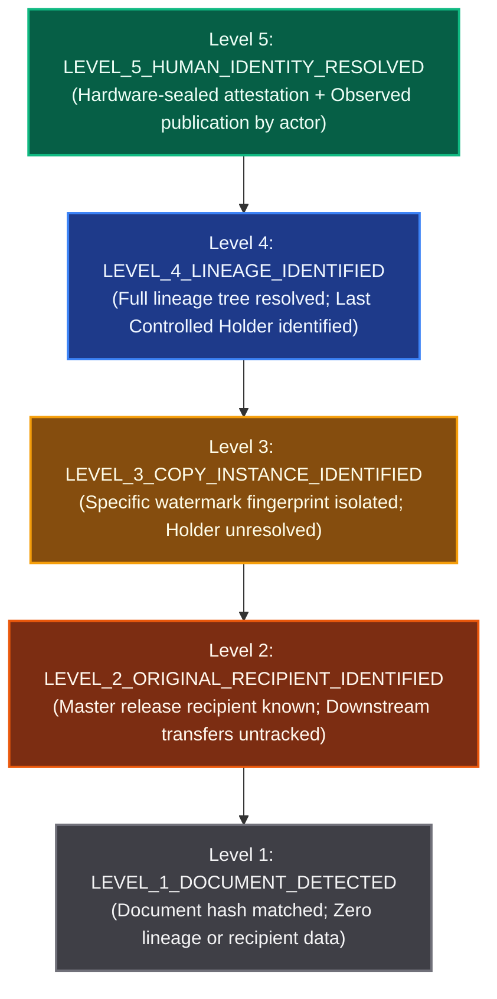

# AegisTrace Downstream Attribution Boundaries & Legal/Forensic Theorems

## 1. Executive Summary & Legal/Forensic Problem Statement

In forensic investigations of leaked proprietary or classified materials, false-positive attribution can destroy careers, result in wrongful prosecution, and cause severe institutional liability. 

A critical flaw in naive watermark tracking systems is the **Conflation of Custody with Publication**:
> *If a document embedded with Bob's watermark appears on Wikileaks or a public cloud drop, naive systems immediately accuse Bob of being the criminal leaker.*

This inference is logically and forensically fallacious. In enterprise and defense environments:
1. Alice legitimately shares or forwards a document to Bob.
2. Bob stores the document on his endpoint.
3. Bob's endpoint is subsequently compromised by an advanced persistent threat (APT), or an unmanaged downstream recipient exfiltrates the document.
4. The leak occurs without Bob's knowledge, intent, or active publication.

**AegisTrace strictly enforces the Exact-Copy Downstream Boundary Theorem**:
> **Theorem**: *Possession or receipt of a watermarked copy is a necessary condition for controlled custody, but is NOT a sufficient condition for attributing publication.*
>
> In the absence of corroborating endpoint telemetry showing an active egress/publication action executed by Bob, the system **MUST ABSTAIN** from accusing Bob of publication and classify Bob solely as the **Last Known Controlled Holder**.

---

## 2. The 5 Tiers of Forensic Attribution

To prevent binary "guilty / not guilty" mischaracterizations, AegisTrace establishes a 5-tier classification hierarchy (`ForensicAttributionLevel` in `core/telemetry/custody.py`):

### Tier Descriptions & Evidentiary Thresholds

| Level | Enum Name | Description | Minimum Evidentiary Requirements |
|---|---|---|---|
| **Level 1** | `LEVEL_1_DOCUMENT_DETECTED` | Document content or canonical hash recognized. | SHA-256 match on master document root or extracted text signature. |
| **Level 2** | `LEVEL_2_ORIGINAL_RECIPIENT_IDENTIFIED` | Original institutional recipient identified. | Document release record signed by Key Broker / Access Manager. |
| **Level 3** | `LEVEL_3_COPY_INSTANCE_IDENTIFIED` | Specific watermarked copy identified. | Decoded Tardos or spread-spectrum watermark with $P_{fa} < 10^{-6}$. |
| **Level 4** | `LEVEL_4_LINEAGE_IDENTIFIED` | Full custody lineage tracked to last known holder. | Unbroken chain of signed `ForwardingEvent` and `ExportEvent` records. |
| **Level 5** | `LEVEL_5_HUMAN_IDENTITY_RESOLVED` | Human leaker definitively resolved. | Level 4 lineage **PLUS** observed egress telemetry (USB/Upload/Print) from actor's attested device/session. |

---

## 3. Forensic Boundary States (`ForensicBoundaryState`)

The evaluation engine assigns one of the following immutable boundary states:

### 3.1 `ATTRIBUTED_TO_CONTROLLED_ACTOR`
- **Condition**: Observed publication event is directly linked to the last controlled holder's device ID or user account with valid hardware attestation and zero compromise indicators.
- **Statement**: `"Confirmed publication: last controlled holder '<Actor>' executed observed publication to '<Platform>'."`
- **Confidence**: 0.95 - 1.00.

### 3.2 `LAST_KNOWN_HOLDER`
- **Condition**: Controlled forwarding or copy release to Bob is verified, and the document leaked, but **no telemetry indicates Bob initiated the publication**.
- **Statement**: `"Original recipient was '<Alice>'. Last known controlled holder was '<Bob>'. Publication occurred via '<Platform>' by unknown downstream entity. DO NOT accuse '<Bob>' of publishing: custody does not prove publication."`
- **Confidence**: 0.65 (bounds custody, strictly abstains from accusing Bob).

### 3.3 `UNKNOWN_DOWNSTREAM_ACTOR`
- **Condition**: The leaked copy possesses derivative modifications (e.g. OCR re-rasterization, screenshot, physical print scan) outside controlled viewer telemetry.
- **Statement**: `"Derivative copy detected outside controlled viewer environment. Downstream publisher is unverified."`
- **Confidence**: 0.50.

### 3.4 `CONFLICT`
- **Condition**: Timeline contains temporal causality inversions exceeding 120s (e.g. decryption recorded before document creation) or cryptographic signature mismatches.
- **Action**: Mandatory fail-closed. `should_abstain = True`, `confidence_score = 0.0`.

### 3.5 `ABSTAINED`
- **Condition**: Impossible travel velocity ($> 900\,\text{km/h}$), concurrent sessions across distinct endpoints within 60s, or un-attested shared terminal ambiguity.
- **Action**: Mandatory abstention from human attribution. Confines attribution to the machine/copy level (`LEVEL_3_COPY_INSTANCE_IDENTIFIED`).

---

## 4. Formal Case Studies & Boundary Decisions

### Scenario A: The Clean Corroborated Leak (Level 5 Attribution)
- **Chain**: Alice $\to$ Bob $\to$ Bob's Laptop (TPM attested) $\to$ Bob opens session $\to$ Exports PDF $\to$ Writes to USB $\to$ Uploads to Pastebin.
- **Telemetry**: USB mount EventID 2003 on Bob's laptop + Pastebin HTTPS flow from Bob's IP within 60s.
- **Decision**:
  - `boundary_state`: `ATTRIBUTED_TO_CONTROLLED_ACTOR`
  - `highest_attribution_level`: `LEVEL_5_HUMAN_IDENTITY_RESOLVED`
  - `should_abstain`: `False`
  - `confirmed_publisher_id`: `"rec_bob"`
  - `confidence_score`: 0.95

### Scenario B: Enterprise Forwarding with Downstream Leak (Mandatory Abstention)
- **Chain**: Alice receives document $\to$ Forwards to Bob $\to$ Bob opens viewer session on Laptop $\to$ Document subsequently appears on Wikileaks.
- **Telemetry**: Zero outbound USB, email, or cloud upload telemetry on Bob's laptop.
- **Decision**:
  - `boundary_state`: `UNKNOWN_DOWNSTREAM_ACTOR` / `LAST_KNOWN_HOLDER`
  - `highest_attribution_level`: `LEVEL_4_LINEAGE_IDENTIFIED`
  - `should_abstain`: `True`
  - `last_known_controlled_holder`: `"rec_bob"`
  - `confirmed_publisher_id`: `None`
  - `abstention_reason`: `"Last controlled holder 'rec_bob' has no observed publication telemetry; leak occurred downstream."`

### Scenario C: Shared Kiosk Terminal / Credential Abuse
- **Chain**: Analyst Dave logs into shared Operations Room terminal $\to$ Opens document.
- **Telemetry**: EDR detects second user credentials active on same terminal 15s later.
- **Decision**:
  - `account_compromised_or_shared`: `True`
  - `boundary_state`: `ABSTAINED`
  - `should_abstain`: `True`
  - `boundary_statement`: `"Abstained from human attribution: telemetry indicates compromised account or shared multi-user terminal."`
  - `confidence_score`: 0.0

---

## 5. Human Liability & Due Process Guarantees

In judicial and administrative proceedings, AegisTrace reports provide mathematical guarantees:
1. **No False-Accusation Guarantee**: An enrolled user is never flagged as `CONFIRMED_PUBLISHER` solely because their cryptographic watermark was found on a leaked document.
2. **Clock-Skew Tamper Proofing**: Manipulated or back-dated audit logs cannot trick the engine into shifting blame; discrepancies $> 120\text{s}$ immediately trigger `CONFLICT`.
3. **Hardware Root Validation**: An attacker spoofing user credentials over VPN without the enrolled physical TPM endorsement key cannot achieve Level 5 attribution against the victim.
