# AegisTrace Forensic Custody Graph & Topological Verification

## 1. Overview & Graph-Theoretic Formalism

Forensic document tracing fundamentally reduces to a directed acyclic graph (DAG) reachability and dependency validation problem. When a leaked document $D_{leak}$ is discovered on an external drop, the forensic investigator must prove the existence of an unbroken, cryptographically verified path from the master document root $R$ to the leak observation node $L$:

$$\mathcal{P} = (v_0, e_1, v_1, e_2, \dots, e_k, v_k)$$
where $v_0 = R$ and $v_k = L$.

If any required edge $e_i$ is missing, inverted, or mathematically contradictory, the graph engine must flag a **Custody Gap** or **Causality Violation** and abort deterministic attribution.

---

## 2. Graph Node & Edge Taxonomy

```mermaid
graph TD
    subgraph Custody Nodes
        N_ROOT["DocumentRoot (R)"]
        N_REC["RecipientPrincipal (Alice)"]
        N_DEV["DeviceBinding (TPM 2.0)"]
        N_SESS["ViewerSession (Sess_01)"]
        N_DEC["DecryptionEvent (CEK Unwrapped)"]
        N_COPY["CopyInstance (Watermarked Copy)"]
        N_OBS["AccessObservation (Rendered Pixels)"]
        N_FWD["ForwardingEvent (Alice -> Bob)"]
        N_EXP["ExportEvent (PDF / Print)"]
        N_EXT["ExternalTelemetry (EDR / USB / Netflow)"]
        N_LEAK["PublicationObserved (Pastebin Leak)"]
    end

    N_ROOT -->|"ISSUED_TO"| N_REC
    N_REC -->|"BOUND_TO"| N_DEV
    N_DEV -->|"AUTHENTICATED_IN"| N_SESS
    N_SESS -->|"UNWRAPPED_BY"| N_DEC
    N_DEC -->|"EMBEDDED_IN"| N_COPY
    N_COPY -->|"RENDERED_ON"| N_OBS
    N_COPY -->|"DELEGATED_TO"| N_FWD
    N_COPY -->|"EXPORTED_TO"| N_EXP
    N_EXP -->|"CORRELATED_WITH"| N_EXT
    N_EXT -->|"OBSERVED_BY"| N_LEAK

    style N_ROOT fill:#1e293b,stroke:#3b82f6,color:#f8fafc
    style N_REC fill:#1e293b,stroke:#3b82f6,color:#f8fafc
    style N_DEV fill:#1e293b,stroke:#10b981,color:#f8fafc
    style N_SESS fill:#1e293b,stroke:#10b981,color:#f8fafc
    style N_DEC fill:#1e293b,stroke:#f59e0b,color:#f8fafc
    style N_COPY fill:#1e293b,stroke:#f59e0b,color:#f8fafc
    style N_OBS fill:#1e293b,stroke:#6366f1,color:#f8fafc
    style N_FWD fill:#1e293b,stroke:#8b5cf6,color:#f8fafc
    style N_EXP fill:#1e293b,stroke:#ec4899,color:#f8fafc
    style N_EXT fill:#1e293b,stroke:#ec4899,color:#f8fafc
    style N_LEAK fill:#0f172a,stroke:#ef4444,stroke-width:3px,color:#f8fafc
```



### 2.1 Node Types (`ForensicNodeType`)
- `DOCUMENT_ROOT`: Canonical document origin (hash, byte length, creation timestamp).
- `RECIPIENT_PRINCIPAL`: Human or programmatic actor authorized for initial distribution.
- `DEVICE_BINDING`: Hardware endpoint bound via TPM 2.0 endorsement key or Apple Secure Enclave.
- `VIEWER_SESSION`: Active ephemeral decrypt/render session.
- `DECRYPTION_EVENT`: Hardware unsealing of document encryption key (CEK).
- `WATERMARKED_COPY`: Specific copy $C_i$ containing unique Tardos/spread-spectrum fingerprint.
- `ACCESS_OBSERVATION`: Render event verified on attested display surface.
- `FORWARDING_NODE`: Cryptographically signed delegation from parent copy to child copy.
- `EXPORT_NODE`: Controlled generation of unmanaged derivative asset (`PDF`, `PRINT`).
- `EXTERNAL_TELEMETRY`: EDR, DLP, USB, Print Spooler, Netflow log entries.
- `PUBLICATION_NODE`: Public appearance on an external drop or whistleblowing repository.

### 2.2 Edge Types (`ForensicEdgeType`)
- `ISSUED_TO`: Root issuance to enrolled principal ($Root \to Principal$).
- `BOUND_TO`: Principal enrollment on hardware device ($Principal \to Device$).
- `AUTHENTICATED_IN`: Hardware-attested session startup ($Device \to Session$).
- `UNWRAPPED_BY`: Envelope key unwrapping ($Session \to Decrypt$).
- `EMBEDDED_IN`: Watermark payload embedding ($Decrypt \to Copy$).
- `RENDERED_ON`: Pixel rendering verification ($Copy \to AccessObservation$).
- `DELEGATED_TO`: Controlled transfer ($Copy_A \to Forwarding \to Copy_B$).
- `EXPORTED_TO`: Format conversion ($Copy \to Export \to Copy_{child}$).
- `CORRELATED_WITH`: Temporal and spatial link to external telemetry ($Export \to SensorEvent$).
- `OBSERVED_BY`: External sensor corroboration ($SensorEvent \to Publication$).

---

## 3. Causal Validation & Topological Verification

The `ForensicCorrelationGraph` (`core/telemetry/graph.py`) enforces strict topological invariants on the custody DAG:

### 3.1 Cycle Prevention (Acyclicity Theorem)
In a valid forensic custody graph, no document copy can be an ancestor of itself:
$$\forall v \in \mathcal{V},\quad v \notin \text{Descendants}(v)$$
- A cycle in copy lineage indicates cryptographic re-use attack, forward replay, or key compromise.
- `find_cycles()` executes Tarjan's strongly connected components algorithm. If any component has size $> 1$, a critical error is flagged.

### 3.2 Temporal Monotonicity on Directed Edges
For every directed causal edge $e = (u, v)$ where $t(u)$ and $t(v)$ are the timestamps of the source and target nodes:
$$t(v) - t(u) \ge -\tau_{skew}$$
where $\tau_{skew} = 120.0\,\text{s}$ is the allowable NTP network jitter.
- If $t(v) - t(u) < -120.0\,\text{s}$, the edge violates physical causality (e.g. child copy timestamped 10 minutes before parent copy was issued).
- The edge is flagged `CustodyCausalStatus.CAUSALITY_VIOLATION` and attribution is blocked.

### 3.3 Custody Gap Detection
When traversing from a publication observation node back to the root:
1. **Unobserved Forwarding**: If the watermark matches copy $C_B$ (issued to Bob), but no signed `ForwardingEvent` exists from Alice to Bob, the graph logs:
   `"Custody Gap: Copy issued to Bob has no cryptographic forwarding parent."`
2. **Missing Decryption Log**: If rendering is observed without a preceding `DECRYPTED` event on the session:
   `"Custody Gap: Rendering observed without corresponding CEK unwrapping."`
3. **Missing Release**: If export occurs without a recorded release to recipient:
   `"Custody Gap: Export observed without documented release to recipient."`

Any uncorroborated gap caps the maximum attribution level at `LEVEL_3_COPY_INSTANCE_IDENTIFIED` or transitions state to `UNKNOWN_DOWNSTREAM_ACTOR`.

---

## 4. Graph Walk: From Leaked Artifact to Document Root

When an external leak occurs, the graph performs a deterministic backward walk:

```
Algorithm 1: Forensic Custody Backward Walk
Input: Leaked Artifact Fingerprint FP_leak, External Telemetry Events E
Output: Custody Path P, Attribution State S, Confidence C

1. Initialize Path P = []
2. Match FP_leak against CopyInstances:
     If match found: Current = CopyInstance C_k
     Else: Return ([], INSUFFICIENT_EVIDENCE, 0.0)

3. Add Current to P
4. While Current != DocumentRoot:
     Find parent edge e = (Parent, Current)
     If e is None:
         Record CustodyGap("Broken lineage tree")
         Break
     Validate Monotonicity: t(Current) >= t(Parent) - 120s
     If Monotonicity fails:
         Return (P, CONFLICT, 0.0)
     Add Parent to P
     Current = Parent

5. Traverse forward from C_k to find Egress Telemetry:
     E_egress = Filter(E, device == C_k.device, copy == C_k.copy, t >= t(C_k) - 120s)
     Cluster E_egress into CompoundActions

6. Evaluate Downstream Attribution Boundaries:
     If Confirmed Publication by Holder:
         Return (P, ATTRIBUTED_TO_CONTROLLED_ACTOR, 0.95)
     Else If Downstream Leak Without Observed Publication:
         Return (P, LAST_KNOWN_HOLDER, 0.65)
     Else If Causality Violation or Compromised Workstation:
         Return (P, ABSTAINED, 0.0)
```

This backward walk guarantees that forensic claims are never asserted based on isolated telemetry hits, but solely on complete, causally verified chains of cryptographic custody.
