# AegisTrace Canonical Telemetry Event Model

## 1. Overview & Forensic Objective

Modern enterprise forensic investigations must ingest disparate telemetry streams ranging from kernel audit daemons and endpoint security sensors to perimeter network flow collectors and public leak feeds. Disparate log formats present severe forensic challenges:
- **Format Inconsistency**: EDR vendors use proprietary event names (e.g. `ProcessCreate`, `FileWrite`, `DocPrintJob`).
- **Trust Asymmetry**: A cryptographically signed TPM measurement log has vastly higher evidential weight than an unverified user-submitted CSV or web hook.
- **Double Counting**: A single physical document leak often produces simultaneous alerts in EDR, DLP, USB monitors, and firewalls. Treating each sensor alert as an independent corroborating event inflates Bayesian posterior probabilities.

AegisTrace addresses these challenges through a unified **Canonical Telemetry Event Model** that enforces deterministic normalization, explicit cryptographic trust classification, hardware attestation binding, and compound multi-sensor aggregation.

---

## 2. Canonical Schema Definitions

### 2.1 Canonical Event Types (`CanonicalEventType`)

Every observed internal or external action maps to one of 14 strictly typed lifecycle stages:

| Canonical Event Type | Lifecycle Phase | Description | Example Sources |
|---|---|---|---|
| `DOCUMENT_CREATED` | Genesis | Creation of the master root asset and canonical hash | Internal Lineage Engine |
| `RELEASED_TO_RECIPIENT` | Custody Start | First cryptographic release / envelope creation to an enrolled principal | Access Control / KMS |
| `DECRYPTED` | Access | Unwrapping of document encryption keys by an authorized session | Controlled Viewer, Key Broker |
| `RENDERED` | Presentation | Visual layout and pixel display onto an attested canvas | Controlled Viewer, Screen Defense |
| `COPIED` | Internal Duplication | Generation of an authorized derivative or internal clone | Lineage Engine |
| `EXPORTED` | Format Conversion | Export to an unmanaged or peripheral file format (`PDF`, `PNG`, `CSV`) | Viewer Export Service, EDR |
| `FORWARDED` | Delegation | Cryptographically signed delegation of access from Alice to Bob | Forwarding Broker |
| `WRITTEN_TO_USB` | Physical Egress | Data transfer across USB mass storage interface | OS Kernel, USB Audit Agent, EDR |
| `EMAILED` | Network Egress | Outbound SMTP / MIME payload attachment transmission | Email Gateway, M365/Google Mail Audit |
| `UPLOADED` | Cloud Egress | HTTP POST / PUT or cloud sync to untrusted remote bucket/SaaS | CASB, Web Proxy, DLP |
| `PRINTED` | Hardcopy Egress | Windows/CUPS spooler job dispatched to physical or virtual printer | Print Spooler (EventID 307), CUPS |
| `ACCESSED_FROM_BROWSER` | Web Presentation | WebAssembly / Canvas render in a web-based document portal | CASB, WAF, Browser Extension |
| `NETWORK_TRANSMITTED` | Transport | Unclassified L4/L7 flow record indicating binary data transfer | IPFIX, Netflow, Zeek, Firewall |
| `PUBLICATION_OBSERVED` | Public Leak | Public drop appearance (e.g. Pastebin, Telegram, Wikileaks, Dark Web) | Threat Intel, Crawlers, Public Scraping |

---

### 2.2 Telemetry Trust Classifications (`TelemetryTrustLevel`)

Unlike traditional SIEM models that treat all logs equally, AegisTrace assigns an immutable forensic trust grade based on cryptographic provenance:

```mermaid
flowchart TD
    subgraph Trust Hierarchy
        L1["CRYPTOGRAPHICALLY_VERIFIED (Weight: 1.00)"]
        L2["HARDWARE_SEALED (Weight: 0.98)"]
        L3["SIGNED (Weight: 0.90)"]
        L4["AUTHENTICATED (Weight: 0.80)"]
        L5["OBSERVED (Weight: 0.60)"]
        L6["UNVERIFIED (Weight: 0.30)"]
        L7["CONFLICTED (Weight: 0.00)"]
    end

    L1 --> L2 --> L3 --> L4 --> L5 --> L6 --> L7

    style L1 fill:#065f46,stroke:#10b981,color:#ecfdf5
    style L2 fill:#065f46,stroke:#10b981,color:#ecfdf5
    style L3 fill:#1e3a8a,stroke:#3b82f6,color:#eff6ff
    style L4 fill:#1e3a8a,stroke:#3b82f6,color:#eff6ff
    style L5 fill:#854d0e,stroke:#f59e0b,color:#fefce8
    style L6 fill:#7f1d1d,stroke:#ef4444,color:#fef2f2
    style L7 fill:#3f3f46,stroke:#71717a,color:#f4f4f5
```



1. **`CRYPTOGRAPHICALLY_VERIFIED`**: Bound to an unbroken post-quantum ML-DSA-65 or Ed25519 digital signature verifiable with root CA.
2. **`HARDWARE_SEALED`**: Bound to hardware root of trust (TPM 2.0 quote, Apple Secure Enclave, Nitro Enclave).
3. **`SIGNED`**: Digitally signed by a registered enterprise service or platform certificate.
4. **`AUTHENTICATED`**: Emitted by an authenticated kernel driver or managed EDR agent over TLS/mTLS.
5. **`OBSERVED`**: Standard syslog or unauthenticated network flow collector with basic network integrity.
6. **`UNVERIFIED`**: Third-party report, public pastebin crawl, or unauthenticated user submission.
7. **`CONFLICTED`**: Log entry containing cryptographic or temporal contradictions (clock skew $> 120\text{s}$, signature mismatch).

---

### 2.3 Device Attestation Standing (`DeviceAttestationState`)

Device telemetry must always reflect hardware assurance standing:
- **`DEVICE_ATTESTED`**: Successfully validated against TPM 2.0 endorsement key or Secure Enclave hardware certificate.
- **`DEVICE_UNATTESTED`**: Enrolled device with expired or missing hardware attestation quote.
- **`DEVICE_UNKNOWN`**: External or guest device with no enrollment record.
- **`DEVICE_REVOKED`**: Device explicitly blacklisted or revoked in `DeviceStore`.
- **`DEVICE_COMPROMISED`**: Device exhibiting impossible travel, concurrent conflicting credentials, or rootkit tampering.

---

## 3. Canonical Event Data Structure

The canonical event object is defined as:

```python
class ForensicEvent(BaseModel):
    event_id: str                              # Unique GUID / hash
    timestamp: datetime                        # UTC normalized timestamp
    event_type: str                            # Vendor raw event type (e.g. "ProcessCreate")
    canonical_type: CanonicalEventType         # Normalized lifecycle type
    source_system: TelemetrySource             # Originating subsystem (EDR, DLP, USB, etc.)
    integrity_status: IntegrityLevel           # Base integrity verification
    trust_level: TelemetryTrustLevel           # Cryptographic assurance tier
    device_attestation_state: DeviceAttestationState # Hardware standing of endpoint
    actor_id: Optional[str]                    # Associated principal/subject identifier
    device_id: Optional[str]                   # Bound hardware device ID
    session_id: Optional[str]                  # Bound viewer session ID
    copy_id: Optional[str]                     # Bound watermarked copy ID
    resource_id: Optional[str]                 # Document root or asset identifier
    artifact_hash: Optional[str]               # SHA-256 of transferred artifact
    source_reliability: float                  # Reliability weight [0.0 - 1.0]
    network_metadata: Dict[str, Any]           # IP, Port, Protocol, Geo-location
    raw_payload: Dict[str, Any]                # Complete un-redacted sensor evidence
```

---

## 4. Normalization Rules Across Sensors

The `TelemetryNormalizationLayer` (`core/telemetry/adapters.py`) applies deterministic rules to raw enterprise logs:

### 4.1 Windows Sysmon & Kernel Logs
- **EventID 11 (FileCreate)**: Evaluates file extension and target directory. If destination is a removable drive (`E:\`, `F:\`, `/media/`), maps to `CanonicalEventType.WRITTEN_TO_USB`; otherwise maps to `CanonicalEventType.EXPORTED`.
- **EventID 1 (ProcessCreate)**: If process matches `printisolationhost.exe` or `spoolsv.exe`, maps to `CanonicalEventType.PRINTED`.
- **EventID 3 (NetworkConnect)**: If remote port is 80/443 and remote domain matches known cloud storage (`drive.google.com`, `dropbox.com`, `pastebin.com`), maps to `CanonicalEventType.UPLOADED`; otherwise `CanonicalEventType.NETWORK_TRANSMITTED`.

### 4.2 Endpoint Detection & Response (CrowdStrike, Defender for Endpoint)
- **`AseFileWritten`**: Checks file hashes against `DocumentRoot` and `CopyInstance` watermarked fingerprints. Maps to `CanonicalEventType.EXPORTED`.
- **`RemovableStorageDeviceIo`**: Captures serial number, vendor ID, product ID. Maps to `CanonicalEventType.WRITTEN_TO_USB`.

### 4.3 Data Loss Prevention (DLP) & Cloud CASB
- **`DlpRemovableStorageBlock / Alert`**: Maps to `CanonicalEventType.WRITTEN_TO_USB` with high confidence.
- **`CloudSyncOutbound`**: Extracts recipient cloud account and pre-signed URL. Maps to `CanonicalEventType.UPLOADED`.

### 4.4 Print Spooler (EventID 307)
- Extracts print job name, page count, and physical printer UNC path.
- Checks against Yellow Tracking Dot (MIC) database. If matched, sets `trust_level = TelemetryTrustLevel.CRYPTOGRAPHICALLY_VERIFIED`.

---

## 5. Compound Custody Action Model (Anti-Double-Counting)

When a document is exfiltrated via USB, three separate sensors typically trigger:
1. $t$: EDR detects `FileCreate` on drive `D:\`
2. $t + 0.8\text{s}$: DLP fires `PolicyAlert: Removable Storage Write`
3. $t + 1.2\text{s}$: USB Monitor logs `MassStorage_BulkOutTransfer`

In naive Bayesian systems, 3 corroborating sensors would multiply the posterior probability:
$$P(H | E_1, E_2, E_3) = \frac{P(E_1|H) P(E_2|H) P(E_3|H) P(H)}{P(E_1, E_2, E_3)}$$
This creates severe evidential inflation, transforming a moderate correlation into an artificial 99.9% certainty.

### AegisTrace Compound Clustering Algorithm
The `_cluster_multi_sensor_events()` engine solves this:
1. Sorts all timeline events chronologically.
2. Applies a sliding look-ahead window of $\tau = 5.0\text{s}$.
3. Groups events sharing:
   - Same `device_id`, OR
   - Same `account_id`, OR
   - Same `copy_id` / `resource_id`.
4. Merges candidate events into a single `CompoundCustodyAction`:
   ```python
   CompoundCustodyAction(
       compound_id="compound-a8f4c21e",
       primary_canonical_type=CanonicalEventType.WRITTEN_TO_USB, # Most specific type
       timestamp=t,
       device_id="ws_finance_42",
       account_id="alice@finance",
       sensor_sources=["EDR", "DLP", "USB"],
       underlying_event_ids=["edr_001", "dlp_001", "usb_001"],
       combined_confidence=0.88, # Calibrated, non-inflated confidence
       is_deduplicated=True
   )
   ```
5. Only the single `CompoundCustodyAction` is emitted into the downstream evidence graph, preserving mathematical integrity.
