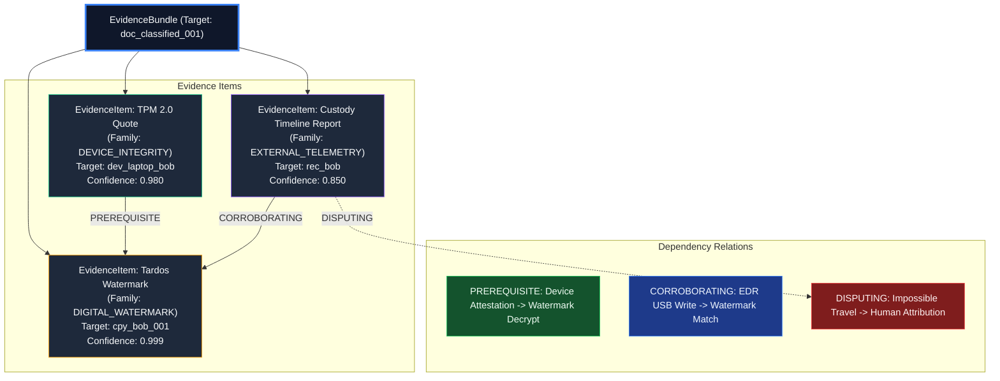

# AegisTrace Telemetry Evidence Dependency & Fusion Architecture

## 1. Overview & Fusion Objectives

In complex document leak investigations, evidence arrives from heterogeneous modalities:
1. **Mathematical Watermark Extraction**: Tardos code correlations, spread-spectrum correlation coefficients, Reed-Solomon syndrome analysis.
2. **Device Hardware Attestation**: TPM 2.0 PCR state quotes, Apple Secure Enclave attestation tokens.
3. **External Sensor Logs**: EDR process execution logs, USB device connection telemetry, network flow records, print spooler jobs.

The role of the **Telemetry Evidence Dependency Engine** (`TelemetryFusionAdapter` in `core/telemetry/fusion_adapter.py` and `EvidenceBundle` in `core/attribution/evidence.py`) is to bind external telemetry into the formal mathematical evidence fusion system without double-counting, false-positive amplification, or circular dependencies.

---

## 2. Evidence Bundle & Dependency Architecture



---

## 3. Dependency Types & Mathematical Semantics

The fusion graph enforces 4 distinct dependency relationships:

### 3.1 `DependencyType.PREREQUISITE`
Evidence $B$ cannot be asserted unless evidence $A$ is cryptographically verified:
$$P(H | B \land \neg A) = 0$$
- **Example**: A decryption event cannot be attributed to a recipient if the device attestation quote failed verification.
- **Rule**: If a prerequisite item is invalid or untrusted (`IntegrityLevel.UNTRUSTED`), all dependent evidence items are automatically zeroed out in posterior probability calculations.

### 3.2 `DependencyType.CORROBORATING`
Evidence $B$ reinforces evidence $A$, increasing confidence along an orthogonal observation channel:
- **Example**: Watermark decoder identifies Bob's copy ID; EDR logs Bob's laptop writing that exact file to USB 4 minutes later.
- **Fusion Rule**: Corroboration combines mass functions in Dempster-Shafer theory:
  $$m_{1 \oplus 2}(H) = \frac{1}{1 - K} \sum_{X \cap Y = H} m_1(X) m_2(Y)$$
  where $K = \sum_{X \cap Y = \emptyset} m_1(X) m_2(Y)$ is the conflict metric.

### 3.3 `DependencyType.DISPUTING`
Evidence $B$ contradicts evidence $A$:
- **Example**: Watermark points to Alice, but IdP telemetry shows Alice's account was compromised via credential stuffing in another country at the same time ($v > 900\,\text{km/h}$).
- **Enforcement**: Disputing evidence triggers fail-closed logic, forcing the boundary state to `ForensicBoundaryState.ABSTAINED` or `CONFLICT`.

### 3.4 `DependencyType.INDEPENDENT`
Evidence items from separate documents, unlinked sessions, or orthogonal incidents that do not influence belief masses.

---

## 4. Target Bindings Across Evidence Dimensions

Every telemetry item ingested into the fusion engine is explicitly bound to an entity via `TargetBinding`:

| Target Type | Identifier | Binding Meaning | Example Value |
|---|---|---|---|
| `TargetType.PRINCIPAL` | `recipient_id` / `actor_id` | Human or service account identity | `"rec_bob_defense_gov"` |
| `TargetType.DEVICE` | `device_key_id` / `device_id` | Physical hardware endpoint | `"tpm_ek_9a8b7c6d5e4f"` |
| `TargetType.SESSION` | `session_id` | Controlled ephemeral viewer session | `"ses_20260927_0042"` |
| `TargetType.COPY` | `copy_id` | Individual watermarked copy instance | `"cpy_tardos_bob_02"` |
| `TargetType.DOCUMENT` | `document_id` | Master document root | `"doc_strategic_plans_2026"` |

Strict target binding prevents category errors, ensuring that an observed USB write on Device $X$ only corroborates claims regarding Device $X$, never claims regarding unrelated endpoints.

---

## 5. End-to-End Code Integration: Attaching Custody Reports to Bundles

The `TelemetryFusionAdapter` automates evidence binding:

```python
from core.attribution.evidence import EvidenceBundle, TargetBinding, TargetType, EvidenceFamily, DependencyType
from core.telemetry.fusion_adapter import TelemetryFusionAdapter
from core.telemetry.custody import UnifiedCustodyTimelineBuilder

# 1. Build custody timeline report
builder = UnifiedCustodyTimelineBuilder()
report = builder.build_timeline(
    document_root=document_root,
    copies=copies,
    sessions=sessions,
    forwarding_events=forwarding_events,
    export_events=export_events,
    telemetry_events=external_events,
    enrolled_devices=enrolled_devices,
    enrolled_recipient_id="rec_bob",
)

# 2. Initialize EvidenceBundle
bundle = EvidenceBundle(
    bundle_id="bundle-leak-investigation-01",
    target_document_id=document_root.document_id,
)

# 3. Attach Custody Timeline Report
# Generates atomic EvidenceItem and sub-observations
bundle = TelemetryFusionAdapter.attach_custody_report_to_bundle(
    bundle=bundle,
    report=report,
    dependency_type=DependencyType.CORROBORATING,
)

# 4. Verify Evidence Properties
assert len(bundle.items) >= 1
evidence_item = bundle.items[0]
assert evidence_item.family == EvidenceFamily.EXTERNAL_TELEMETRY
assert evidence_item.target_binding.target_type == TargetType.PRINCIPAL
assert evidence_item.target_binding.target_id == "rec_bob"
```

### Granular Observation Propagation
Within `attach_custody_report_to_bundle()`, every timeline item is also converted to an atomic `Observation`:
- `observation_id = "obs-custody-<item_id>"`
- `modality = ObservationModality.TELEMETRY_LOG`
- `confidence = report.confidence_score`
- `source_reliability = item.trust_level.weight`

These granular observations feed directly into the Dempster-Shafer consensus engine, ensuring transparent, mathematically verifiable attribution reports.
